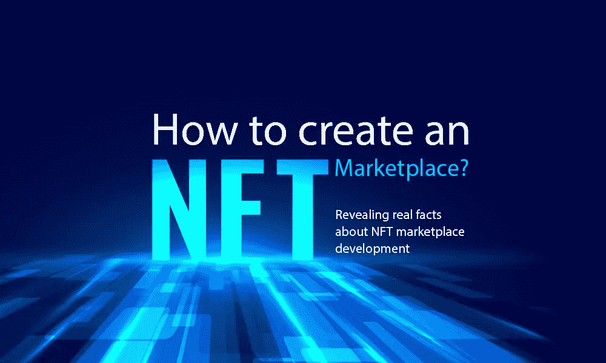
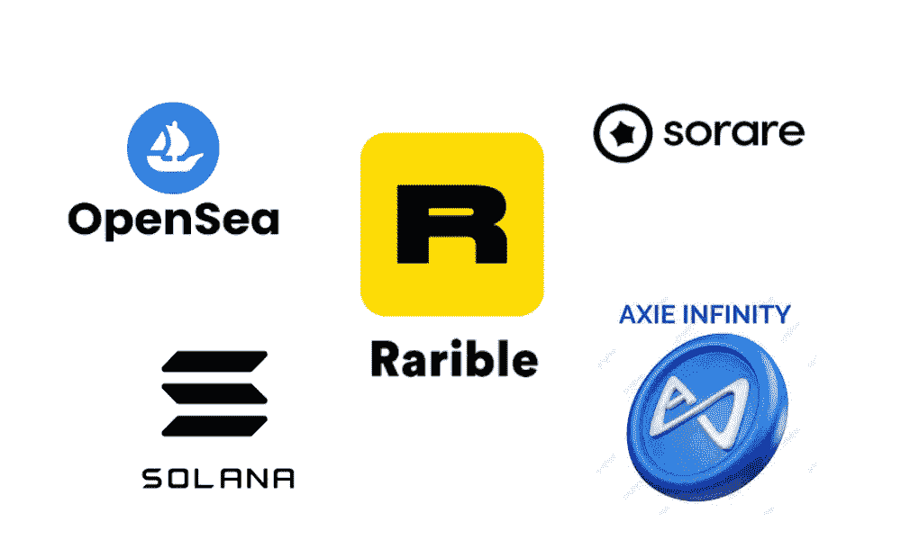
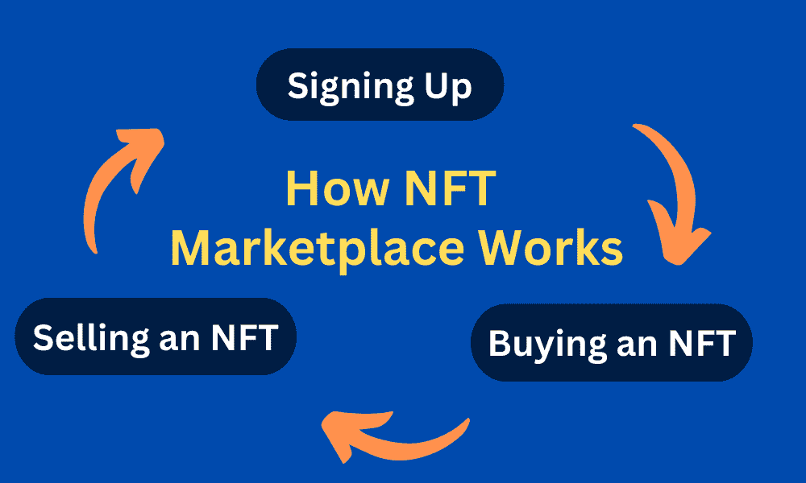
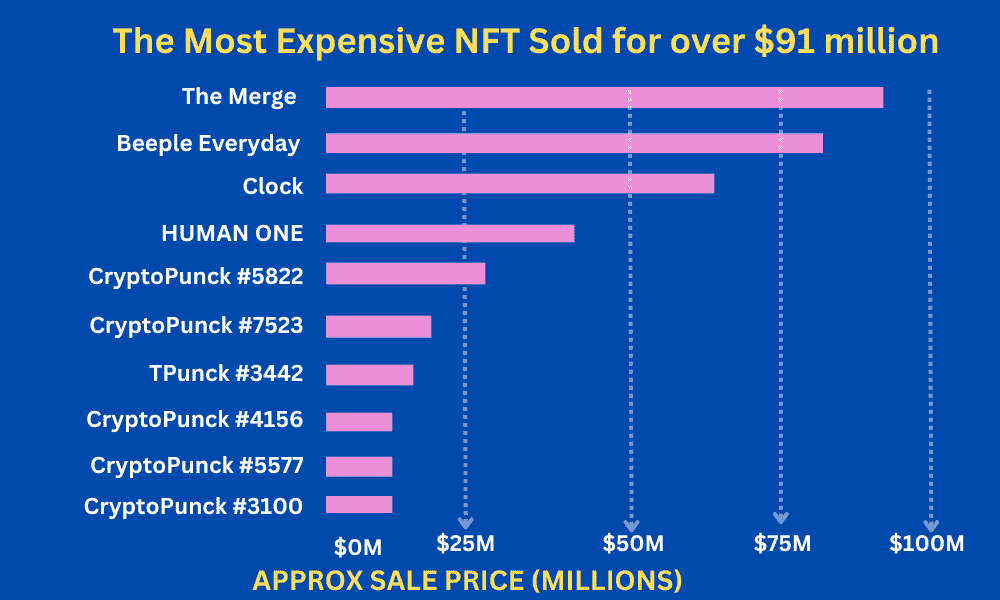

# 如何创建 NFT 市场——揭示 NFT 市场发展的真实情况。

> 原文：<https://medium.com/geekculture/how-to-create-an-nft-marketplace-revealing-real-facts-about-nft-marketplace-development-716af0c5bd59?source=collection_archive---------12----------------------->

NFT 或不可替代令牌成为新闻已经有一段时间了。在享受创造任何东西的自由的同时，NFT 的创造者们赚了令人难以置信的钱，买家们收到独特的物品进行转售或收藏。然而，没有中间人，就不可能买卖 NFT。这就是 NFT 市场出手相救的地方。

目前，NFT 的市值约为 670 万美元，但该值会随着市场的变化而波动。这种非凡的发展不仅有利于非专利技术的所有者和创造者，也有利于从事非专利技术的市场。

像 Opensea、Rarible 和 Solana 这样的 NFT 市场已经成为资金和高收入的温床，这表明 NFT 触及的每一个商业模式都在变成黄金。但 NFT 市场的核心是它拥有许多非功能性交易——这意味着它的收入来源不仅仅是直接的 NFT 创造和销售。

当 NFT 开发和它的相关费用正在互联网周围除草的时候，让我们稍微深入一点。在这篇文章中，我们将看看如何创建一个 NFT 市场，以及了解区块链的企业家在进入该领域并建立 NFT 平台时需要知道什么。

那么，事不宜迟，让我们开始吧！

# 什么是 NFT 市场？

知道如何建立一个 NFT 市场的关键是理解它是什么。当 NFT 市场是一个在线市场，收藏家出售他们不可替代的虚拟产品，买家使用比特币或以太网等加密货币购买。每次从他们的平台上购买 NFT，市场都会收取交易费。NFT 作品售出后，买家会收到一个令牌，这是一个唯一的标识符，可以证明所有权以及关于出处、作者和真实性的信息。

现在我们知道了什么是 NFT 以及如何购买代币，让我们来看看 NFT 最好的市场:

现在，我们已经弄清楚了如何扩大 NFT 市场，以及在哪里购买 NFT，有一些事情，每个定制 NFT 市场开发公司都希望你在开始开发之前知道。

# NFT 市场发展的需要

由于 NFT 市场的存在，NFT 在国际上进行交易。随着这项令人印象深刻的技术的兴起，创建一个 NFT 市场是安全的，并使其成为数字空间中一个坚实的商业前沿。要开发一个优秀的 NFT 市场，与 NFT 市场开发公司联系。在创意 NFT 市场发展公司的帮助下，你可以开发一个创新的 NFT 市场平台。

# NFT 市场是如何运作的？

非功能性交易在智能合约的基础上运作。每个令牌由记录在智能合约和区块链中的一组唯一的信息组成，以提供安全性和不变性。

NFT 的工作遵循这些简单的步骤，

**第一步** —一般来说，所有 NFT 市场都按照标准流程运作。用户在平台上注册，并安装一个存储加密货币和 NFT 的数字钱包。他们通过展示作品和选择他们想要接受的数字物品的支付令牌来创建他们的收藏。

**第二步—** 下一步是为拍卖选择出价或保持固定价格。当一个项目被列出时，会产生一个交易，该交易会在用户的钱包中启动一个智能合同。

**第三步** —一旦您批准平台的收款限额请求，NFTs 将出现在销售列表中，您可以在这里接受出价。作为平台交换资金和非金融交易的回报，市场会从销售收入中收取一定的费用。

# 为什么要为未来创建一个 NFT 市场？

全球都在谈论这个话题，为什么要创建一个 NFT 市场？

如前所述，数字胜于雄辩。

让我们来看看一些统计数据，这些数据显示了未来创建 NFTmarketplace 的前景。

到 2022 年中期，全球 NFT 市场将达到约 30 亿美元。2020 年，NFT 市场价值 1 亿美元。我们谈论的是在不到两年的时间里增长 30 倍。

*   最豪华的 NFT，售价超过 9100 万美元。
*   作为最受欢迎和最大的 NFT 市场之一，Opensea 的估值为 133 亿美元。
*   大约 23%的千禧一代收集 NFT，并将其视为一种爱好或投资。近 8%的 X 一代、4%的 X 一代和 2%的婴儿潮一代收集 NFT。
*   NFT 每月的销售总额估计约为 18 亿美元。最流行的类别是收藏品、元宇宙和艺术品

毫无疑问，NFT 的市场在未来一年将会扩大。你可以观察其他人的成功，或者创建自己的 NFT 市场并从中获益。

# 如何创建 NFT 市场

利用 NFT 市场启动一项创新项目很简单。它们可以通过以下任何一种方式创建。

*   **白手起家**

一个 NFT 市场是专门设计的，具有所有的功能和其他因素，用来吸引访客到你的平台。在这里你必须按部就班地行动，时间是唯一重要的东西。由于您的需求是独一无二的，这种技术可以为您带来一个完全符合您期望的平台。它就像是按照剧本精心雕刻和设计的雕塑。

*   **NFT 市场克隆脚本解决方案**

获得一个 NFT 市场的克隆脚本对于希望在短时间内启动的初创公司来说是理想的。该解决方案是预先构建的，可以快速开始使用。但是，您可以通过添加各种功能和其他安全措施对其进行定制，以满足您的业务需求。这种产品是一种高效且有利可图的解决方案，这就是为什么他们中的许多人更喜欢这种解决方案来进入 NFT 市场。

你可以使用这些方法中的任何一种来创建一个无止境交易的平台。

NFT 市场的发展是一个过程，包括不同的阶段、步骤和需要做出的决定。借助智能合约，NFT 市场建立在区块链之上。一般来说，开发过程可以分为八个主要步骤。

**步骤 1** —研究数字市场，选择合适的 NFT 市场发展公司。

**第二步**——一旦公司被选中，提交业务利基。业务核心包含 NFT 市场的所有文档和开发流程。

**第 3 步** —开发团队将审核文档并制定一个计划来建立 NFT 市场。

**步骤 4** —开发计划包括与选择区块链技术和增加功能相关的其他讨论。

**第 5 步—** 一旦区块链被选中，开发过程就开始了，市场也就建立起来了。

**第 6 步** —在开发过程中，将创建智能合约，并且还将设计平台的前端&后端。

**第 7 步** —一旦 NFT 市场建成，该平台将通过广泛的测试运行来识别和消除错误。

**步骤 8** —在开发人员执行测试运行后，完美的 NFT 市场将立即构建并提供给公司平台。

# 创建一个 NFT 市场要花多少钱？

我们遇到了一个令人困惑的问题，每个人都想知道答案，创建一个 NFT 市场需要多少成本？或者 NFT 市场发展的成本是什么？

嗯，这完全取决于所需的工作量。例如，如果您想使用现成的解决方案，成本将会降低。用一个流行的克隆脚本创建一个 NFT 市场将会节省资金，并让初创公司和企业家可以使用它。不知道需求和规格，就不可能说出准确的价格，然而，NFT 市场克隆脚本的基本组件通常花费 5000-50000 美元。此外，它不是一个固定的价格，而只是一个估计。

开发 NFT 市场的成本可能会上升，这取决于满足您的业务需求所需的定制。如果你想从零开始建立你的 NFT 市场，成本将高于现成的解决方案。平台的功能遵循相同的结构。如果您的需求导致了一个复杂的平台(一个具有以前没有过的动态特性的平台)，您可能需要在市场开发上花更多的钱。除了用于确定 NFT 成本的平台、工具和技术。就像说的那样，会更愉快。但是任何东西都是有价格的，添加的东西越多，成本肯定就越高。

# 结论

现在，我希望你对如何创建 NFT 市场[**有所了解，它是如何运作的，以及创建它需要多少成本。下一步是联系最好的**](https://www.alwin.io/blog/how-to-create-nft-marketplace) **[**NFT 市场开发公司**](https://www.alwin.io/nft-marketplace-development) ，他们可以利用定制的 NFT 市场开发专业知识，帮助将你的想法转化为高利润的市场。不可替换的令牌今天得到了很多关注。在寻求获得独特的数字物品的有眼光的收藏家中，它们引起了极大的兴趣。因此，对于早期用户来说，创建 NFT 业务似乎是一项有利可图的事业。通过这种方式，你现在就创建了一个 NFT 市场，并通过一个独特的平台增加了你成功的机会，这个平台将会受到热情的数字艺术爱好者的喜爱。**