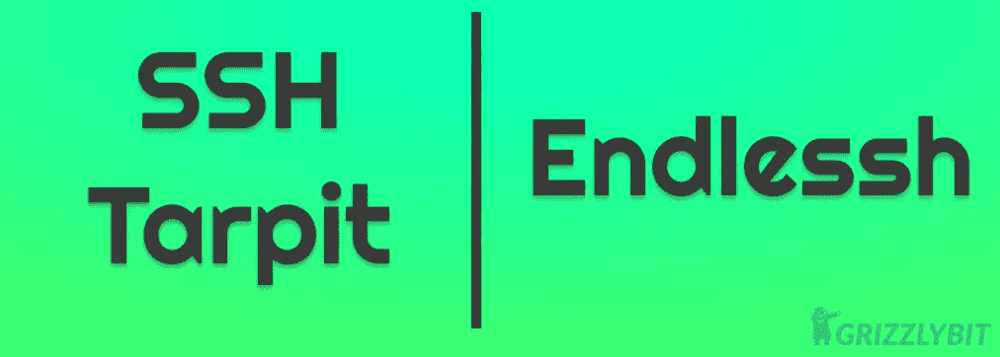
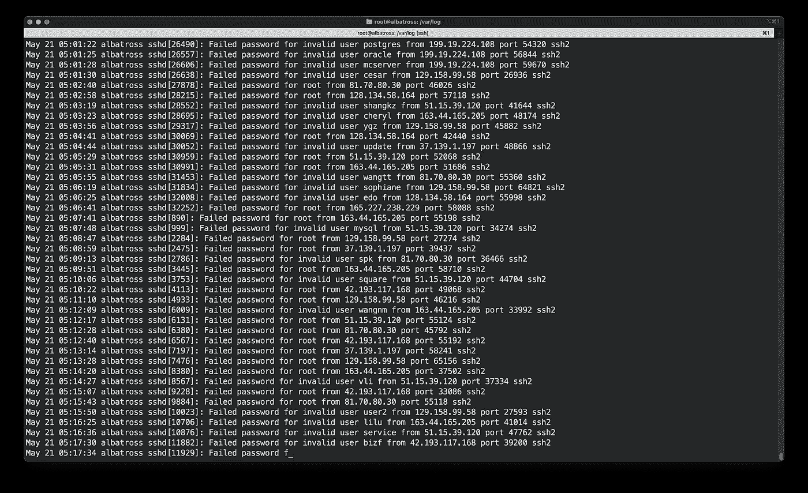

# 如何创建一个 SSH Tarpit

> 原文：<https://medium.com/geekculture/how-to-create-an-ssh-tarpit-f3b48af1b60c?source=collection_archive---------8----------------------->



# 为什么有一个宋承宪沥青坑？

如果你有任何使用 SSH(安全套接字外壳)连接访问的服务器，你会很熟悉它是如何被我的黑客用来访问你的服务器的。但是，通过查看您的服务器验证日志，您还会注意到如下所示的内容:



你会注意到，机器人已经数千次试图用一些默认凭证登录到你的服务器，这种方法本质上被称为“暴力”技术。现在，如果您已经为您的服务器设置了一个不安全的密码并启用了密码验证，并且使用了 SSH 的默认端口，那么您很有可能拥有一个受损的服务器。如果您遵循一些标准的最佳实践来设置您的 Linux 服务器，这些攻击可能看起来是无害的。

在本帖中，我们将用一种扭曲的方式来保护我们的服务器。我们将让黑客们尝尝他们自己的药。😉

为了执行我们的技巧，我们将利用所显示的“横幅”,以及对显示其内容的时间长度没有真正限制的事实。此外，我们知道任何服务器的 SSH 默认端口通常是 22。现在，我们将使用这个概念来迫使黑客阅读一个非常长的横幅，这个横幅基本上永远不会结束，我们称之为 **endlessh (endless SSH)** 或 **SSH tarpit** 。通过这种方法，您不仅保护了您的服务器，而且还浪费了黑客的宝贵时间，否则这些时间可能会被用来危害其他服务器。

# 如何创建一个 SSH Tarpit？

我们将通过名为`endlessh`的 [skeeto](https://github.com/skeeto) 为此使用一个 git 存储库。登录到您的服务器并克隆存储库

```
git clone [https://github.com/skeeto/endlessh.git](https://github.com/skeeto/endlessh.git)
```

现在，转到目录并编译目录

```
cd endlessh
make
```

如果你使用的是基于 Debain 的操作系统，你可能会在编译程序时出错。您将需要安装`libc6-dev`库，这可以使用`apt`包管理器来完成

```
sudo apt-get install libc6-dev
```

然后，我们会将二进制文件移动到您的`path`文件夹中

```
sudo mv endlessh /usr/local/bin/
```

现在，让我们来验证一下

```
which endlessh
# it should print the path like /usr/local/bin/endlessh
```

现在，我们需要妖魔化它，为此我们将复制`systemd`服务文件

```
sudo cp util/endlessh.service /etc/systemd/system/
```

现在，我们将启用`systemd`服务

```
sudo systemctl enable endlessh
```

现在，我们要做的最后一件事是创建配置文件，首先创建文件夹，然后在其中创建配置文件，我们将以编辑模式打开它

```
mkdir -p /etc/endlessh
sudo nano /etc/endlessh/config
```

配置文件的内容如下:

```
PORT 22 # this is becasue endlessh runs by default on port 2222
```

现在，我们完成了设置，让我们启动服务

```
sudo systemctl start endlessh
```

同样，让我们验证它是否真的在运行

```
netstat -tulpn | grep enlessh
```

一旦确认服务正在运行，就大功告成了。很简单，不是吗？

# 嘲笑黑客

我们现在将在另一个终端窗口上模拟一个黑客试图通过 SSH 进入服务器

```
ssh root@<server-address> -p 22
```

现在，你将什么也看不见。为了实际了解幕后发生了什么，我们将使用 verbose 选项进行 SSH

```
ssh -vvv root@<server-address> -p
```

你会注意到用户会在横幅中不断得到胡言乱语，每一行都要花将近 30 秒才显示出来。由于横幅通常不被视为可以明确执行超时的任何东西，黑客将使用的脚本将永远停留在这个阶段，否则谁会。任务已完成👍。

你成功地浪费了一个黑客的时间和精力。你是坏蛋。😎

现在出去浪费一些人的时间和精力，让世界变得更安全，一次一个服务器。

在 [Grizzlybit](https://www.grizzlybit.dev) 阅读更多信息🐻。