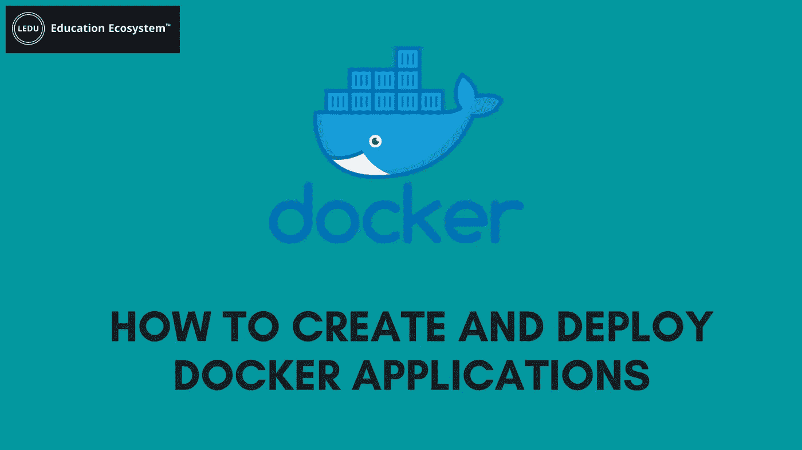

# 如何创建和部署 Docker 应用程序

> 原文：<https://medium.com/geekculture/how-to-create-and-deploy-docker-applications-1b00e4246c1d?source=collection_archive---------4----------------------->



**Docker 的简要概述**

Docker 是什么？Docker 是一个工具，它使开发人员能够在容器中创建、部署和运行应用程序。简单来说，Docker 消除了协作过程中可能出现的无休止的环境配置冲突。Docker 可以用来在隔离的容器中并行运行和维护应用程序。开发团队可以使用它来补充现有的敏捷和 DevOps 交付实践。作为一个平台，Docker 可以在 Linux 和 Windows 环境下安全运行。

Docker 节省了开发人员的时间，并自动化了通常与提供新开发环境相关的重复任务，这使得开发人员可以专注于编写代码。

Docker 使得在任何运行 Docker 的[环境中运行应用程序变得容易。有三种主要的 Docker 变体:](https://educationecosystem.com/education_ecosystem/RYjYA-how-to-ping-docker-container-from-another-container-by-name)

*   Docker 企业版(Docker EE)
*   Docker 社区版(Docker CE)
*   Docker 云

变体的选择取决于您正在设置的环境类型。

**创建码头工人图像**

Docker 容器是从 Docker 映像创建的。要将您的应用程序分发到不同的机器上，您必须创建一个 Docker 映像并发送给每台机器。您可以使用 docker 文件来做到这一点。要构建映像，您将使用 build 命令。继续在注册表上托管您的 [docker 映像，然后在目标机器上获取并运行该映像。](https://educationecosystem.com/education_ecosystem/ZWjoX-how-to-copy-a-docker-image-from-one-server-to-another-without-pushing-)

下面是一个来自 [Docker 文档](https://docs.docker.com/)的简单 Docker 文件示例:

```
FROM docker/whalesay:latestRUN apt-get -y update && apt-get install -y fortunesCMD /usr/games/fortune -a | cowsay
```

**设置环境**

为了方便地分发您的应用程序，您需要一个地方来共享它们。因此，您需要准备好 Docker 环境来运行您的应用程序。这可以通过使用命令行和一些工具来实现。

这些虚拟机负责设置我们已经讨论过的容器。设置您的本地机器将不同于创建 Dockerized 云服务器。

在发球时展开

现在您已经运行了 Docker 机器，设置了 Docker Hub 存储库，并构建了 Docker 映像，现在您可以在您的机器上部署应用程序了。

首先，将您的应用程序推送到存储库。接下来，将您的应用程序从存储库拉到其他机器上。您可以使用 docker run 命令来实现这一点。该命令将自动查找、提取并运行您的新应用程序。

**自动化 Docker 部署流程**

因此，您不必在每次更改应用程序时都运行所有这些命令，幸运的是，有许多工具可以用来简化您的工作流程，并自动化整个 Docker 应用程序部署过程。

您可以按照 docker 教程来查看完整的自动化过程:

**Kubernetes 对 Docker**

容器保存应用程序的所有代码、依赖项、库和其他必要的配置。然后，可以使用 Docker 之类的工具在机器上运行容器的流程。

容器擅长将应用程序与其依赖项打包，以便您可以在任何地方轻松运行它。然而，它们有一些局限性。当使用容器构建可伸缩的应用程序时，您需要某种方法以最有效的方式管理容器。这就是容器编排工具发挥作用的地方。

Google Kubernetes 和 Docker Swarm 是强大的工具，可以在分布式、高弹性的环境中运行您的应用程序，同时对任何使用它的人来说都是一个应用程序。

[Docker Swarm](https://educationecosystem.com/education_ecosystem/Ze0vw-how-to-start-docker-containers-automatically-after-a-reboot) 是 Docker 的原生集群和容器管理工具。另一方面，Kubernetes 是 Google 对容器编排的继承。它是开源的，可以使用 Docker 容器。这是功能最丰富、最强大的框架之一。

**总结**

Docker 是游戏规则的改变者，它极大地改变了应用程序开发世界。容器化是使用 Linux 容器来部署应用程序。Docker 是一个让开发人员在容器中创建、部署和运行应用程序的工具。

正如我们所看到的，Docker 让您可以在与其他技术相同数量的服务器上运行更多的应用程序。它使开发封装的、随时可运行的应用程序变得轻而易举——在“容器”中交付一切，这些容器包含应用程序的所有库和依赖项。它使管理您的应用程序和将它们部署到实时服务器变得更加容易。您可以编辑应用程序，将新的 docker 映像推送到存储库，然后在任何地方立即运行该应用程序。我们还简要讨论了 Kubernetes vs Docker。