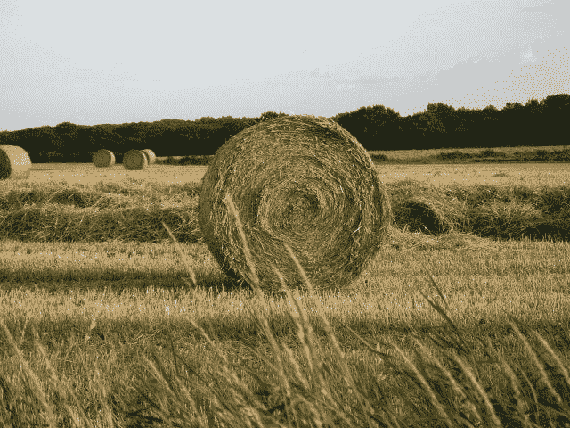

# 如何使用 sklearn 创建和绘制瑞士卷

> 原文：<https://medium.com/geekculture/how-to-create-and-plot-a-swiss-roll-using-sklearn-cbd2c81fddc6?source=collection_archive---------9----------------------->

在我的上一个视频中，我讨论了如何创建一个 s 曲线，并将其绘制在图表上(以及对其进行预测)。这篇文章的链接可以在这里找到:-[https://medium . com/geek culture/how-to-make-and-plot-a-s-curve-using-sk learn-17c 98 ddbeb 4d](/geekculture/how-to-make-and-plot-a-s-curve-using-sklearn-17c98ddbeb4d)

在这篇文章中，我打算讨论如何使用 Python 的机器学习库来创建一个瑞士卷，把它绘制在图上，并制作…