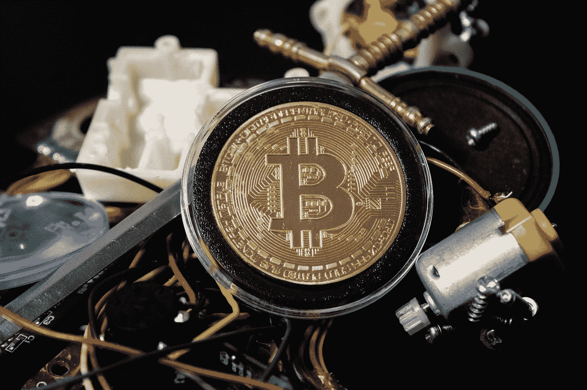

# 如何创造和销售你的第一个 NFT

> 原文：<https://medium.com/geekculture/how-to-create-and-sell-your-first-nft-f4ebca4e1790?source=collection_archive---------3----------------------->

## 不可替代令牌的美好世界

Photo by [Brian Wangenheim](https://unsplash.com/@brianwangenheim?utm_source=medium&utm_medium=referral) on [Unsplash](https://unsplash.com?utm_source=medium&utm_medium=referral)

# 什么是 NFT？

不可替换令牌是存储在数字分类帐中的唯一且不可互换的数据单元。NFTs 可用于将照片、视频、音频和其他类型的数字文件等易于复制的项目表示为唯一的项目，并使用区块链技术建立一个…