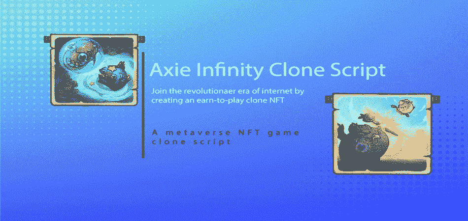
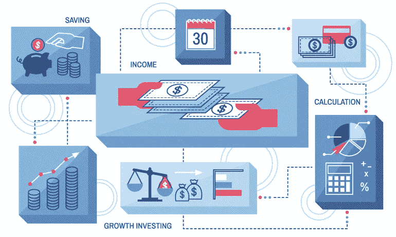
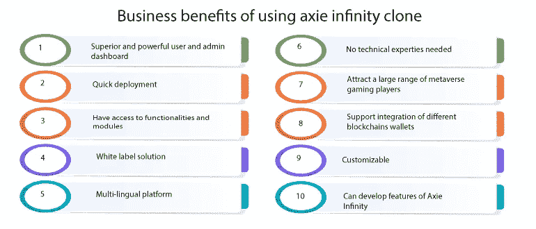
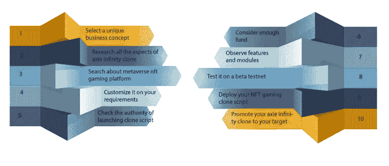

# 如何创建 Axie Infinity 克隆脚本？

> 原文：<https://medium.com/geekculture/how-to-create-axie-infinity-clone-script-e4cf279dd05a?source=collection_archive---------11----------------------->

Axie Infinity clone script 是一个“玩到赚”的 NFT 市场，游戏项目可以通过平台的本机令牌进行交易。Axie Infinity platform 是一款在以太坊区块链上运行的口袋妖怪游戏，包含一个不可替换令牌的市场。在 axie infinity 市场，用户可以交易游戏的宠物和其他游戏物品。

Axie Infinity script 是一个位于元宇宙的游戏平台，受到喜欢交易的玩家的高度关注，因为他们可以在这个平台上玩游戏。因此，通过创建一个 3D 元宇宙游戏赚取平台，你可以吸引大量喜欢在元宇宙空间交易的玩家。投资者可以开发和部署包含游戏和交易平台功能特性的 axie infinity 克隆。

# **Axie Infinity 克隆人开发**

[**Axie Infinity 克隆脚本**](https://radindev.com/axie-infinity-clone-script/) 开发是开发和部署像 Axie Infinity 这样的 NFT 游戏市场的步骤。开发 axie infinity 克隆是编码，帮助您创建一个像 axie infinity-著名的元宇宙游戏脚本 NFT 市场。

开发 axie infinity 克隆平台是对加密领域的适当投资，可带来高收益回报。Axie Infinity clone 是一个经过多重测试的、无争议的、随时可以上市的 NFTgaming 平台。axie infinity 克隆体为玩家交易 axie 提供了快速便捷的 NFT 大市场。

# **Axie Infinity 克隆功能**

分散的

定制仪表板

容易接近

实时数据分析

推荐和奖励方法

高度安全的 CMS 和 CRM

**用户功能**

低风险投资

3D 体验

快速交易

推荐和奖励制度

分散的

玩家无风险

**管理功能**

定制仪表板

推荐报价

安全的 CMS 和 CRM

各种广告模块

交易历史

实时数据和分析

# **Axie Infinity 克隆软件**

Axie Infinity 克隆软件是一个完全分散的源代码，在区块链联邦理工学院网络上运行。Axie Infinity 克隆应用程序可以定制功能和插件，使启动 axie infinity NFT 脚本更容易和更快。您可以根据需要删除或添加任何想要的功能。

## **axie infinity 克隆脚本的核心功能**

**市场**:axie infinity 克隆最本质的功能就是提供 axie 有市场价值的交易和游戏物品。axie infinity 游戏脚本中的宠物是 axie，它们是不可替换的代币，可以在 axie infinity 的市场中进行交易。

**土地**:axie infinity 克隆上的土地，玩家可以购买不同的地块。

**AXS** : AXS 是 axie infinity 克隆脚本的原生令牌，它提供了治理属性，并赋予 AXS 持有者所有权，以便他们能够对平台的重要决策进行投票，并参与平台的改进。

**小爱份:**被称为 SLP 的小爱份是在标准代币 ERC-20 下制造的。它为 SLP 所有者提供了治理属性，并实现了收益。

**饲养**:是玩家将宠物升级成棋子的方式。玩家可以收集和提高 axes 来开始自己的育种业务和出售 axes。

**战斗**:战斗是 axie infinity 克隆人的主要游戏功能，用户可以与宠物对战以获得奖励。战斗可以通过使用平台上的角色来实现，这些角色被命名为 axies。axie 有六个部分，每个 axie 有四个部分参加战斗。

# 为什么选择 axie infinity 克隆脚本？

Axie 自推出以来已经产生了大量的收入。它获得了近 9000 万美元的收入，高于顶级游戏平台的总收入。 [**Axie Infinity**](https://axieinfinity.com/) 日活跃玩家超过 25 万可以看出这个 p2e 平台的受欢迎程度。Axie infinity 是最大的 NFT 市场平台之一，它打破了销售不可替代代币的记录，因此使用 axie infinity 克隆脚本创建一个先玩后赚平台是合理的。

此外，Substack 上的时事通讯报道说，许多人辞职加入 axie infinity 平台，开始交易 axie。请注意，Axies 的价格在一个月内上涨了%600。

## **什么是轴？**

Axies 是惊人的宠物创作，可以战斗，创造，并为游戏奖励出没。这些都是类似 axie infinity 领域收藏品的重要部分。它们包括六个身体部分和四个属性。在游戏战斗中，身体部位将为 Axies 解锁能力，它们将在不同的战斗中拥有完全不同的技能、价值和利益。axies 的六个身体部分也有独特的卡，玩家可以收集。

## **Axie 有不同的身体部位**

身体部位:

口

背部

尾巴

喇叭

耳朵

眼睛

轴的类别:

伯德

病菌

野兽

浅绿色

爬行动物

植物

# **axie infinity 克隆脚本的白标解决方案提供了什么？**

白色标签 axie infinity 克隆脚本是一个快速上市的解决方案，用于推出 axie infinity 等 NFT 游戏平台。白标克隆脚本涉及原始平台的所有功能特性和核心结构，所有这些都可以根据您的业务需求进行定制。创建像 axie infinity 这样的 NFT 市场的最佳方法是使用无缺陷的白色标签 axie infinity 克隆。

您将采取主要措施在可根据您的业务需求定制的加密领域脱颖而出。像 axie infinity 这样的白牌 NFT 游戏平台是一个经济高效、简单易用的解决方案。你可以启动你的元宇宙 NFT 市场，吸引世界各地的元宇宙爱好者。

# **axie infinity 克隆的安全特性**

高级解密

加密桥接

完整的 SSL 加密

服务器端条目伪造特征

防御 DDoS 攻击

内置安全 API

多层安全选项

不可变智能合约

## **使用 axie infinity 克隆脚本的商业优势**

附带了卓越而强大的用户和管理员控制面板。

它可以快速部署，在几天内提供像 axie infinity clone 这样的用户友好的元宇宙 NFT 游戏。

作为 axie infinity 克隆平台的所有者，您可以以无错误的方式访问功能、安全模块、用户和管理员控制面板等。

这是一个完全白标的解决方案，提供多语言克隆平台。

企业所有者开发 axie infinity 游戏克隆平台不需要任何技术专业知识。

Axie infinity clone script 是一个位于元宇宙的游戏市场，你可以吸引大量的元宇宙爱好者到你的平台上。

在 axie infinity 克隆平台上开发的协议可以支持各种区块链钱包的集成。

使用克隆脚本最突出的一点是可定制的。NFT 游戏平台可以根据您的需求进行定制。

通过使用白色标签 axie infinity 克隆脚本，您可以获得所有好处和令人难以置信的功能。

# **开发 axie infinity 克隆平台的步骤**

1.选择一个独特的商业概念

2.在创建 axie infinity 克隆脚本之前，搜索 axie infinity 的所有方面

3.研究元宇宙游戏 NFT 平台

4.定义 axie infinity 克隆的优缺点，并根据您想要的平台对其进行定制

5.一些国家禁止数字资产交易，所以请检查创建 axie infinity 这样的 NFT 游戏平台的权限两次

6.确保你有合适的预算和足够的资金来启动一个使用 axie infinity 克隆脚本的 NFT 游戏平台

7.弄清楚你想在你的 NFT 游戏市场上执行的功能特性和安全模块

8.运行一个 beta 测试网来观察这些见解，看看最终用户是否喜欢它

9.在多链网络上部署您的 NFT 游戏市场。

10.最终开始向全球目标用户推广您的 axie infinity 克隆平台

# **axie infinity 克隆脚本的工作流程**

用户应该注册该平台，并集成游戏市场支持的加密钱包，以开始玩游戏。

在开始玩 axie infinity 的下一步中，用户必须购买三个在平台市场上可用的 axie。Axies 是可爱的怪物，扮演游戏中宠物的角色。

玩家需要提高到一个新的水平，这样他们就可以升级他们的轴，为了达到更高的水平，玩家需要完成先进的任务。

竞技场模式是游戏的一部分，玩家可以邀请其他玩家对抗他们的 axies。

玩家可以通过加密货币在 axie infinity 平台上出售或购买 axie。每个轴的值由身体不同部分的状态、能力和力量决定。

玩家需要从优势轴开始才能获得游戏内的好处。

每个 axie 都由支持 NFT 的加密货币购买，如币安、北海巨妖和火币。

玩家可以从借出斧头的人那里借出斧头，这些人被称为“经理”，经理可以向玩家收取他们在玩斧头时获得的任何奖励。

# **结论**

Axie Infinity clone script 是一个随时可以部署的 NFT 游戏平台，它提供的 3D 体验将带来巨大的收入。如果你是一个密码创业者，并寻求推出一个像 axie infinity 这样包含 axie infinity 核心功能的趋势 NFT 市场，我们可以为你提供一个完美的解决方案。联系我们在 radindev 的专家进行 axie infinity 克隆开发。您可以开始您的 NFT 游戏平台的成本效益，以脱颖而出，在加密领域的革命时代，并获得巨大的成功。