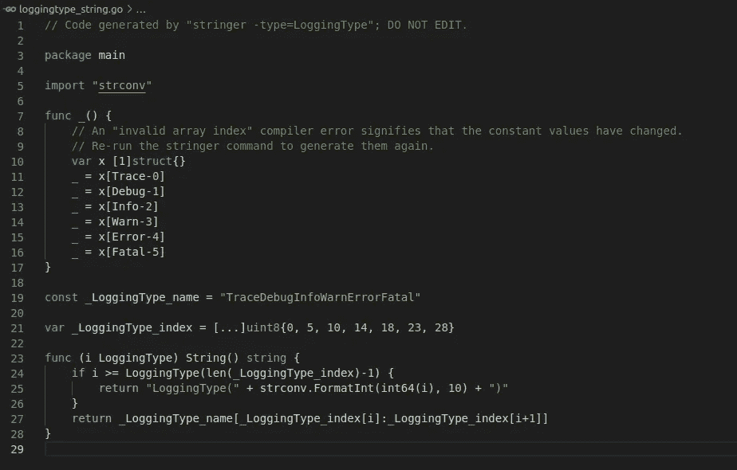

# 如何在 Golang 中创建枚举

> 原文：<https://medium.com/geekculture/how-to-create-enum-in-golang-c0b19dd5439f?source=collection_archive---------0----------------------->

## 在 Golang 中使用 Enum 的快速指南

output of stringer tool

Enum 是用户定义的数据类型，用于将值集限制为固定的命名常量。这是编程语言的一个常规特征。它可以在 Pascal 等复古语言和 Rust 等现代语言中找到。

在本教程中，我们将学习如何实现`enum`。我们还将通过一些小技巧来制作…