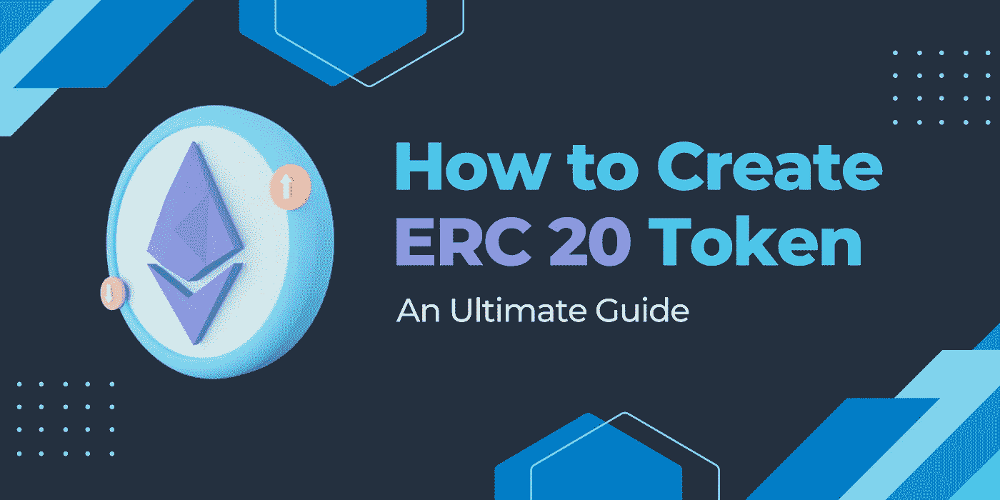

# 如何创建 ERC 20 代币-终极指南

> 原文：<https://medium.com/geekculture/how-to-create-erc-20-token-an-ultimate-guide-245ec95fc9e1?source=collection_archive---------21----------------------->

在近年来，ERC20 令牌规范已经成为以太坊令牌事实上的标准。换句话说，今天可用的大多数以太坊合约都符合 ERC20。为了理解这篇文章中如何构造自己的以太坊令牌，我们先来深入了解一下 ERC20 标准。

# 什么是 ERC 20 代币？

编译后的 Solidity ABI 代码运行在以太坊虚拟机(EVM)上，这是一种虚拟机。以太坊平台的智能合约已经成为生产多种代币的全球标准。以太坊征求意见(ERC)标准就是这些指南现在的名称。

虽然以太坊包括几个标准，但 ERC-20 和 ERC-721 是最著名和最常用的。令牌是使用 ERC-20 生成的，而不可替代的令牌是使用 ERC-721 (NFTs)生成的。

Fabian Vogelsteller 提出的智能合约 ERC-20 标准包括各种 API。所有选择采用 ERC-20 标准的令牌都需要遵循 ERC20 制定的一套特定指导原则。

正如已经提到的，ERC-20 可以用于构建比特币和以太等数字货币。最著名的符合 ERC 20 的硬币包括币安硬币 BNB 和柴犬沙布。

发送和接收基于 ERC 20 的令牌是可能的。它们是可替换的令牌，因此每个令牌的值在整个网络中都是一致的。

据 Blockchain.com 支持中心称，钱包和交易所使用该标准将不同的 ERC-20 代币集成到他们的平台上，并实现 ERC-20 代币和其他加密货币之间的交易。

现在我们已经熟悉了 ERC-20 标准，让我们来检查一下 ERC-20 令牌的主体。

**为什么 ERC20 代币如此受欢迎和吸引人？**

正如您将在本课中看到的，ERC20 令牌简单明了，易于部署。

因为区块链的市场和加密货币钱包需要一个单一的、定义好的命令集来连接它们管理的各种代币，所以 ERC20

标准化有效地克服了这个问题。这既包括购买令牌的指导原则，也包括各种令牌如何相互关联的指导原则。

这是第一个广泛使用的规范，为以太币建立统一性。尽管这绝不是第一个，但由于其受欢迎程度，它迅速上升为行业标准。

ERC20 令牌被实现为智能合约，并以分散的方式在以太坊虚拟机(EVM)上运行，就像其他以太坊令牌一样。

**我如何创建 ERC20 令牌？**

*   你应该首先决定你希望向整个市场提供多少代币。
*   为您的加密货币令牌创建符号。
*   配置您的令牌名称
*   通过用代码编写智能合约，使用 ETH 网络创建令牌。
*   测试和部署过程正在进行中。
*   部署过程结束后，您可以列出您的加密货币令牌。
*   在令牌组学的背景下估计你的加密令牌的市场价值。

这些是创建 ERC20 令牌的简单步骤，但在当前形势下，找到最好的加密令牌开发公司对许多企业家来说将是至关重要的一部分，对吗？

让我来帮你！

WeAlwin Technologies 是一家著名的 [**ERC20 令牌开发公司**](https://www.alwin.io/erc20-token-development-company) ，提供各种类型的令牌开发服务，并取得了良好的效果，同时帮助初创公司和企业生产自己的 ERC20 令牌。他们拥有一支技术娴熟、知识渊博的令牌开发团队，在创建和分发基于以太坊的加密令牌方面拥有丰富的经验。他们专门为所有流行的操作系统创建移动 ERC20 令牌钱包应用程序，包括 web、Android 和 iOS。除此之外，他们擅长以合理的价格提供值得信赖的区块链服务，包括 ICO 开发、IEO 开发、加密交换开发等等。