# 如何用 JPA 创建 gRPC 微服务？

> 原文：<https://medium.com/geekculture/how-to-create-grpc-microservices-with-jpa-b3e804b4d91e?source=collection_archive---------9----------------------->

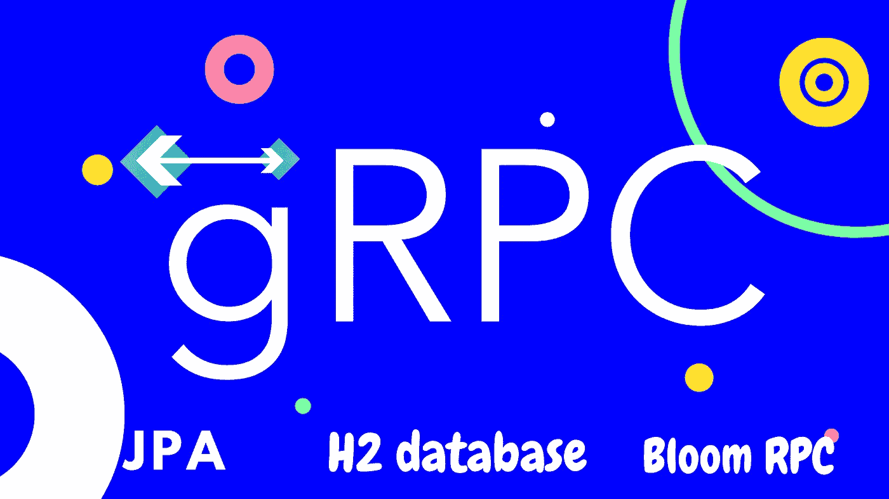

**嘿，阿尔戈斯，**

> 技术在发展，我的朋友，你昨天认为正确的今天变成了错误。是的，这就是科技。

好久不见了。经过长时间的休息，我想写点东西给你，它是关于 gRPC 的。现在，你们中的大多数人不知道术语 RPC，但是我假设你们至少对 REST 有基本的了解。因为在这篇博文的后半部分，我将比较 REST 和 RPC。你最好知道休息。然而，你可以不了解 REST 而继续阅读，因为 RPC 与 REST 没有任何相似之处，它完全不同。所以，准备好你的咖啡，我们开始吧。

这些是你在这篇文章中将要学习的话题。

*   什么是 gRPC
*   REST 与 RPC
*   gRPC 实践项目
*   用 Bloom RPC 测试您的项目

您将创建两个相互通信的微服务，而不是一个。

# gRPC 到底是什么？

gRPC 代表 **gRPC 远程过程调用**。所以，是的，这是一个递归的缩写，第一个字母' **g'** 代表 gRPC 本身。gRPC 是一个开源项目，最初是谷歌在 2015 年开发的。并且它是开发**高效**系统的好工具。原因是使用了 HTTP 2 协议。然而，在许多情况下， **HTTP 1.1** 协议是最著名的，也是最值得推荐的。那么，**我们为什么要从 HTTP 1.1 迁移到 HTTP 2 呢？**答案是**速度**。举个例子，

`http/1.1 vs http/2

上图为我们展示了 HTTP 1.1 和 HTTP 2 的**对比。正如你所看到的，使用 HTTP 1.1 加载图片花了 8 秒，而 HTTP 2 只用了 1.5 秒。您可以通过访问 [www.http2demo.io](http://www.http2demo.io/) 来尝试一下。当然，根据你的网络连接，你的价值观会和我的不一样。但是，HTTP 2 总是赢得这场竞赛。**

我不会解释更多关于 HTTP 2 的内容，但是你可以在 google 上搜索，因为已经有很多全面的文章了。现在，记住 HTTP 2 比 HTTP 1.1 更快，它是一个二进制协议。什么是二进制协议？你以后会看到的。

现在，gRPC 使用 HTTP 2 协议。这是你学习它的一个原因。

gRPC 是根据 RPC 标准开发的。RPC 是很多开发人员在 REST 之前使用的有点老的技术。RPC 携带了调用植入远程服务器的方法的想法。例如，假设你开发了一个【ChatServer.java】*类。在那个 Java 类中，您实现了一个名为 ***addUser*** 的方法。而你已经主持了****端口 3000*** 。现在，你需要从另一个类调用 addUser 方法，比如说运行在 ***端口 8080*** 上的***Client.java***。在那种情况下，我们使用 RPC。**

**RPC 是 REST 之前使用的最著名的技术。Java RMI 是 Java 开发人员用来让 RPC 工作的著名框架之一。但是，RPC 的问题是它太复杂了。因此，开发人员转向不同的技术。其中一项技术是纯文本的 XML。XML 用于通过明文将服务从服务器公开给客户机。因此，不需要调用服务器上的方法，我们可以通过 XML 获得它们的服务。但是，XML 的结构使得解析它需要很长时间。然后**休息**进入画面。有了 **REST** ，服务器可以通过 **JSON 字符串**向客户端提供服务。开发人员开始使用 REST 已经有很长时间了，尽管如此，还是强烈推荐使用。但是在 2015 年，一项新技术出现了，这就是 gRPC。等等，RPC 被认为是一种复杂的技术，开发人员停止了使用它，然后同样的技术带着一个附加的字母“g”又出现了。gRPC 是 RPC 的一种引导版本，它允许开发人员去掉那些样板代码。**

**下面给出了使用 gRPC 代替 REST 的原因。**

# **REST vs gRPC**

**REST 使用 JSON 字符串来提供服务。JSON 字符串也是由纯文本构成的，所以加载需要时间(解析一个 JSON 字符串所需的时间比 XML 少)。**

****gRPC 使用二进制协议**，其中服务通过**字节而不是纯文本**公开。**

**REST APIs 仅限于一些预定义的方法，比如 GET、POST、DELETE 等等。然而，无论您需要做什么任务，您都应该在这些方法中定义它。**

**gRPC 使用**协议缓冲区(proto buff)**来生成服务，稍后您将会看到。**

**gRPC 不仅适用于 Java 开发人员，许多其他语言也可以使用它。**

**您创建的协议缓冲区可以跨多种语言使用，以生成服务。**

# **让我们用一些代码来弄脏我们的手。**

> **注意|我建议你按照给出的说明完成整个项目，然后试着理解 gRPC 的下划线过程。**

**让我们创建两个相互通信的微服务，而不是用 gRPC 创建一个微服务。**

**我们将要开发的是一个学生信息系统。在这个系统中，我们有两种服务。一个用于在给定 student_number 时获取学生的详细信息，另一个用于获取该学生不同科目的成绩。**

**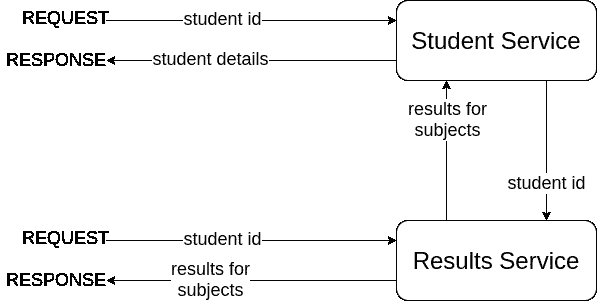**

**正如您在上面看到的，我们有两种服务**

1.  **学生服务**
2.  **结果服务**

**当学生 id 被传递给结果服务时，结果服务应该能够为以下主题提供结果。**

*   **数学**
*   **艺术**
*   **化学**

**学生服务应该能够提供学生的详细信息，包括他/她的给定学生证的结果。现在，结果是由结果服务提供的，因此学生服务应该在内部调用结果服务，并返回包括结果服务响应在内的学生详细信息。**

**我认为学生的详细资料是，**

*   **名字**
*   **年龄**
*   **性别**

**如果你有错误，你可以在这里看我的报告。**

## **让我们创建结果服务**

**打开你最喜欢的 IDE，在我的例子中，我将使用 IntelliJ IDEA。我建议您使用相同的 IDE 来避免任何混淆。**

****步骤 1 - >** 创建一个 **maven 项目**，名为**学生-信息-系统**。**

**为了使这成为一个 gRPC 项目，我们需要向 pom.xml 文件添加一些依赖项。除了主要的 gRPC 依赖项之外，我们还需要一些其他的数据库依赖项。对于这个项目，让我们使用 H2 内存数据库和 hibernate-core 来获得 JPA 功能。除此之外，让我们使用龙目岛使我们的生活更容易。**

****第二步** - >添加依赖关系**

**这些依赖项也可以在官方 gRPC github 库中找到。**

**复制下面的代码并粘贴到你的 pom 文件中。**

**下载完依赖项后，我们需要将 maven 插件脚本粘贴到 pom.xml 文件中。**

****第三步** - >添加插件脚本。**

**复制下面的代码并粘贴到你的 pom 文件中。**

**这个插件包含了将协议缓冲文件转换成实际代码的信息(你将在后面看到)。**

**现在配置部分结束了；开始编码吧。**

****步骤 4->-**创建 proto 文件。**

**在 src/main 文件夹下创建一个名为 Proto 的新目录。在该目录中创建两个新文件，分别名为***result . proto****和 ***student.proto*** 。***

**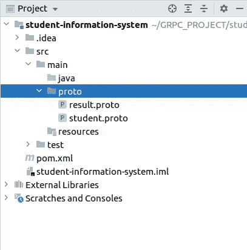**

*****result.proto*** 是我们用来定义结果服务描述的文件。而***Student . proto***文件用来定义学生服务的描述。**

**这个描述包括以下两点:**

1.  **信息**
2.  **服务**

**消息是我们服务的域类，它们是在客户机和服务器之间传递的对象。**

**服务包含方法，这些方法负责处理用户请求消息并向它们提供适当的响应消息。**

****步骤 5->-**定义 result.proto 文件。**

**将以下代码添加到您的 result.proto 文件中。**

**这就是我们在协议缓冲区中编写代码的方式。在协议缓冲区中，我们有一些预定义的数据类型，如果你需要，你也可以创建一些枚举。除此之外，我们还可以有数组列表，映射类的集合类型。这里，我使用了 enum(Grade)、string 和 int32(对于整数，我们使用 int64)。**

**通过上面的代码，您可以观察到的另一件事是，每个消息字段都添加了一个数字。例如，数字 1 被赋予**学生 id** 字段，数字 2 被赋予**数学**字段，以此类推。原因就像我之前说的那样，gRPC 使用 HTTP 2，而 HTTP 2 是一个二进制协议。对于二进制协议，我们不能传递纯文本，这就是为什么我们需要添加一个数字来表示该字段。因此，ResultResponse 的 student_id 将以二进制格式作为数字 1 传递。**

**在 ***result.proto*** 文件中，我们定义了请求消息和响应消息。并且只有一个名为 ResultService 的服务可用。这个 ResultService 导出一个方法 getResultForStudent()，该方法接受 ResultRequest 消息并提供 ResultResponse。**

**为了了解更多关于协议缓冲区的信息，点击[这里](https://developers.google.com/protocol-buffers)。**

****步骤 5- >** 定义 student.proto 文件。**

*****将以下代码添加到您的 student.proto 文件中。*****

**在 student.proto 文件中，我使用了两个枚举，一个表示年级，另一个表示性别。响应消息(StudentResponse)包含学生 id、姓名、年龄、性别和学生的结果。记住，我们必须从结果服务中获取这些结果。**

****步骤 6- >** 清理并安装你的 maven 项目。**

**一旦原型文件定义好了，您就应该清理并安装您的 maven 项目。在 IntelliJ 中，这可以很容易地完成，使用 ide 右侧的 maven 工具，您可以看到它带有 maven 标签(m)。**

**现在，您应该转到一个 proto 文件，单击 maven 工具，选择清理和安装选项，最后使用 play 按钮运行它。(您也可以使用命令行界面来实现这一点，但我更喜欢这种方式)。**

**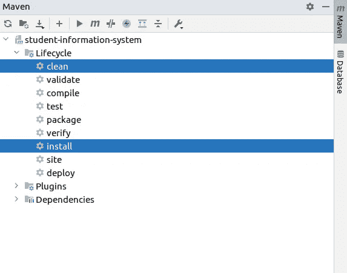**

**一旦 maven 编译成功完成，您将能够在项目的目标文件夹中看到一些自动生成的类。**

****

****步骤 7->-**创建实体类。**

**我们的项目将从 h2 内存数据库中检索给定学生 ID 的数据。因为我们使用 JPA，所以我们必须定义实体类来检索和添加数据到数据库。因此，在这一步中，让我们为结果表和学生表创建实体类。**

**在路径 src/main/java 下，创建一个名为“domain”的新包。在其中为结果和学生实体添加两个类。**

**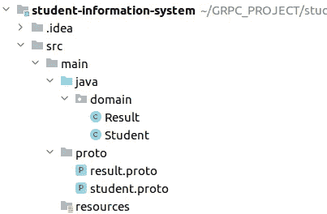**

**将以下代码添加到您的 Result.java 类中。**

**将下面的代码添加到你的 Student.java 类中。**

**正如您在上面看到的，我已经使用了 Lombok 注释来去掉那些 getters 和 setters。**

****步骤 8- >** 创建 persistence.xml 文件和数据初始化文件。**

**现在，这里的要点是，这不是一个弹簧启动应用程序。所以，你如何处理 spring 数据 JPA 不适用于这个项目。在这里，您应该配置您的数据源。否则，hibernate-core 依赖项将无法猜测数据存储在哪里。为了配置您的数据源，我们必须在路径 src/main/resources 下创建一个名为 **META-INF** 的新目录。在该目录中创建一个名为 persistence.xml 的新文件。**

**除此之外，如果您想在应用程序启动时用一些数据初始化数据库，您应该在路径 src/main/resources 下创建一个 SQL 文件。在这里，我将我的 SQL 文件创建为 **data.sql** 。**

**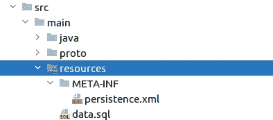**

*****将以下代码添加到 persistence.xml 文件中。*****

**正如您在上面所看到的，我们必须提到数据库的 h2 驱动程序、URL、用户名和密码作为属性。除此之外，我们还应该提供希望在应用程序启动时执行的 SQL 文件的名称。本例中是 **data.sql** 。**

*****将以下代码添加到您的 data.sql 文件中。*****

****步骤 9->-**创建 DAO 类。**

**DAO 类将帮助我们从数据库中检索数据。在这些类中，我们将实现从数据库中访问数据的方法。因此，每当我们需要数据时，我们可以调用 DAO 类中的方法并获取数据。**

**为了创建 DAO 类，让我们首先在路径 *src/main/java* 下创建一个名为' ***dao'*** 的包。在这个包中，让我们为我们的两个表创建两个 dao 类 ResultDao.java 和 StudentDao.java。**

****

**将以下代码添加到您的 ResultDao.java 类中。**

**如果您以前已经使用过 JPA，那么上面的代码可能会适合您。但是如果你觉得很难理解，我推荐你阅读我在代码中添加的注释。但是，简而言之，我们在这里所做的是创建一个实体管理器，并使用该管理器来查找我们正在寻找的数据。为了找到数据，我们必须提供学生证。**

**将以下代码添加到您的 StudentDao.java 类中。**

**StudentDao 类与 ResultDao 类非常相似，因为它们都执行相同的操作。**

**至此，数据处理的代码就完成了。现在让我们实现我们在原型文件中定义的服务。让我们从结果服务开始。**

****步骤 10- >** 实现 ResultService。**

**在路径 src/main/java 下创建一个名为 **service** 的新包。在包内部创建一个名为 ResultServiceImpl 的类。之所以将其命名为 ResultServiceImpl，是因为这是我们在 ***result.proto*** 文件中定义的 ResultService 的实现。**

**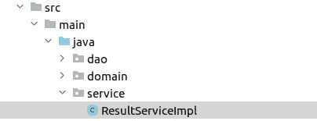**

**将以下代码添加到您的 ResultServiceImpl.java 类中。**

**我们对 ResultServiceImpl 所做的是获取请求消息并执行操作，最后返回响应消息。这里我们必须用 ResultServiceGrpc 扩展我们的类。ResultServiceImplBase 类。我们在结果原型文件中定义的方法在 ResultServiceImplBase 类中是可用的。因此，我们在这里应该做的唯一一件事就是覆盖该方法，并提供返回响应的逻辑。**

**结果服务完成！！！！**

****步骤 11- >** 创建结果服务的服务器。**

**现在，我们在 result proto 文件中定义的所有内容都已经在代码中实现了，我们现在要做的下一件事是创建一个为 ResultService 导出服务的服务器。该服务器监听特定的端口号。**

**在路径 src/main/java 下创建一个名为 **server** 的新包，并在包内创建一个名为 ResultServer 的新 java 类。**

**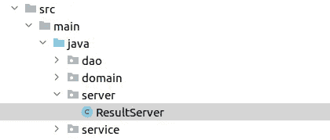**

**将以下代码添加到您的 ResultServer.java 类中。**

**酷！！！！**

**现在我们的结果服务器将监听端口 8080。但是，如果您记得我们需要将结果服务导出到学生服务，否则学生服务将无法提供学生的结果。为此，我们必须为 ResultService 创建一个客户端。通过这个客户端，其他服务能够从 ResultService 获得服务。因此，请记住，如果您想要将服务从一个 gRPC 服务导出到另一个 gRPC 服务，您将始终需要创建一个客户端。这里，我需要将 ResultService 导出到 StudentService，所以让我们创建一个 ResultClient。**

**创建一个名为 **client** 的包，并在包中创建 ResultClient 类。**

****

**将下面的代码添加到你的 ResultClient.java 类中。**

**所有的结果都完成了，现在让我们进入学生服务。从现在起，我们只剩下两步来完成这个项目。**

****步骤 12- >** 实现学生服务。**

**正如我们之前对 ResultServiceImpl 所做的那样，在**服务**包中创建一个名为 StudentServiceImpl 的新类。**

**将以下代码添加到您的 StudentServiceImpl.java 类中。**

**在这里，我们必须通过 ResultServer 的客户端连接它。为此，我们需要一个通道，这个通道是在 ManagedChannel 类的帮助下创建的。**

****步骤 13- >** 为学生服务创建服务器。**

**这与我们之前为结果服务创建的服务器非常相似。因此，只需在您的服务器包中创建一个名为 StudentServer 的新 java 类。**

**将以下代码添加到您的 StudentServer.java 类中。**

**搞定了。！！！**

**我们的项目已经完成，这是你的项目结构完成后的样子。**

**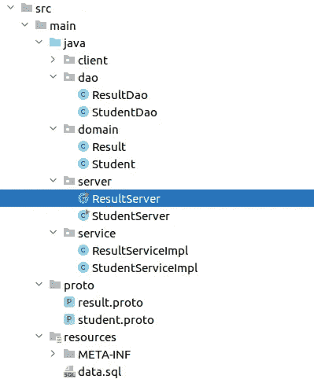**

****最后一步- >** 让我们运行我们的项目**

**首先，运行 ResultServer 和 StudentServer 类中的主要方法。如果它工作正常，您将能够在您的控制台上看到如下内容。**

**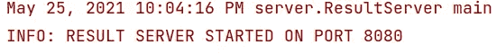****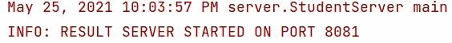**

**为了测试我们的项目，我们需要一个名为 **Bloom RPC 的附加软件。**点击[这里](https://github.com/uw-labs/bloomrpc/releases)下载。**

**下载完成后，打开它，使用左上角的加号按钮导入两个 proto 文件(result.proto 和 student.proto)。您将能够看到如下内容。**

**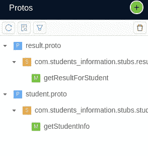**

**正如您在上面看到的，显示了我们通过服务导出的两种方法。所以首先让我们测试我们的 ResultService。单击 getResultForStudent 方法，在编辑器中为请求消息提供一个学生 id(本例中为 st1)，然后单击 play 按钮查看响应。**

**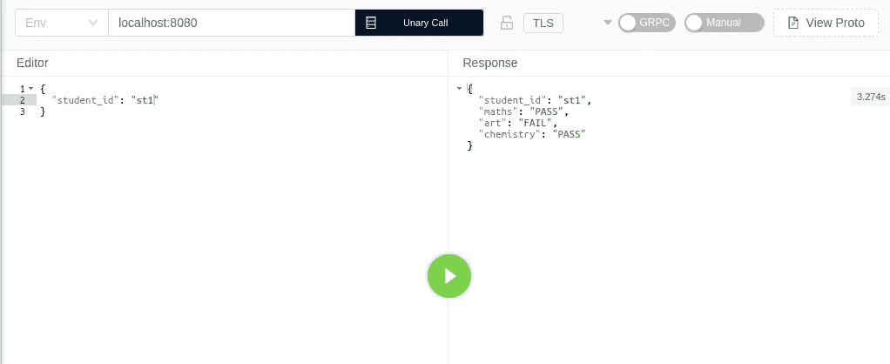**

**同样，如果您测试学生服务器，您将看到类似下面的内容。(记得把端口号 8080 改成 8081)。**

**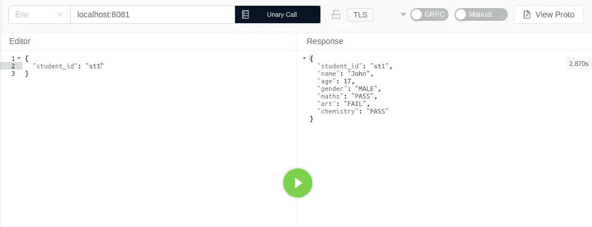**

**酷！！！！**

**我建议你也看看下面的视频。**

**这就是本教程的内容。让我们在另一个帖子里学习一些更有趣的东西，直到那时再见，希望你们都平安。**