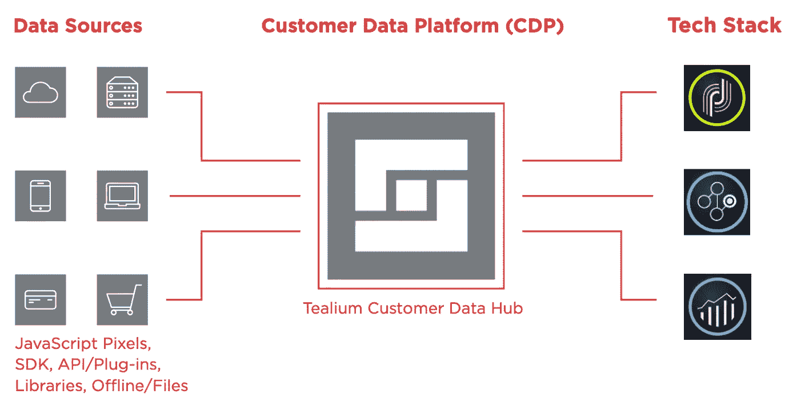
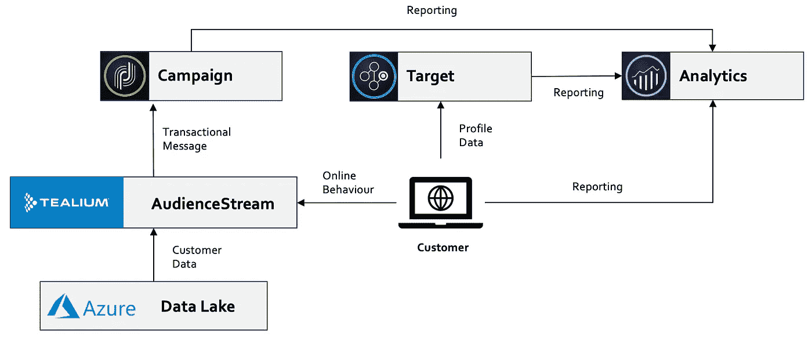

# 如何使用 Adobe & Tealium 创建集成用例

> 原文：<https://medium.com/geekculture/how-to-create-integrated-use-cases-with-adobe-tealium-f7638fcb6551?source=collection_archive---------6----------------------->

在本文中，我将通过一个多解决方案使用案例的示例来说明如何让 CDP、电子邮件、优化和分析协调工作。在这个特定的例子中，我将使用 Tealium AudienceStream、Adobe Campaign、Adobe Target 和 Adobe Analytics，但是无论您使用哪个供应商，理论都是一样的。

# #1 用例假设

每个 CDP 项目都将有一些已经确定的计划，这些计划基于现有的业务挑战或成熟以前成功案例的机会。然而，在一个项目中，很容易花太多时间在计划层面上，这仍然是一个关于“重新定位客户”或“优化付费媒体支出”的高层次讨论。这在一定程度上是因为确定计划意味着许多大的架构/实现决策已经可以采取了。例如，无论您的媒体支出优化是侧重于脸书还是谷歌，您都知道您需要一个数据层和标签管理器来收集在线数据，一个客户数据馈送到您的 CDP，以及一些连接器/目的地来激活这些受众。

然而，对于项目的成功和技术的长期采用来说，尽早进入详细的用例定义领域是至关重要的。这样做有三个主要原因:
i)它确实让业务涉众非常清楚地思考每个用例的目标是什么
ii)与第一点相关联——如果你知道目标是什么，并且你知道用例的每个组成部分看起来是什么，那么将它转化为将实际交付你所需要的东西(正确的数据，正确的位置， 正确的时间)
iii)每一个项目最终都必须经历一次优先化练习，所以如果你有一个用例列表，根据业务影响/实现工作进行优先化，那么你就避免了进入执行阶段并意识到你超出了数据层工作的范围，而这是你最有价值的用例的基础。

当涉及到创建详细的用例时，一个绝对清楚用例目标的简单方法是从一个假设开始。用例不是银弹，将会有许多基于在每次迭代中收集的知识的改进，就像在标准的优化周期中一样。在我的用例示例中，假设如下:
“我们认为，向掉出购买漏斗的客户提供相关的&及时消息将导致转化率的增加。我们将通过观察对订单的影响来知道这是真是假”。

# #2 客户之旅

这个特殊的用例针对的是考虑购买第二个产品的现有客户。它与许多垂直行业相关，但在银行、保险和电信行业非常普遍——有大量数据显示，如何通过增加拥有多种产品的客户群的百分比来提高客户忠诚度/保留率。

I)当保险客户将产品添加到购物车时:
-他们将被添加到受众流中的“放弃购物车 p1”受众
-产品数据将被发送到 Adobe Target(活动资格)
- Adobe Analytics 还接收所有相关的“添加到购物车”数据
注意:如果用户完成购买，他们将被从“放弃购物车 p1”受众中删除，并失去目标活动的资格

ii)当客户返回主页时，他们将看到基于他们添加到购物篮中的产品的目标内容

iii)当客户访问结束时，如果他们仍然是“购物车放弃 p1”受众，则会根据以下信息触发个性化电子邮件:
-受众流中的客户档案(包括购物车产品数据)
-活动中的客户档案(包括联系历史等)

iv)如果客户打开电子邮件，此信息不仅会反馈给营销活动和分析，还会传达给受众流。这也开始创造机会，让您能够区分如何与客户互动:a)完全忽略电子邮件 b)打开电子邮件但不点击 c)打开电子邮件并点击网站

v)如果客户点击电子邮件:
-他们会看到一个个性化的登录页面体验，该体验延续了电子邮件内容的故事
-他们将从“购物车放弃 p1”受众中移除，并被置于“购物车放弃 p2”

显然，这一客户旅程管理流程可能会继续发展更多步骤，变得更加复杂，但我只想举例说明这一部分流程所需的详细程度。

# #3 解决方案架构

解决方案架构包括以下组件:
- Adobe Analytics(报告)
- Adobe Target(定位)
- Adobe Campaign(电子邮件)
-Tealium audiensestream(CDP)
-Azure(数据湖)
- Tealium IQ(标签管理器)

上面选择的产品仅仅是生态系统的一个例子，同样的想法适用于任何技术。当然，根据所涉及的供应商，这个用例的某些部分可能比其他部分更简单。

# #4 配置

**Adobe Campaign**
i)第一步是为电子邮件设置事件触发器，这可以通过营销计划>交易消息>事件
ii)作为事件配置的一部分，您将定义事件的数据结构；这种数据结构需要与正在发送的受众流数据相匹配(更多内容请见下文)
iii)下一步是设计电子邮件内容；这样做的最大好处是，你不仅可以将你的营销活动数据作为个性化字段，还可以将受众发送的数据包括在内。流
iv)最后一个难题是确保将你的散列 customerID 作为查询字符串参数附加到所有电子邮件链接中

**Adobe Target**
i)第一部分是主页活动，考虑到用户可能不会打开所发送的电子邮件
ii)该活动将基于具有特定值的目标简档属性而被定向；当用户添加到购物车时，此配置文件属性值被发送到目标。如前所述，如果客户完成了购买，此配置文件属性将在确认页面上被覆盖
iii)第二部分是登录页面活动，其目标是用户从电子邮件中点击进入
iv)在 target 中定义目标受众有几种不同的方式，但可以简单地基于您附加到电子邮件链接的唯一跟踪代码(Adobe Analytics)值

**Tealium IQ**
i)当添加到购物车事件发生时，所有相关的产品信息等被发送到 AudienceStream
ii)如果您有一个良好的数据层实现，这一部分将已经发生；然而，即使情况并非如此，使用一些自定义事件处理程序也有可能实现相同的结果
iii)如 Target 部分所述，当添加到购物车事件发生时，信息通过配置文件属性直接发送到 Target
iv)当客户从电子邮件中点击进入时，部分登录页面查询字符串将包括他们的散列客户 ID，因此 Tealium 配置需要能够获取该值并将其作为 declaredID 传递给 Adobe(客户属性- > AA 分析，例如

**Tealium AudienceStream**
I)第一步是定义“放弃购物车 P1”&“放弃购物车 p2”受众
ii)连接器(即目的地)有几个不同的触发选项，这意味着受众逻辑可以更简单。
例如，当客户添加购物车时，他们符合“购物车放弃 p1”的条件；之所以有效，是因为连接器被设置为在访问结束时触发，这意味着完成购买的客户永远不会触发连接器
iii)回想一下营销活动部分，以及我谈到的将营销活动数据结构与受众流数据相匹配的部分， 这需要在连接器中发生
iv) Campaign 提供了一个很好的 API 预览特性，它确切地告诉您事务性消息 API 期望接收什么主体结构，然后在连接器中创建相同的结构只是一个简单的任务。
v)audience stream 的最后一部分是确保访问者拼接规则的设置方式允许查询字符串中的散列客户 ID 被识别为拼接关键字(跨设备识别/个性化)

# #5 摘要

我在配置部分没有提到的一件事是 Adobe Analytics 这样做的主要原因是因为在 AA 中对于这个用例没有任何特定的设置要求。然而，这绝对是这个用例成功(或失败)的基础，因为没有它你永远不会知道。通过一个经过深思熟虑的分析实施，您将能够分析整个客户旅程，从客户加入购物车的那一刻开始，一直到电子邮件点击和随后的现场行为。

除了强大的分析实现之外，如果您使用 Campaign，那么您应该利用 KPI 共享工作流；当然，您应该有一个经过深思熟虑的归因设置，这样您就可以根据那些参与您的电子邮件交付的客户的行为提供一个反馈回路。应该是对 Adobe Analytics 数据的分析推动了用例的新迭代和改进。

最初，我写这篇文章的目的是非常具体地谈论让 Adobe 和 Tealium 如此好地一起工作的不同集成。然而，当我开始写下一些想法时，它让我思考我跨项目的经历，结果我觉得将一些焦点放在计划、用例&所需的细节水平上是重要的。

正如您在文章中看到的，有些事情可能以“增加客户群中的产品持有量”计划开始，然后变成非常具体的“重新吸引放弃购物车的客户”用例，这反过来又导致不同触发点和编排层(正确的数据、正确的地点、正确的时间)的非常详细的计划。