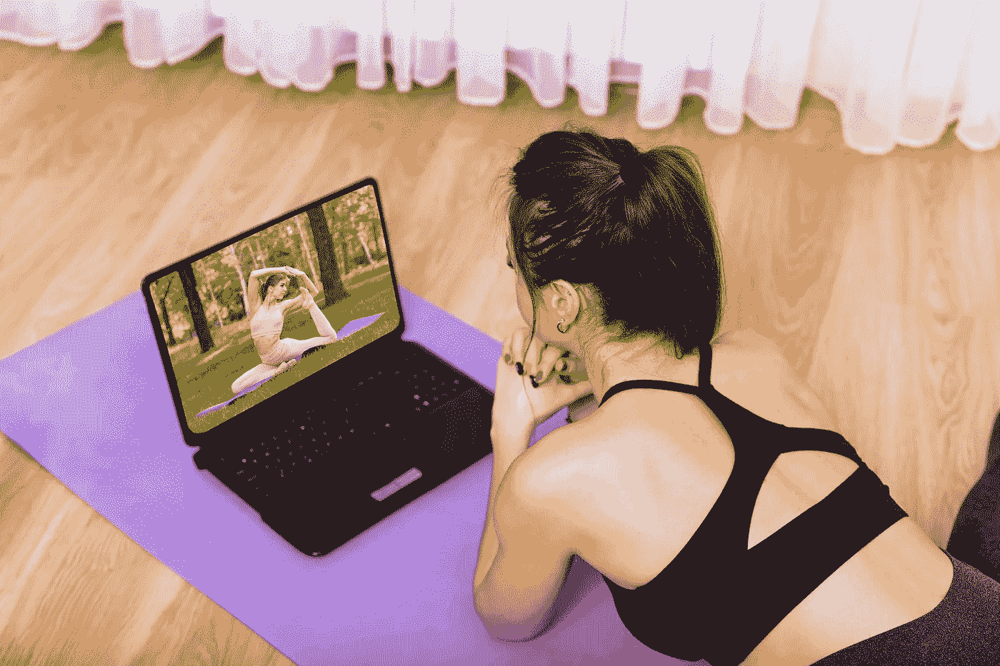

# 2022 年如何打造直播流健身课

> 原文：<https://medium.com/geekculture/how-to-create-live-stream-fitness-classes-in-2022-6eaf9f751890?source=collection_archive---------15----------------------->

虽然健身视频和在线健身课程平台并不是一个新概念，但最近按需健身课程的蓬勃发展使得无论你的日程安排有多忙或多满，都可以轻松出汗。无论你想避免有氧运动，尝试减压瑜伽课程，还是以肌肉增长为目标，总有一种课程可以满足你的偏好。

在 2020 年至 2024 年期间，全球健康和健身市场预计将以每年 7.7%的速度增长。到 2024 年底，这个行业预计价值近 966 亿美元。

2019 年，全球共有超过 20.5 万家健康健身俱乐部。2019 年，拉丁美洲健身俱乐部和健身行业创造的总收入略低于 61.5 亿美元。2019 年，美国有 41，190 家健身和健康俱乐部。

## **直播和预录训练的区别**

众所周知，在线实时流和实时训练课程是实时的，而预先录制的训练有更多的编辑，这是其中的一部分。每种健身方式都不会扩展到带有直播流的家庭格式版本。如果你的工作室课程依赖于专门的设备，是时候发挥创造力了。作为典型产品的补充，预录视频格式的锻炼是一个很好的选择。

## **在以下情况下选择直播:**

你要坚持你的常规课表。在不确定的时期，常规和正常是至关重要的。坚持一个平常的时间表会给人一种正常的感觉。想念你的在线瑜伽或有氧运动课吗？收集直播流上的每个人

你想保持真实并快速行动。使用实时流，不需要发布或编辑文件

你的观众可以在客厅里进行锻炼

你想与客户实时互动。根据您选择的设置方式，您可以启用与课程的互动，也可以保持这种互动

## 在以下情况下，选择预录锻炼:

有一个动作系列你需要演示一次，但你需要你的观众重复或表演一次。

你想要在一个位置选择最好的拍摄和做内容编辑

你需要更短的剧集或内容

你不介意观众是现在看还是以后看

您希望分享客户可以在任何给定时间进行的“每日锻炼”

您正在按比例搜索

# **直播健身课程——好处**

保护您的企业并为其未来做好准备——无论行业前景如何，您都可以利用可靠的收入流

**从低供给高需求中获利** —很多人需要网上健身班，但这个行业还没有饱和。你有机会彻底改变你的健身方式！选择你的[最佳在线健身流媒体平台](https://www.apptha.com/blog/best-fitness-streaming-platforms-for-live-ondemand-video/)。

**灵活的课程安排**——在线训练让你在自己方便的时候尽情挥汗如雨。它能让健身爱好者在一天中的任何时候都能轻松地锻炼。对于工作室和健身房来说，没有这样的便利，尤其是对于工作时间不确定的公司员工。你所要做的就是起床，铺好垫子，开始锻炼。

**现场互动** -健身课程是现场团体健身课程的一个入口。对于那些不喜欢在大班集体中锻炼而喜欢现场互动的人来说，在线课程是在私人化的环境中建立自信的好方法，速度适合你。音乐与锻炼相结合，可以在家中进行有效的锻炼。

**提供多种形式—** 通过在线课程，有多种健身锻炼和工作室可供选择。每个人都有适合自己的运动——从像旋转、有氧运动和人体泵这样的高能量运动到像瑜伽和普拉提这样的温和的强化运动。观众可以在一天中的任何时间，在专属教练的指导下，以适合他们的方式体验真正的锻炼。有了无限的选择，你很可能会找到一个与你的兴趣相匹配的课程，你可以享受。

**在家舒适享受专业指导** —日常锻炼者可以很快进入健身轨道。在线课程取代了你自己浏览锻炼数据的方式，有合格的教练指导你进行训练，以合适的方式安排锻炼时间，并遵循正确的流程。这些训练器提供详细的练习和指导，让您可以在家中舒适地进行实时流训练。

# **健身课程直播**

了解以下如何创建实时流健身班。你将确切知道如何开始直播健身课程

## **1。确定健身课程的类型**

如何开始直播健身的第一步是确定你想直播哪种类型的健身课程。这会影响你的方法和你需要的设备。成功的虚拟健身企业是围绕许多不同类型的培训创建的，其中包括:

普拉提健身法

有氧运动

力量训练

横档

有氧运动法

HIIT

如果你不确定从哪里开始或者如何开始网上健身课程，选择一种类型的课程——你最擅长的课程——然后从这一点开始增加你的时间表。你是否在想——我该如何直播我的健身课程？

## **2。选择点播直播平台**

如何直播串流健身课？你需要找到一个平台来托管直播流。你可能会想到 Instagram、Zoom 或脸书直播来播放锻炼视频以及直播和点播流媒体。如果你想为你的业务和直播健身课程创建一个成功的[在线健身平台](https://www.vplayed.com/fitness-streaming-platform.php)，你需要一个包容性的平台，帮助接触更多的受众，并将他们转化为客户。你肯定会使用一个已经帮助许多直播健身企业建立成功的流媒体平台的平台。

## **3。定制您的网站平台**

下一步是定制直播健身视频的新网站。你必须给它一个外观和感觉来反映你的训练风格，并且是一个你的客户想要训练的地方。

## **4。选择商业模式**

在这一步，你将选择一个商业模式，你将利用直播视频赚钱。

有两种商业模式需要注意:

i. **按课程付费** —个人付费参加直播健身课程的个人课程

二。**会员制**——人们每月支付一定的费用来参加会议。

这些选择反映了客户将如何支付他们的健身房。一些人将付费参加一次性课程，其他人将获得实时健身课程，作为其会员套餐的一部分。会员资格会产生稳定的月收入。不断扩大的受众带来的持续收入提供了稳定性，让你专注于提供优质服务。你的收入是由观众数量决定的，而不是有多少人参加了一场现场直播的健身锻炼。

## **5。经过优化的直播设置**

你必须准备好直播设备。你将需要的核心设备是各种直播健身班。对跆拳道有益的东西对有氧舞蹈课也是有益的。如果他们能很好地听到您的指令，直播的质量将取决于视频的清晰度，即直播在设备上的显示质量和音频质量。

## **6。视频播放器**

您的视频播放器和质量决定了客户在他们的设备上观看您的视频流的效果。重要的是，你的视频流要有最好的质量，并能快速有效地加载。质量差的直播流和直播健身课已经被证实损失高达 25%的收入。

## **7。安全平台**

音乐是你面对面健身锻炼的核心。事实证明，在虚拟环境中体验音乐是很棘手的。在线视频和录音室音频之间有许多法律变量。

## **8。健身班的推广**

第一个实时流应该安排在订户可以参加的合理时间。它应该是可达到的，并且简单地适合时间表。一些让人数最大化的技巧是做一个在线倒计时，明确什么，什么时候，为什么，用预告片，偷窥等等创造期待。你应该列出你可以发布或分享信息流的地方，如电子邮件列表、Whatsapp、社交媒体和你的网站主页，并在那里推广健身课程。

## **结论**

这个博客会给你一个明确的想法，如何生活在健身班的健身流中，为什么这对你的健身事业的未来至关重要。