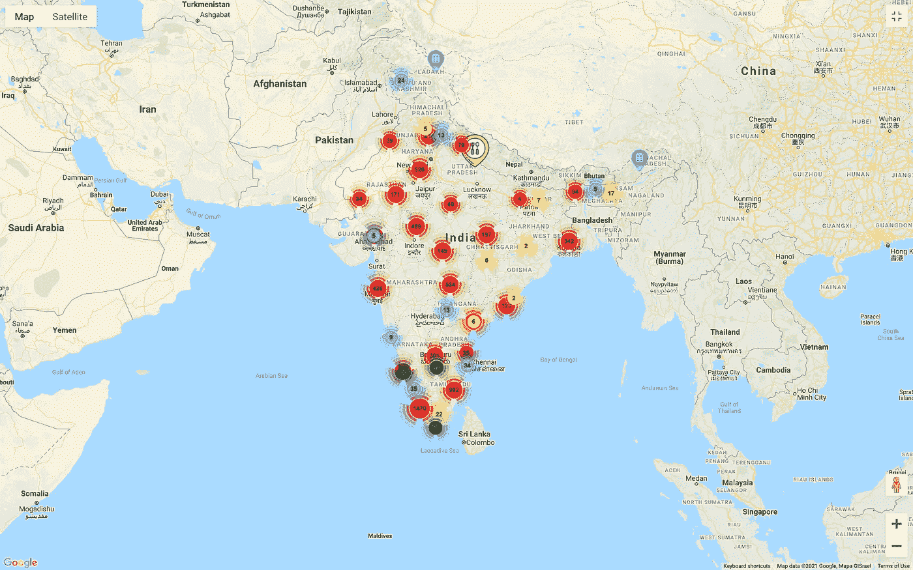

# 如何在谷歌地图上创建标记集群

> 原文：<https://medium.com/geekculture/how-to-create-marker-clusters-on-google-maps-7c9f61b869c9?source=collection_archive---------0----------------------->

Source [cowinmap.com](https://cowinmap.com/)

当地图上有很多标记时，地图可能会变得混乱。有一个很酷的方法可以绕过它。您可以使用标记聚类，以便 Google map 根据标记的位置自动将标记聚类成组。当您单击特定标记时，它会放大并显示所选位置标记的子聚类。