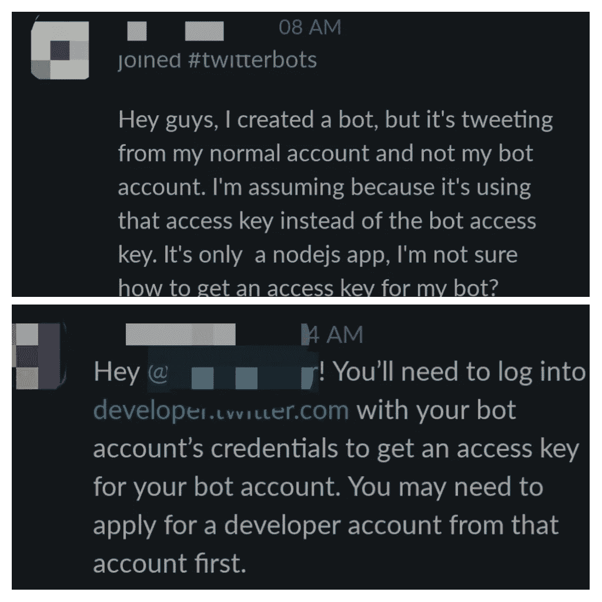
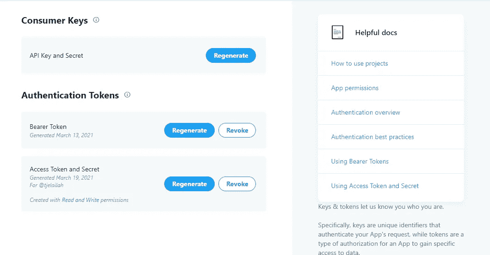
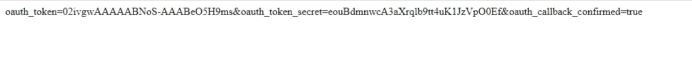
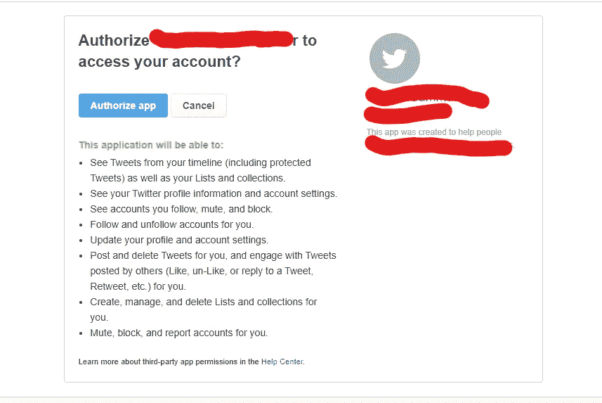
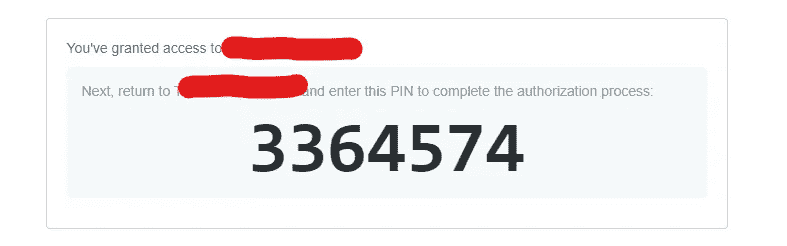

# 如何用一个 Twitter 开发者账户创建多个机器人

> 原文：<https://medium.com/geekculture/how-to-create-multiple-bots-with-a-single-twitter-developer-account-529eaba6a576?source=collection_archive---------2----------------------->

Photo by [Alex Knight](https://unsplash.com/@agk42?utm_source=medium&utm_medium=referral) on [Unsplash](https://unsplash.com?utm_source=medium&utm_medium=referral)

我在开发我的第一个 Twitter 机器人时遇到的一个问题是，这个机器人是从我的个人账户而不是我的机器人账户发微博的。在做了一些研究之后，我意识到这是开发人员社区中的一个普遍问题。

但不幸的是，我遇到的 Twitter 社区[的回答](https://twittercommunity.com/t/multiple-twitter-accounts-different-languages-how-do-can-i-use-a-single-dev-account/149272)对初学者来说并不太有解释力。在我自己设法解决这个问题的几个星期后，有人在[机器人制造商的](https://botmakers.org/) Slack 频道上问了一个类似的问题，这是我写这篇文章的线索。

Screenshot by Jelilat Anofiu from [Botmakers](https://botmakers.org/)’ Slack channel

这张截图中提出的解决方案是为机器人申请一个新的开发者账户，但是你会发现从长远来看这是不实际的。

这是为什么呢？👇

作为一个业余爱好者，他想创建许多 Twitter 机器人来取乐，或者作为一个为各种组织创建 Twitter 机器人的专业人士，为你创建的每个机器人申请一个新的开发人员帐户是非常不切实际的，可能会耗费时间和精力。

正如一些人在评论中指出的那样，拥有多个开发者账户也是违反 Twitter 规章制度的。

> *"* [*一个 Twitter 用户可以拥有一个开发者账户，也可以是一个团队账户的成员*](https://developer.twitter.com/en/docs/developer-portal/faq#application-process-faq) *"* 。

为了让想要创建多个 Twitter 机器人的开发者更容易，我将分享一个如何将一个 Twitter 开发者帐户与多个机器人相关联的分步指南。

*如果你还没有 Twitter 开发者账户，我在我的* [*上一篇文章*](https://blog.formpl.us/analyzing-tweeps-favorite-spotify-podcasts-a29ba6b11fbd) *中写了一个简单的指南，告诉你如何创建一个。*

# 术语

为了更好地理解本文的其余部分，您需要熟悉一些 Twitter 开发人员术语。

1.  [**项目**](https://developer.twitter.com/en/docs/projects/overview) **:** 它们可以用来根据您打算如何使用 Twitter API 来组织您的工作，管理您对 API 的访问，还可以监控使用情况。每个项目都包含一个应用程序，您可以使用它来生成身份验证凭据。
2.  [**App**](https://developer.twitter.com/en/docs/apps/overview)**:**App 是任何进行 API 调用的程序、工具或 bot。Twitter 向应用程序授予认证证书，而不是帐户。因此，您需要创建一个能够进行 API 调用的应用程序。
3.  [**不记名令牌**](https://developer.twitter.com/en/docs/authentication/oauth-2-0) **:** 这种方法专门针对需要对 Twitter 应用进行只读访问的开发者。它特定于某个应用程序，用于代表您的应用程序对请求进行身份验证。
4.  **Oauth 密钥& Oauth 令牌秘密:**也分别称为访问令牌和访问秘密，它们是用于认证 OAuth 1.0a API 请求的特定于用户的凭证。
5.  [**消费者密钥&消费者秘密**](https://developer.twitter.com/en/docs/authentication/oauth-1-0a) **:** 也叫 API 密钥和 API 秘密，它类似于你的 Twitter 账号的邮箱和密码。有了这两个令牌，您可以对个人帐户执行任何读写权限。这就是我们需要创建一个程序，从一个机器人的帐户鸣叫。

如果您希望您的应用程序代表与您在 [Twitter 开发者应用程序的](https://developer.twitter.com/en/docs/basics/apps/overview)详细信息页面上的开发者帐户相关联的同一 Twitter 帐户发出请求，您可以生成自己的消费者密钥和消费者机密。

但是，如果您想代表另一个帐户提出请求，您需要遵循以下步骤。

*   访问"https://twitter.com/oauth/request_token 的网址？oauth _ consumer _ key =<your consumer="" key="">& oauth _ callback = OOB”。也就是用于请求 Twitter 开发人员访问的帐户。</your>

类似这样的东西应该会出现在您的浏览器中。这是一个临时令牌，使用一次后就会过期。复制令牌并粘贴到某个地方。

*   现在，登录到你的机器人帐户，然后粘贴这个网址在浏览器"https://twitter.com/oauth/authenticate？oauth_token= <newly generated="" token="">"。用之前复制的新生成的 oauth_token 替换链接中的 oauth _ token。</newly>

现在，点击**授权 app** 授予访问权限。点击之后，你应该会看到一个自动生成的 7 位数。把那个号码抄在某个地方。

最后，在您的浏览器上访问下面的 URL，您将获得通过您的 bot 帐户发布所需的 OAuth 令牌。

"[https://twitter.com/oauth/access_token?oauth_token=<新生成的 OAUTH 令牌>OAUTH _ verifier =<7 位数 PIN 码>](https://twitter.com/oauth/access_token?oauth_token=UdsAfAAAAAABNoS-AAABeO5QSzw&oauth_verifier=3364574)

我们上面强调的所有步骤都是访问第三方 Twitter 账户所需的[三脚 OAuth 流程](https://developer.twitter.com/en/docs/authentication/oauth-1-0a/obtaining-user-access-tokens)的一部分。虽然略有不同，但这种方法也可以用于通过 Web 应用程序接收读&写权限。

> *如果你觉得这篇文章有帮助并且愿意支持我，你可以发一些代币到我的以太坊地址 tjeilalah . eth(*0x 66 Fe 4806 CD 41 BCD 308 c 9 D2 f 6815 AEF 6 b 2 e 38 F9 a 3)

# 参考

[https://twitter.com/filtertrend](https://twitter.com/filtertrend)

[https://Twitter community . com/t/multiple-Twitter-accounts-different-languages-how-do-can-I-use-a-single-dev-account/149272](https://twittercommunity.com/t/multiple-twitter-accounts-different-languages-how-do-can-i-use-a-single-dev-account/149272)

[https://botmakers.org/](https://botmakers.org/)

[https://blog . formpl . us/analyzing-tweeps-favorite-Spotify-podcasts-a 29 ba 6b 11 FBD](https://blog.formpl.us/analyzing-tweeps-favorite-spotify-podcasts-a29ba6b11fbd)

[https://developer.twitter.com/en/docs/projects/overview](https://developer.twitter.com/en/docs/projects/overview)

[https://developer.twitter.com/en/docs/apps/overview](https://developer.twitter.com/en/docs/apps/overview)

[https://developer . Twitter . com/en/docs/authentic ation/oauth-2-0](https://developer.twitter.com/en/docs/authentication/oauth-2-0)

[https://developer . Twitter . com/en/docs/authentic ation/oauth-1-0a](https://developer.twitter.com/en/docs/authentication/oauth-1-0a)

[https://developer . Twitter . com/en/docs/authentic ation/oauth-1-0a/getting-user-access-tokens](https://developer.twitter.com/en/docs/authentication/oauth-1-0a/obtaining-user-access-tokens)