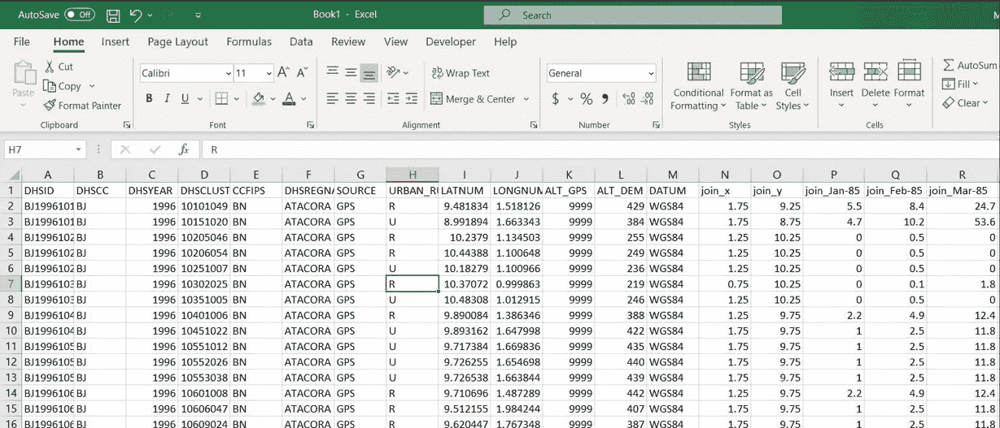

# 如何创建温度的非线性测量

> 原文：<https://medium.com/geekculture/how-to-create-non-linear-measures-of-temperature-f533df51eca7?source=collection_archive---------57----------------------->

不同领域的研究人员，如环境研究和经济学，在研究温度对一系列健康结果的影响时，经常使用非线性的温度测量方法。温度的非线性可以用下面的例子来解释，比如说，温度从 [25C 上升到 27C 对健康的影响远没有从 34C 上升到 36C](https://www.nature.com/articles/s41598-018-28392-z) 严重。这篇博文讨论了温度的非线性测量，并提供了在 r。


Image Source: [https://unsplash.com/@sumekler](https://unsplash.com/@sumekler)

*   **数据**

本博客中使用的温度数据可在[网站档案](http://climate.geog.udel.edu/~climate/html_pages/download.html)上获得，标题为[地球气温:1900–2017](http://climate.geog.udel.edu/~climate/html_pages/download.html#T2017)。这种全球 0.5*0.5 度经纬度网格温度[数据](http://climate.geog.udel.edu/~climate/html_pages/download.html#T2017)可以与住户调查或任何行政级别的数据匹配，这些数据具有相同类型的采样单位坐标。我们还使用了[人口和健康调查](https://dhsprogram.com/data/) (DHS)，它提供了所需的坐标，并可以与温度数据相结合。然后，我们可以调查区域层面的温度对与抽样单位(家庭和个人)相关的各种变量的影响。

*   **研究问题**

下面是两个研究问题的例子。为了回答上面提到的问题，我们需要一个温度测量，这将在博客的其余部分解释(用代码)。

1."一生中每月平均温度对个人的身体质量指数有什么影响？"

2.“上一年的平均气温对一个人短期患病有什么影响？”

# 测量

我们将像研究人员经常做的那样，把测量称为“累积度-月”。为了构建这个测量，我们需要假设一个温度阈值(这个阈值是位置特定的)。例如，如果我们假设阈值为 25C，则可以使用下面的示例来解释“累积度大于 25C 的月份”的度量，例如，在 2005 年，有两个月的温度超过了阈值 25C。一个月，一个是 30C，一个是 40C。那么“大于 25C 的累积度-月”将是(30–25)+(40–25)= 20。根据这个定义，我们将计算两个温度测量值。

(1)度月> 25C，终生有效，

(2)在调查前的 12 个月中，度月> 25C。

**第一步**

我们的第一步是使用 Moumita Ghorai 的教程[将温度数据加入 DHS 坐标。将 DHS 数据与温度数据匹配将产生一个横截面数据集，其中所有特定月份的温度都显示为列。下面是最终结果的一部分:](/swlh/easiest-way-to-convert-data-from-geospatial-format-to-csv-d1c81f571238)



What you see after merging the temperature data with DHS coordinates

我们用前缀“month”和对应于 [DHS 变量的月份号 b3](https://dhsprogram.com/pubs/pdf/DHSG4/Recode7_DHS_10Sep2018_DHSG4.pdf) 对月份变量进行序列化。以*月*为前缀的温度变量包含我们感兴趣的一年中所有月份的温度。

为了计算儿童一生的平均体温，下一步是

(1)选择 b3 和 hv003*中提到的月份，

(2)根据这些月份温度变量计算寿命温度。

*DHS 数据码本在这里是。

**第二步**

在下面的 R 代码块中，我们将最终数据集称为 *df* 。第一个数据块将生成 DHS 儿童一生的平均体温- *avgtemp-* (截至访谈月)。

```
#... Run this code on R!browseURL("[https://dhsprogram.com/pubs/pdf/DHSG4/Recode7_DHS_10Sep2018_DHSG4.pdf](https://dhsprogram.com/pubs/pdf/DHSG4/Recode7_DHS_10Sep2018_DHSG4.pdf)")# HV008 Century month code of date of interview, calculated from HV007 and HV006 (see note on century month codes)
#B3 Century month code for the date of birth of the child (see note on century month codes).#install.packages("dplyr")
library(dplyr)df$avgtemp<-NA
for (i in 1:dim(df)[1]){ a1<-df$hv008[i]
  a2<-df$b3[i]
  a3<- a2-a1
  sumtemp<-vector()

  for (j in 0:a3) {
    damju<- df[i,paste0("month", eval(a1+j))]
    sumtemp<-c(sumtemp,damju)
  }
  df$avgtemp[i]<-mean(sumtemp)
}
```

然而，这个变量不会对儿童产生非线性的温度测量。因此我们需要非线性测量！接下来，我们创建平均温度高于 25℃的天数的总温度—度月> 25℃或*度月*。

**(1)总度月> 25C 过一生**

```
#... Run this code on R!#install.packages("dplyr")
library(dplyr)browseURL("[https://dhsprogram.com/pubs/pdf/DHSG4/Recode7_DHS_10Sep2018_DHSG4.pdf](https://dhsprogram.com/pubs/pdf/DHSG4/Recode7_DHS_10Sep2018_DHSG4.pdf)")# HV008 Century month code of date of interview, calculated from HV007 and HV006 (see note on century month codes)
#B3 Century month code for the date of birth of the child (see note on century month codes).df<-data.frame(df)
colnames(df)
df$degmonth<-NA
for (i in 1:dim(df)[1]){

  a1<-df$b3[i]
  a2<-df$hv008[i]
  a3<- a2-a1
  sumtemp<-vector()

  for (j in 0:a3) {
    damju<- df[i,paste0("month", eval(a1+j))]
    sumtemp<-c(sumtemp,damju)
  }

  #turn values less than 25 into NAs
  for (m in 1:length(sumtemp)) {
    if (sumtemp[m] < 25) {
      sumtemp[m] <- NA
    } 
  }

    #drop NAs, subtract 25 from every value and create sum of temp above 25
  sumtemp<-sumtemp[!is.na(sumtemp)]

  for (n in 1:length(sumtemp)) {
    sumtemp[n]<-sumtemp[n]-25
  }

  df$degdays[i]<- sum(sumtemp, na.rm = TRUE)

}
```

截至调查月份的最后一年— *,最终温度测量值为度日> 25C。*

**(2)截至调查月**的前 12 个月中的总学位月> 25C

```
#... Run this code on R!#install.packages("dplyr")
library(dplyr)browseURL("[https://dhsprogram.com/pubs/pdf/DHSG4/Recode7_DHS_10Sep2018_DHSG4.pdf](https://dhsprogram.com/pubs/pdf/DHSG4/Recode7_DHS_10Sep2018_DHSG4.pdf)")#HV008 Century month code of date of interview, calculated from HV007 and HV006 (see note on century month codes)
#B3 Century month code for the date of birth of the child (see note on century month codes).df<-data.frame(df)
colnames(df)
df$yrdedeg<-NA
for (i in 1:dim(df)[1]){

  a2<-df$hv008[i]
  a3<- a2-12
  sumtemp<-vector()

  for (j in 0:a3) {
    damju<- df[i,paste0("month", eval(a1+j))]
    sumtemp<-c(sumtemp,damju)
  }

  #turn values less than 25 into NAs
  for (m in 1:length(sumtemp)) {
    if (sumtemp[m] < 25) {
      sumtemp[m] <- NA
    } 
  }

  #drop NAs, subtract 25 from every value and create sum of temp above 25
  sumtemp<-sumtemp[!is.na(sumtemp)]

  for (n in 1:length(sumtemp)) {
    sumtemp[n]<-sumtemp[n]-25
  }

  df$yrdedeg[i]<- sum(sumtemp, na.rm = TRUE)

}
```

**** [*西密歇根大学经济系 Moumita Ghorai*](https://sites.google.com/view/moumitaghorai/home)*是这篇博文的合著者。*