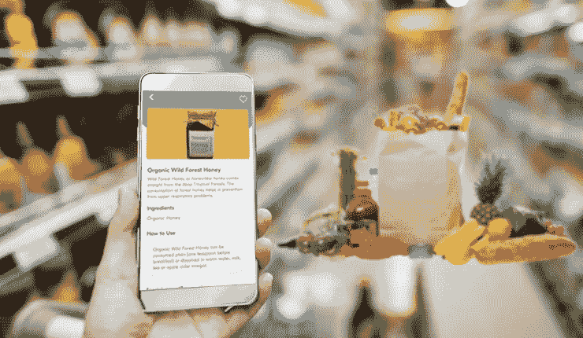
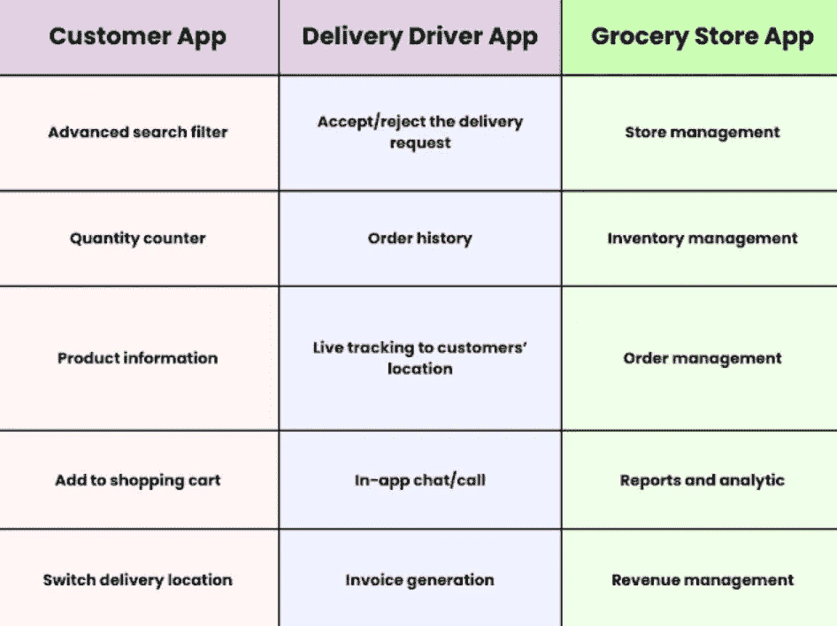
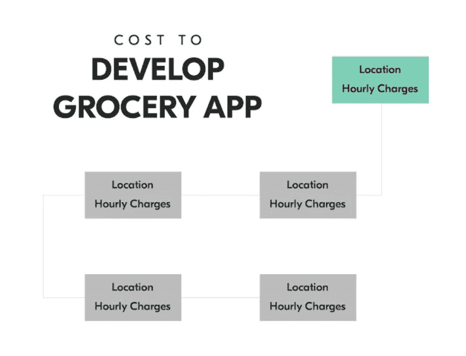

# 如何创建在线杂货配送 App？遵循以下步骤

> 原文：<https://medium.com/geekculture/how-to-create-online-grocery-delivery-app-follow-these-steps-8037646bacf5?source=collection_archive---------15----------------------->

想轰轰烈烈地进入竞争激烈的网上杂货购物市场吗？现在是加入这个有利可图的行业的时候了。这篇文章将向您简要介绍在杂货交付应用程序开发过程中需要遵循的步骤，以简化杂货交付的方式，并提高传统超市商店的可见性和利润。

疫情结束后，杂货店显然需要数字化运营，以确保更多的顾客了解他们提供的产品。

除此之外，你还将接受如下方面的教育-

*   杂货交付应用受欢迎程度的市场统计
*   应用程序采用的商业模式
*   这款应用遵循的收入模式
*   典型在线购物应用程序中的功能
*   如何搭建一个杂货配送 app？
*   开发杂货交付应用程序的成本

## 网上购物流行程度的市场统计

我们收集了以下在线杂货购物解决方案的市场统计数据，这些数据描述了这些解决方案的总体盈利性、利润性和受欢迎程度。

1.  2021 年市场估值为 2857.0 亿美元。
2.  2022 年至 2030 年间，在线杂货购物业务将以 25.3%的 CAGR 增长。
3.  2022 年，在线杂货应用的使用量增长了 11%。
4.  到 2026 年，按需杂货应用的使用将增长 20.5%。

通过这些数字，你可以很好地制定拥抱[杂货交付应用程序开发](https://www.groceryappclone.com/)是正确的方法。它要求坚持遵循一些重要的步骤。

## 如何进行杂货配送 App 开发？

当你决定接受杂货应用程序开发服务，为你的超市商店赋予一个数字形象，并创建一个在线杂货购物企业时，你必须记住一些要点。

下面讨论同样的问题。

> ***商业模式***

当你建立一个网上购物解决方案时，你必须知道商业模式。

**这里主要有三种——**

*   杂货店直接向顾客提供订单的库存模型。
*   多供应商模式是客户从应用程序下单，然后送货上门。
*   超本地模式是客户进入应用程序，然后将订单发送到当地杂货店和商店。

请务必深入了解这三个方面，并采用一个与您的业务需求和客户要求同步的方面。

> ***App 功能***

确保应用程序的独特性至关重要。因此，您需要在解决方案中包含一些功能。在此之前，你需要注意有三个主要的细分市场——顾客、送货司机和杂货店。一旦你有了这方面的知识，你就需要知道它的特性。这里有一些你可以特别加入的。

了解不同的功能并包含它们，您将能够确保用户参与度保持在较高水平，并且所有其他两个细分市场将长时间粘在解决方案上。

> ***选择合适的收入模式***

接下来重要的是选择一种收入模式，让你的网上购物解决方案增加利润。

*   向应用程序上的卖家收取销售佣金。
*   通过要求买家和送货司机支付送货费。
*   通过让供应商支付会员费。
*   让供应商为上市买单。

从这四个中，选择一个可以让你的网上购物业务增加收入和利润的。

> ***打造健壮 App***

当你创建一个杂货应用程序时，你必须专注于使它健壮。因此，使用流行的技术堆栈。

**这里有一些你可以用的-**

> *后端— Laravel
> 
> *管理面板— Laravel Nova、JavaScript、HTML5 和 CSS
> 
> *移动开发— React Native 和 Java for Android 以及 Swift for iOS
> 
> *数据库— MongoDB、MySQL
> 
> *支付— Braintree、PayPal、Stripe
> 
> *地理位置—谷歌地图应用编程接口
> 
> *实用程序— Twilio、Firebase、Google 和脸书软件开发工具包
> 
> *服务器- AWS

请确保您了解这些，以便最终解决方案能够稳健运行，并且根本不会发生崩溃事件。

> ***购买现成杂货配送 App***

杂货交付应用程序开发的最后一个关键步骤是购买现成的杂货交付应用程序，也称为杂货应用程序克隆。即将推出的解决方案易于定制和修改。

但是，要知道市场上哪种解决方案最好并不容易。为了确定这一点，请检查以下方面-

*   检查杂货店克隆应用程序开发期间使用的技术堆栈。
*   评估它的开源性质。
*   检查其中存在的特性，并了解其可修改的本质。

了解了杂货交付应用程序开发过程中需要采取的不同步骤，现在关注成本因素至关重要。

## 开发杂货应用程序的预计成本

当你计划数字化你的杂货店和建立一个网上购物解决方案时，你必须关注财务因素。例如，如果你正在利用现成的杂货交付应用程序，就可以很容易地在很大程度上节省资金。

这里给你一个粗略的数字，在不同的地方，按小时计算，开发一个杂货应用程序的[成本。](https://www.groceryappclone.com/blog/gopuff-like-app-development-steps-features-costs/)

值得注意的是，在杂货交付应用程序开发期间，控制财务至关重要。然而，一些因素可能会影响预算。

*   基于应用程序设计
*   基于特征
*   应用程序复杂性
*   在外景地

这是至关重要的，因此你保持应用程序尽可能简单，并保持一个用户友好的方法设计策略。这将使你的预算保持完整，并确保你的财务保持在严格的检查。

## 关键要点

阅读这个全面的指南，你可以理解拥抱杂货交付应用程序开发是正确的方法，特别是如果你想数字化你的杂货设置，并创建一个在线杂货购物解决方案。由于从头开始开发应用程序会消耗大量的时间和资金，因此用现成的杂货交付应用程序或杂货克隆应用程序来增强自己的能力是一个好主意。

由于易于修改和定制，该解决方案将有助于杂货店在更大比例的客户中提高知名度。它还将支持他们在短时间内实现可伸缩性和增长，方法是根据未来需求为客户和业务需求提供服务。

## 包扎

计划成为 2857 亿美元盈利性杂货应用市场的一部分？想获得一个在线杂货购物解决方案的数字基础吗？联系一家专门从事杂货应用克隆开发的杂货配送应用开发公司。他们将利用自己的专业知识为您提供解决方案，帮助您在短时间内做好业务准备，无缝满足客户需求，让您的利润不断增长，从而让您在没有任何困难或挑战的情况下获得最大回报。