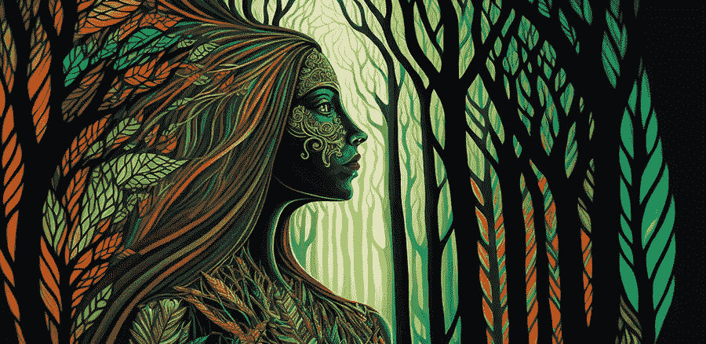

# 如何创造迷幻的人工智能艺术

> 原文：<https://medium.com/geekculture/how-to-create-psychedelic-ai-art-170b740c6aa8?source=collection_archive---------1----------------------->

## 一种新流派的重新觉醒

made by author on Midjourney

2015 年 5 月，Alex Mordvintsev(谷歌的 ML 研究科学家)在凌晨 2:00 从噩梦中醒来，决定尝试一项实验。

他一直致力于一个输出算法图像的神经网络项目，并希望尝试一些新的东西。他希望算法能够探测到隐藏区域的模式，而人类通常不会…