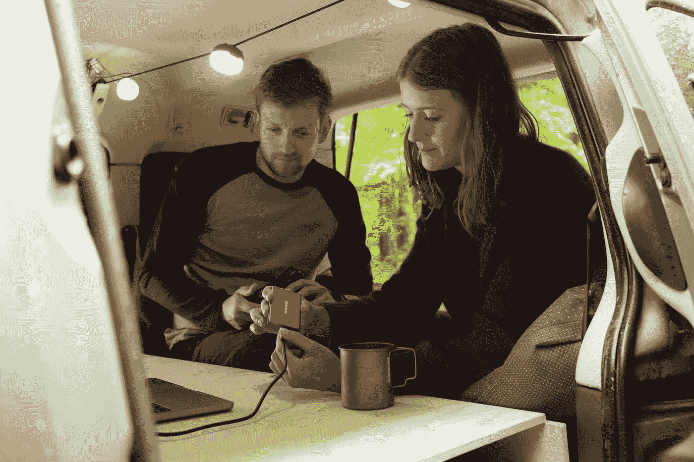

# 如何为终极工作狂创造终极的旅途工作空间

> 原文：<https://medium.com/geekculture/how-to-create-the-ultimate-on-the-road-workspace-for-the-ultimate-workaholics-a7d3883d05c0?source=collection_archive---------13----------------------->

你是一个目标是跟上你的工作量的超常者吗，不管你在哪里，即使你不得不在旅行中工作？无论你是决定在假期处理一些与工作相关的琐事，还是想在旅途中赚点外快，你都有各种方法在旅途中舒适高效地完成工作。如果你的目标是在工作中坚持不懈，下面的建议会让你的经历变得积极，不管你决定在哪里做日常工作。

# 选择一个合适的工作区域

你的[家庭办公室](https://barry-davret.medium.com/working-from-home-tanked-my-productivity-24ebe08a792)可能有你需要的一切，并设置为使工作变得轻而易举。因为你在旅途中不会有这种设置，你必须做出牺牲和改变，以保证你有最好的工作条件。创建一个合适的工作区域可以在确保生产力方面发挥重要作用。

例如，如果你带着野营车或房车旅行，你可以用一张桌子、一把椅子和适当的电子设备来创建一个临时办公室。尽量靠近窗户，这样你工作时就能看到室外的风景。此外，考虑添加一些植物和一些图片，因为这样做会帮助你把一个临时的工作空间变成你的个人天堂。

如果你开的是小型车，你可能需要制定其他计划。有些人不介意在车里工作，而有些人喜欢更大的空间。这取决于任务的复杂程度。例如，如果你必须打字，在你的车上工作可能不是最好的主意，因为你可能无法进入一个符合人体工程学的舒适位置。相反，你可以很容易地在[开一个虚拟会议](https://www.forbes.com/sites/forbesagencycouncil/2020/10/07/how-to-conduct-an-effective-virtual-meeting/?sh=11853bf627bf)。

如果你不想在车里工作，可以考虑去咖啡馆、网吧或图书馆工作。这些地方大部分都有免费 Wi-Fi 和你需要设置的空间。

或者，如果你打算沿途找住处，你可以研究一下房间里有书桌的酒店。请注意，您应该避免使用沙发或床来完成您的工作，因为这样做会使这些地方在您试图睡觉或放松一天时感觉不那么放松。

# 购买便携式办公设备

使用合适的办公用品可以让在路上工作变得更容易管理，因为它们可以帮助你在任何地方都可以在最后期限前完成工作。这里有五件你应该在旅行中随身携带的办公用品。

# 1.笔记本电脑

也许你在家里使用台式电脑，但你需要一台笔记本电脑来更好地满足你在旅途中的需求。如果可能的话，选择一个轻便的选择，因为它会更容易带着你从一个地方到另一个地方。在最终购买之前，考虑一下你更喜欢哪个操作系统，你需要多少处理能力来完成你的工作，以及你需要多少内存。

# 2.笔记本电脑支架

如果你的工作需要你一天中周期性的关注，你可能需要靠边停车，在车上工作。为了使这种转变更容易，考虑使用卡车或汽车的[笔记本电脑支架，这样你就可以把你的笔记本电脑放在身边。如果你需要在开车时使用 GPS，这种类型的支架也很方便。](https://ocmounts.com/pages/laptop-mounts-from-ram-mount)

此外，你可能想买一个可以把电脑屏幕抬高到与眼睛齐平的桌面支架。这个有用的选项有助于消除低头看屏幕造成的颈部劳损。如果你对这种实用的布局感兴趣，你还需要一个键盘和鼠标，这样你就可以舒适地坐着工作。

# 3.电光队

没有什么比一个没电的笔记本电脑电池更能阻止一个成功的工作日，所以别忘了带上你的充电器。如果你在车上工作，你可能想买一个车载充电器电源适配器，以确保你的电脑整天保持工作就绪。

# 4.耳机

根据你的工作类型，耳机可能会派上用场。如果你经常打电话，考虑购买带麦克风的耳机，以获得免提体验。这将允许你用手做更重要的与工作相关的任务，比如上网搜索或打字。

也许你独自工作，很少与同事或客户通信。如果是这样，你可能会对一副[降噪耳机](https://www.nytimes.com/wirecutter/blog/what-noise-cancelling-headphones-do/)感兴趣。这些耳机将帮助你在嘈杂的环境中集中注意力。

# 5.Wi-Fi 加速器

毫无疑问，你会发现一些无线网络不稳定的地方，这使得你几乎不可能完成工作。幸运的是，有了 Wi-Fi 增强器，你可以将微弱的信号转化为有用的信号，帮助你完成工作。

# 有一个互联网计划

在你离开家之前，你需要为可靠的高速 Wi-Fi 制定一个计划。幸运的是，有几个可行的选择，包括:

*   购买或租赁移动热点
*   使用您的移动服务提供商
*   购买 SIM 卡
*   投资购买 USB 加密狗
*   使用公共 Wi-Fi

请记住，虽然公共 Wi-Fi 很方便，但并不安全。如果使用这种类型的互联网，请确保保护您的个人信息以及您公司的详细信息免受骗子的侵害。在登录公共 Wi-Fi 之前，考虑下载一个值得信赖的 [VPN 应用](https://www.forbes.com/advisor/business/software/why-use-a-vpn/)来加密你的数据。这样做将有助于保护您的信息和浏览历史记录的安全。

最好也是最安全的选择是使用你自己的私人网络资源。然而，如果你选择使用可用的[公共 Wi-Fi](/startupsco/12-reasons-you-should-never-use-the-public-wi-fi-b146fcf32dbe) ，请记住以下几点:

*   不要访问你的财务信息。
*   仅登录完全加密的网站。
*   使用多种[不同的密码](https://www.businessnewsdaily.com/5597-create-strong-passwords.html)。
*   完成后注销网站。

# 随时随地继续工作

幸运的是，在线工作已经成为常态，这使得每个工作狂在旅途中工作的梦想得以实现。只要你有合适的技术和积极进取的态度，你可以在任何地方建立办公场所。你不必仅仅因为旅行而失去金钱、潜在客户或与工作相关的目标。

毕竟，一点新鲜空气和离开家一段时间可能会让你更有效率，让你从久坐的生活方式中得到急需的休息。另外，如果你喜欢边旅行边工作，你会发现科技游牧生活方式很适合你。