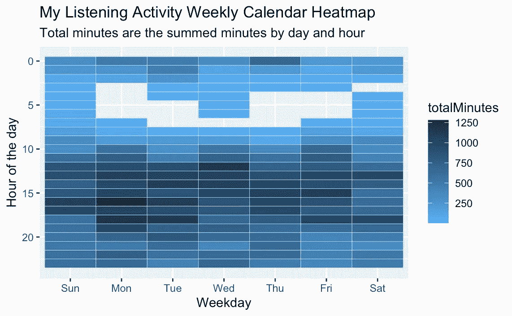

# 如何在 R 中创建周历热图

> 原文：<https://medium.com/geekculture/how-to-create-weekly-calendar-heatmaps-in-r-d238837f2c6b?source=collection_archive---------2----------------------->

Example of a Weekly Calendar Heatmap of my Spotify Activity

在本教程中，我将解释我们为什么使用日历热图以及何时使用它们，如何使用 R 中的 ggplot 包轻松创建它们，最后如何添加格式使它们看起来更漂亮。你很快就会成为一名制图大师。本教程是为初学 r 的程序员或数据科学家设计的。