# 在币安智能链(BSC)上创建您自己的 BEP20 代币

> 原文：<https://medium.com/geekculture/how-to-create-your-own-bep20-tokens-on-binance-smart-chain-bsc-d7075ba2f057?source=collection_archive---------11----------------------->

## 并使用 Remix IDE 部署它

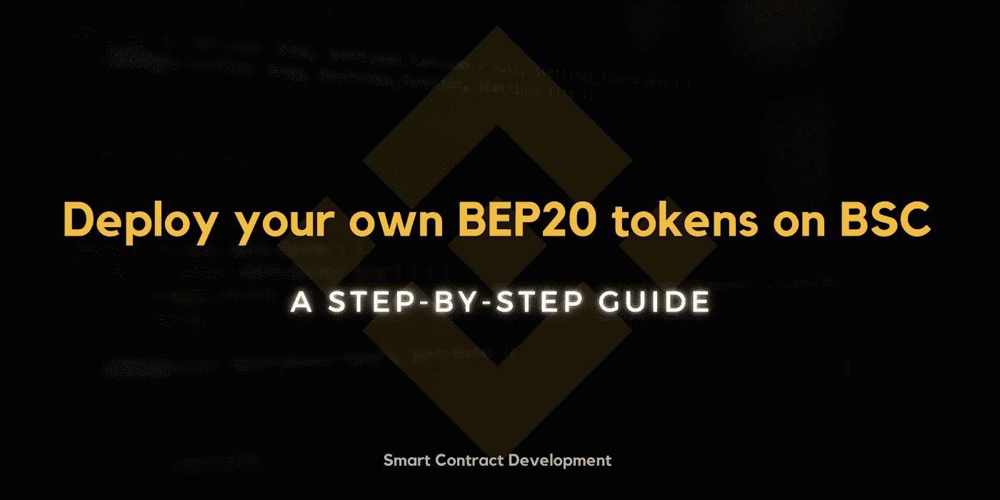

> **免责声明**:本文仅供参考。它不建议你购买、出售或交易任何加密货币，这样做是高度受制于市场风险的。代码不适合生产。目的仅仅是给出事物如何工作的概述。

从 2020 年 DeFi 夏季开始，许多新的加密货币和区块链相关项目涌入以太坊网络，导致天然气价格上涨。人们需要为 10 美元的交易支付 100 美元的汽油费。因此，每个人都开始将其项目和基础设施迁移到各种气体高效平台，其中一个平台就是币安智能链(BSC)。

简而言之，BSC 几乎是一个类似以太坊的区块链，但有一些小的变化。它也得到 EVM 的支持。因此，任何运行在以太坊上的智能合约都可以部署在 BSC 上。截至 2021 年 5 月 14 日，日交易量已达到 1200 万笔。

[bscscan.com](https://bscscan.com/chart/tx)

几乎在所有的 DeFi 项目中，一个常见的组件是项目自带的 BEP20 令牌，它将用于平台内外的一些特定目的。BEP20 令牌标准和以太坊上的 ERC20 标准差不多。

在本文中，我们将学习使用 [Remix IDE](https://remix.ethereum.org/) 和 [MetaMask](https://metamask.io/) 创建和部署一个非常基本和简单的 BEP20 令牌到 BSC testnet。

## 令牌详细信息:

*   名称:SampleBEP20 令牌
*   象征:SBT
*   总供应量:100 万 SBT

# BEP20 令牌合约:

> **注意**:我们将使用元掩码将合同部署到 BSC testnet，因此请确保您已将元掩码添加到配置了 BSC Testnet 的浏览器中。要将 BSC Testnet/Mainnet 添加到您的元掩码中，您可以参考此处的。

# 步骤:

**#1。**打开您的浏览器(在其中配置了元掩码)并导航至[https://remix.ethereum.org](https://remix.ethereum.org)

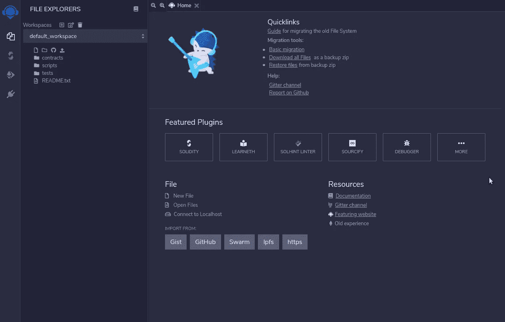

Remix IDE Landing Page

**#2。**您可以使用此[要点链接](https://gist.github.com/PraneshASP/2e18a11d8ee79ae0baa8429fe4ecda49)导入文件。或者也可以创建一个名为`SampleBEP20Token.sol`的新文件，并添加上面给出的 BEP20 令牌契约的代码。

**#3。我们应该在部署之前编译我们的代码。按下`Ctrl + S`键将编译代码。我们还可以通过单击导航面板(最左边)上的第二个选项导航到编译页面。**

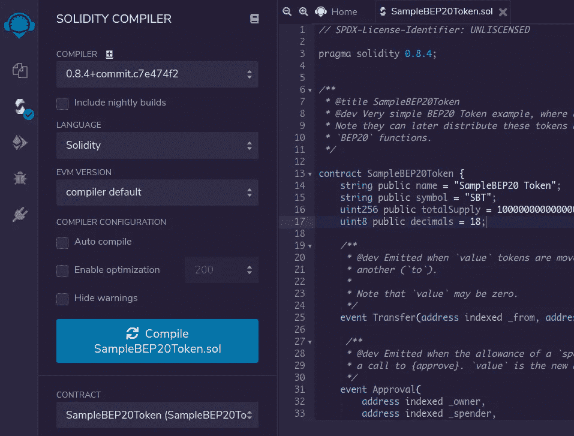

我们已经在代码中指定了 solidity 版本为`0.8.4`，所以我们也需要在 remix 中选择相同的编译器版本。

**#4。**编译成功后，我们可以通过单击“编译器”图标下方的图标前进到部署面板。

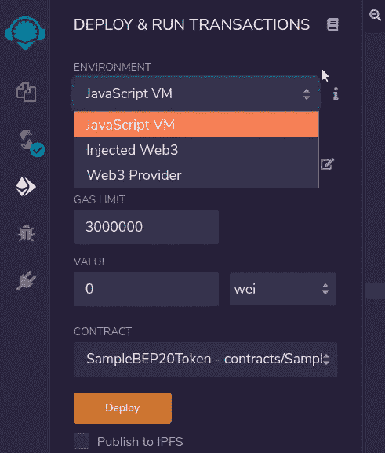

`ENVIRONMENT`应该是`Injected Web3`，因为我们使用元掩码进行部署。还要确保您已经在`CONTRACT`下拉菜单中选择了`SampleBEP20Token`合同(在`Deploy`按钮上方)。

> 注意:我们需要一些 BNB 测试网来支付合同创建期间的天然气费用。我们可以从这个[龙头](https://testnet.binance.org/faucet-smart)得到 testnet BNB。

我们已经准备好部署我们的 SBT 令牌。点击`Deploy`按钮。它将触发一个元掩码弹出窗口进行确认。点击`Confirm`部署令牌。

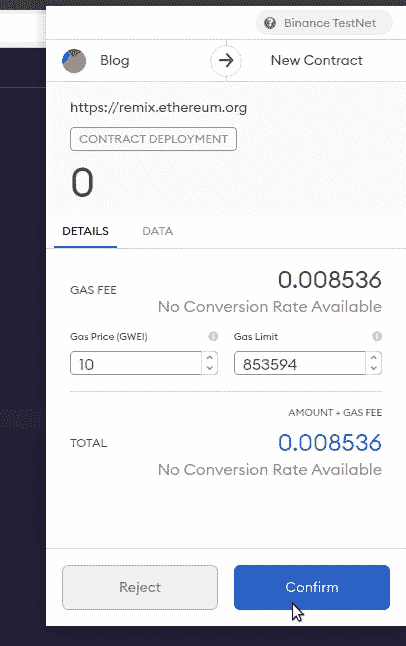

MetaMask Confirmation

**#5。**一旦交易被挖掘，我们可以看到日志以及合同细节将出现在`Deployed Contracts`部分。

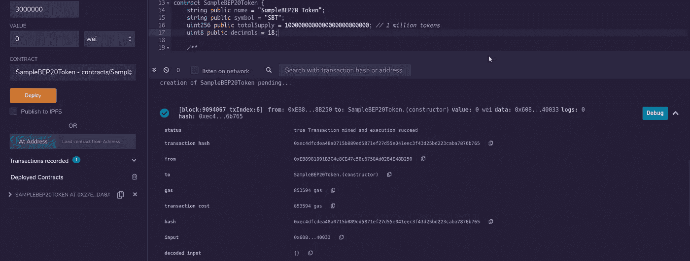

**#6。**如果我们点击`Depolyed Contracts`下的`SAMPLEBEP20TOKEN`选项，我们可以看到公共方法和变量，用它们可以测试我们的部署。让我们检查合同所有者的余额。

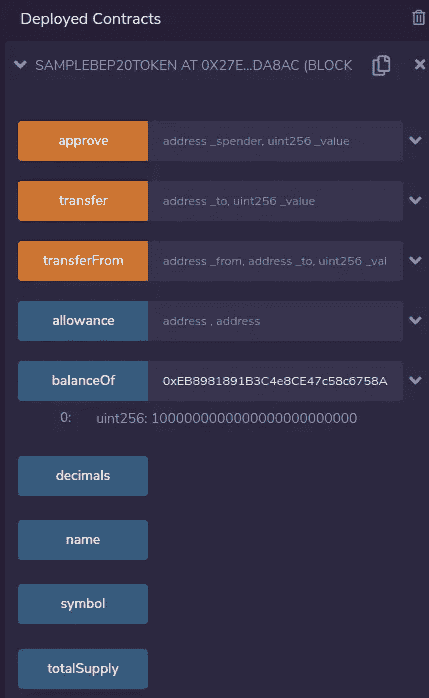

哇哦🎉🎊现在我们可以看到，所有者/管理员拥有令牌的总供应量，这是意料之中的。

> **注**:显示的数值精度为 18，即 1M * 10 ⁸.

**#7。**现在让我们尝试使用`transfer` 方法将代币转移到另一个钱包。一旦输入了接收方`address`和发送方`amount`(精确到 18 ),点击`transfer`按钮。元掩码将再次弹出一个窗口，要求确认交易。请注意，此弹出窗口包括我们输入的代币金额。

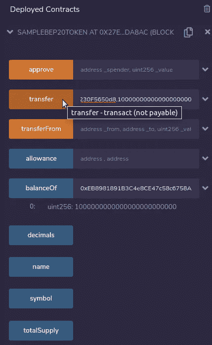

Calling Transfer Method

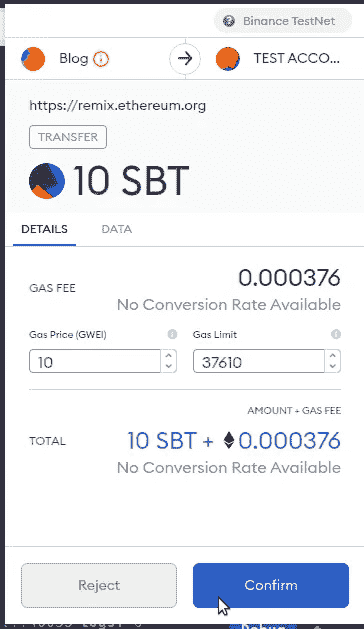

Metamask Confirmation

点击`Confirm`按钮推动交易。几秒钟后，可以在 Remix IDE 日志中看到事务状态。我们也可以在 [BSCScan testnet explorer](https://testnet.bscscan.com/) 上检查事务状态。

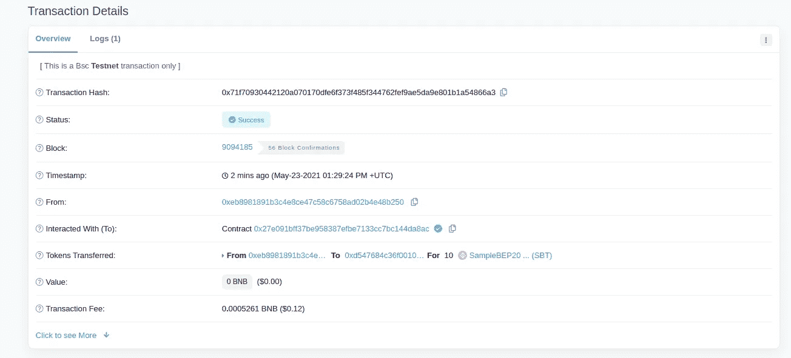

Transaction details

现在，如果我们在 Remix 上使用`balanceOf`方法再次检查所有者钱包的余额，将会是少于一百万的 10 个代币。

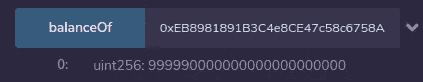

接收者的钱包将被存入 10 SBT。

凉爽的👏👏现在，您可以部署任意数量的令牌。在 BSC mainnet 上部署 smartcontracts 可以遵循相同的过程。但是这将花费 mainnet BNB 的天然气。

# ✨奖金:将我们的令牌添加到元掩码

现在，我们将在 MetaMask 上检查我们的收件人钱包(也是我的帐户之一)的 SBT 余额。

*   点击所选元掩码账户底部的`Add Token`按钮。

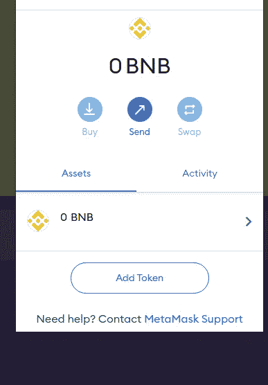

*   输入我们部署的合同地址。`token name`和`token symbol`将被自动检测。点击`Next`。

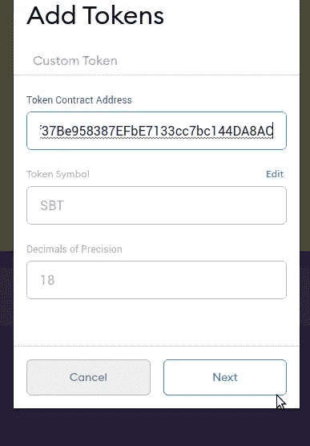

*   帐户的代币余额将在下一步显示。点击`Add Tokens`将令牌添加到元掩码账户。

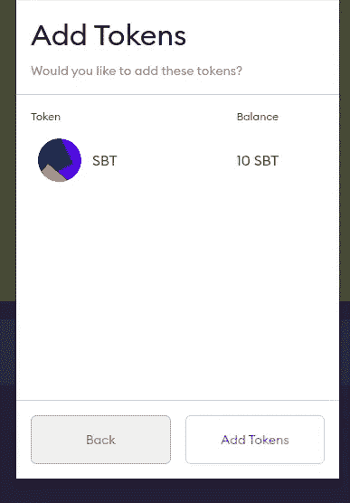

添加后，可以在添加了令牌的元掩码帐户的`Assets`部分找到令牌。

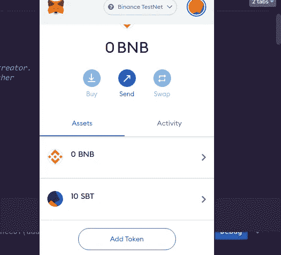

可以遵循相同的方法在选择的网络上添加任何部署的令牌，在我们的例子中是`BSC Testnet`。

快乐编码🎉🎉