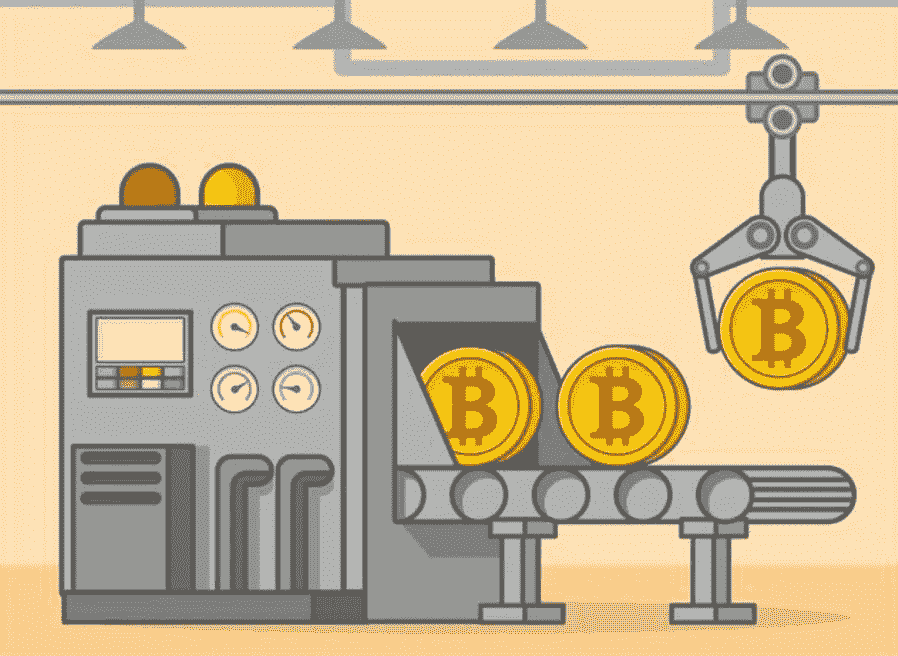

# 如何创建自己的加密令牌

> 原文：<https://medium.com/geekculture/how-to-create-your-own-crypto-token-4097a173dd73?source=collection_archive---------6----------------------->

循序渐进的指南

Photo Credit: Vladimir Melentev

# **概述**

早在 2015 年以太坊网络首次推出时，没有任何令牌开发的模板或指南。这意味着有各种各样的标记，每一个都是独一无二的。为了使令牌更加统一，社区提出了 ERC-20 标准。