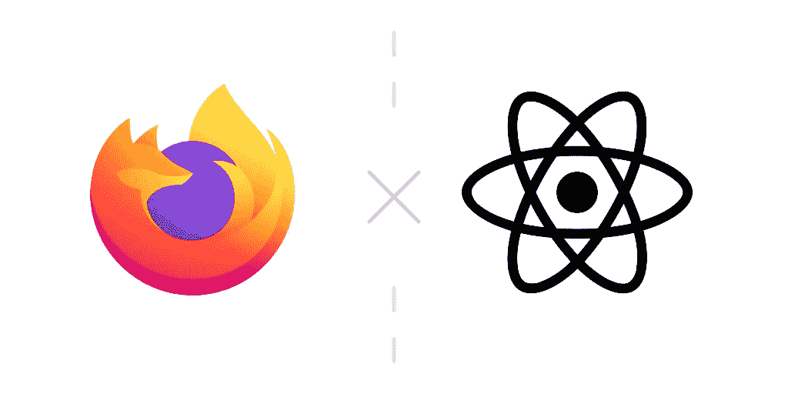
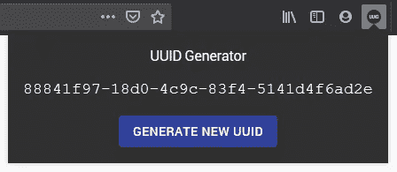
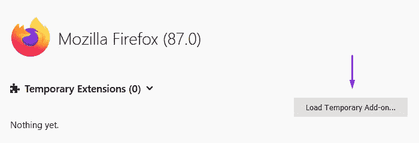
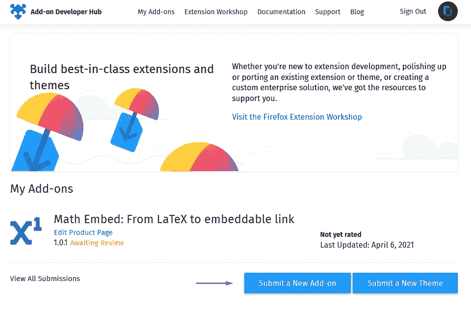
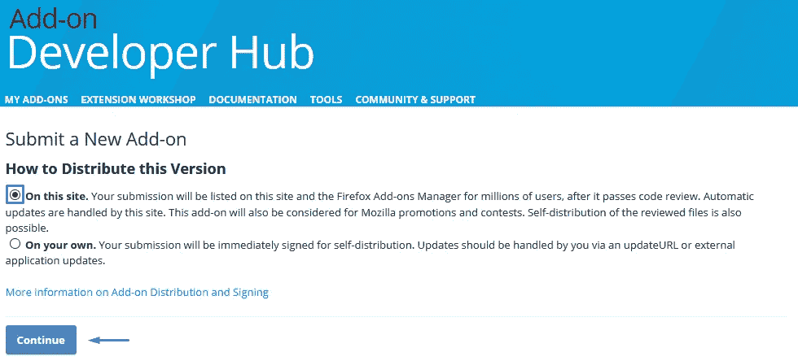
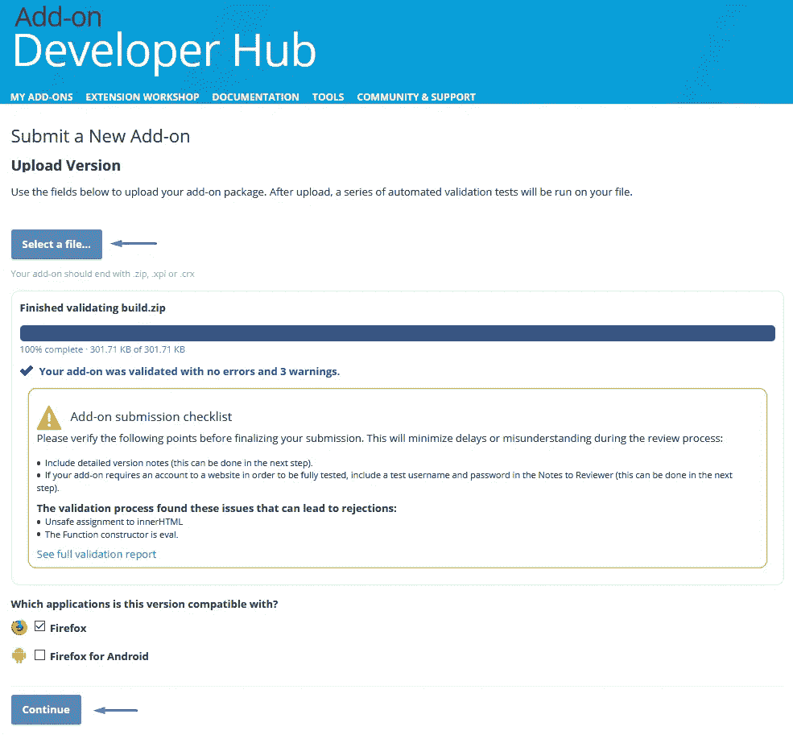
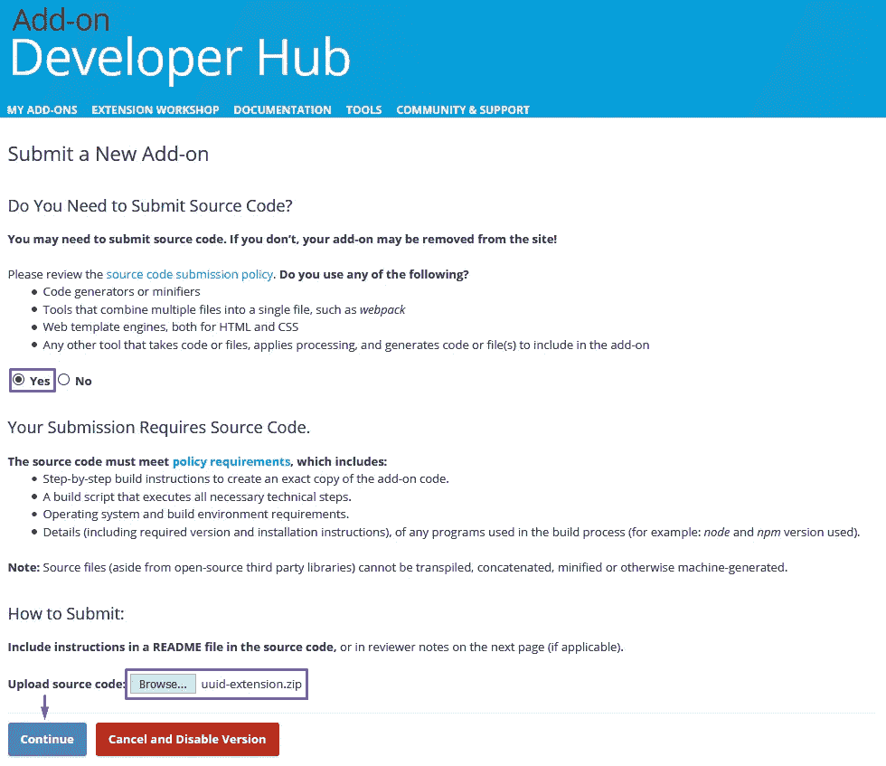
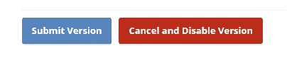
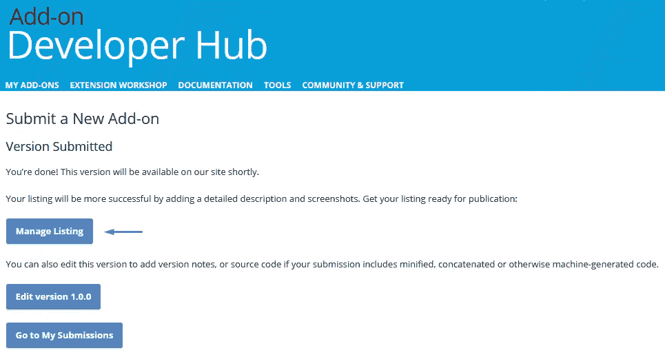
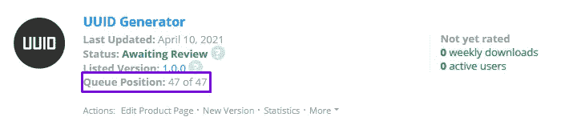

# 如何用 React 创建自己的 Firefox 插件

> 原文：<https://medium.com/geekculture/how-to-create-your-own-firefox-add-on-with-react-ef34fcddb2ea?source=collection_archive---------6----------------------->

要么你想探索新的方法来为你的 web 应用带来流量，要么只是学习一项新技能，你来对地方了。

但是到底什么是扩展或者附加呢？Mozilla 说得最好。

> 扩展就像火狐的应用程序。他们给 Firefox 增加了一些功能，让浏览变得更快、更安全，或者仅仅是简单有趣。

我们将看看如何使用 React 创建一个简单的 Firefox 扩展，并一起完成提交过程。*提示:这比你想象的要简单。*

*   [创建一个简单的 React 应用程序](#f49d)
*   [是什么让它成为扩展？](#ec87)
*   [测试完毕](#7195)
*   [提交至附加开发中心](#9b38)

你可以在我的 GitHub 上找到这个[项目的源代码。](https://github.com/zanozbot/uuid-extension)



Firefox Add-on created with React.

# 创建简单的 React 应用程序

我们将创建一个简单的生成器，使用户能够创建通用的唯一标识符或 UUIDs。UUID 是一段 128 位的数据，以 32 位十六进制数字的形式显示，如`3adee25a-eb20–48ca-9106–84820e108b20`。
uuid 有几种不同的版本。这完全取决于它们是如何生成的，但是为了简单起见，我们将只实现使用随机数生成 UUIDs 的版本 4。



Firefox Add-on we’ll create.

创建一个新的 React 应用程序的最好方法是运行`npx create-react-app`,它为我们建立了开发环境。您需要的唯一先决条件是在您的机器上安装了 [Node > = 10.16 和 npm > = 5.6](https://nodejs.org/en/) 。我们将把 React 与 Typescript 和 npm 结合使用，因此，我们需要添加`--template typescript`和`--use-npm`标志。

```
npx create-react-app uuid-extension --template typescript --use-npm
```

我们将安装两个库，这将有助于我们加快开发过程。第一个是 [Material UI](https://www.npmjs.com/package/@material-ui/core) ，第二个是 [uuid](https://www.npmjs.com/package/uuid) ，也需要将其类型作为开发依赖项安装。

```
npm install @material-ui/core uuid
npm install --save-dev @types/uuid
```

我假设你已经知道 React 的基本知识，所以我不会用我们将要编写的代码如何工作的细节来烦你。也就是说，让我们开始吧。

首先，让我们稍微清理一下项目。我们可以安全地删除`App.tsx`的返回函数的内容，并从`src`文件夹中删除`logo.svg`、`App.test.tsx`和`App.css`。让我们也从`public`文件夹中删除`favicon.ico`、`logo192.png`、`logo512.png`和`robots.txt`，因为我们不再需要它们中的任何一个。清洗后的`App.tsx`应该是这样的。

```
//App.tsx
function App() {
  return (
    <></>
  );
}
export default App;
```

下一步，我们将添加扩展的功能。将所有东西都放入`App.tsx`中并不可取，但是由于这是一个非常简单的扩展，我们可以做到这一点。

这就是我们启动和运行这个扩展所需的所有代码。所以让我们分解一下，看看我们实际上做了什么。我将大量引用上面的代码，所以为了简单起见，我将行号放在方括号内，如 so[4–9]，意思是从第 4 行到第 9 行。

*   [1–5]添加所有必要的导入。
*   [8]从用户那里获取首选的配色方案，我们将使用它来更改扩展的主题。
*   [12–30]创建一个材质 UI 主题对象，该对象将根据用户的设置生成浅色或深色调色板。此外，我们正在覆盖一些排版设置。
*   [32–34]负责生成新 UUIDs 和更新状态的函数。
*   [37，58]如果我们想使用材料 UI 为我们提供的开箱即用的主题功能，我们必须将所有东西包装在里面`ThemeProvider`。
*   [38] `CssBaseline`将 CSS 重置为一致的基线，这样你就可以期望元素在所有浏览器中看起来都是一样的。
*   [39–57]使用网格创建简单布局，将其项目居中，并沿 y 轴均匀分布。
*   [46]我发现`user-select: all` CSS 样式是替代复制到剪贴板功能的简单方法。当用户点击它时，它基本上选择整个文本，在我们的例子中是生成的 UUID。

# 什么使它成为一个扩展？

要将 React 应用程序转变为 Firefox 扩展，我们需要做三件事情。首先，我们必须为我们的扩展创建一个标志。一旦我们对设计满意，我们必须导出 48px、96px 和 128px 的版本。我们将前两个放在`public`文件夹中。让我们给它们起个通用的名字，比如`logo48.png`和`logo96.png`。提交过程中将使用 128px 版本。


UUID Generator’s logo

其次，我们必须更新位于`public`文件夹中的`manifest.json`的内容。有多种类型的清单，我们正在更新的清单告诉浏览器有关 web 应用程序以及当安装在用户设备上时如何表现。因为我们正在开发一个扩展，所以我们必须改变它的内容。

```
{
  "name": "UUID Generator",
  "description": "Generate universally unique identifiers fast.",
  "version": "1.0.0",
  "manifest_version": 2,
  "homepage_url": "[https://github.com/zanozbot/uuid-generator](https://github.com/zanozbot/uuid-generator)",
  "browser_action": {
    "default_popup": "index.html",
    "default_title": "UUID Generator",
    "default_icon": {
      "48": "logo48.png",
      "96": "logo96.png"
    }
  },
  "icons": {
    "48": "logo48.png",
    "96": "logo96.png"
  }
}
```

使用修改后的清单，我们告诉 Firefox 一些关于扩展的基本信息，我们还可以指定扩展的功能，如后台脚本、内容脚本和浏览器动作。从上面的`manifest.json`中你可以看出，我们使用了浏览器动作，在 Firefox 的工具栏上添加了一个按钮，点击后会弹出一个窗口。

我们要做的最后一件事是在项目的根目录下创建一个`.env`文件，并将下面一行`INLINE_RUNTIME_CHUNK=false`粘贴进去。当运行`npm run build`时，React 编译器将获取它，不会将运行时脚本插入到`index.html`中，而是像往常一样导入它。在我看来，这是向 React 项目添加开发环境变量的最简单的方法。[阅读更多关于在](https://create-react-app.dev/docs/adding-custom-environment-variables/#adding-development-environment-variables-in-env) `[.env](https://create-react-app.dev/docs/adding-custom-environment-variables/#adding-development-environment-variables-in-env)`中添加开发环境变量的信息。

我们现在准备为生产构建扩展。

```
npm run build
```

# 测试它

为了测试我们的扩展，我们必须打开 Firefox 调试工具。我们通过在 Firefox 的 URL 栏中输入`about:debugging`来实现。接下来，我们点击 *This Firefox* 选项卡，它提供了关于扩展和运行工人的信息。我们的重点将放在页面的顶部，更具体地说是在*临时扩展*面板上。

点击*加载临时附加组件…* 打开文件选择器。导航到扩展的构建文件夹，选择`index.html`并按*打开*。



Loading our extension temporarily.

这使我们能够预览扩展，如果我们对它的外观和功能感到满意，我们可以继续进行最后一步，即将它提交给附加开发人员中心。

# 将其提交到附加开发人员中心

导航到[插件开发者中心](https://addons.mozilla.org/en-US/developers/)，点击*提交或管理扩展*。如果您已经登录，提供的链接会将您带到您的控制台，您只需点击*提交新的插件*。



Submitting a new extension.

之后，我们被要求决定如何在我们自己或 Firefox 附加组件管理器上发布扩展。我们会选择后者。



Choosing a way to distribute the extension.

接下来，我们最终被要求上传扩展。但是在此之前，我们必须将`build`文件夹中的所有内容压缩成一个 ZIP 文件。之后，我们可以点击*选择一个文件…* 并打开新压缩的文件。



Uploading the extension.

在下一步中，我们被要求审查[源代码提交政策](https://extensionworkshop.com/documentation/publish/source-code-submission/)并在需要时附上源代码。由于我们在 React 中开发了一个扩展，React 确实缩小并生成了一些额外的代码，我们还必须压缩并上传源代码。
不要忘记在`README.md`文件中包含如何构建扩展的说明，以避免不必要的拒绝。



Uploading the extension’s source code.

最后，我们必须描述我们刚刚上传的扩展。我们之前创建的`manifest.json`已经预填充了一些信息。填写完所有必填字段后，我们最终准备好提交扩展，方法是点击*提交版本*。



Submitting our first version of the extension.

就是这样。火狐插件管理器应该很快就可以使用这个扩展了。因为我们希望增加被发现的机会，所以我们还将提供一些在前面的步骤中没有的附加信息，例如图像和标签。我们可以通过点击*管理列表*来实现。



Adding additional information about the extension.

对结果满意后，我们可以导航到提交页面并开始刷新它。整个提交过程中最棒的部分是 Add-on Developer Hub 实际上向您显示了您的扩展何时会被审查。



The current position in the reviewing queue.

如果你想为谷歌 Chrome 创建一个扩展，看看 Dik 的文章，用 React 创建你自己的 Chrome 扩展比你想象的要容易得多。