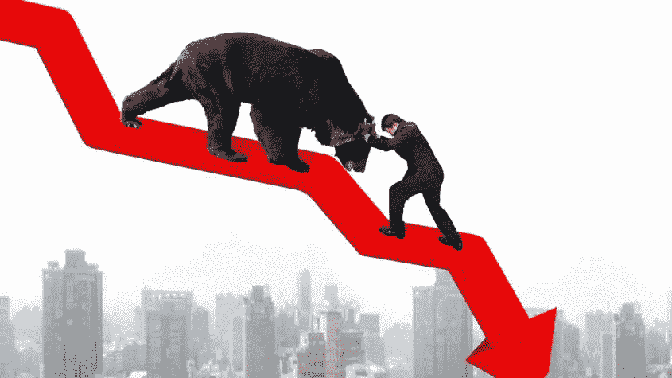
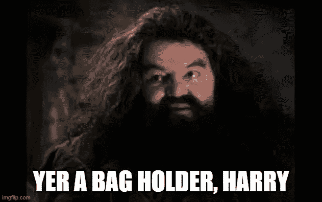
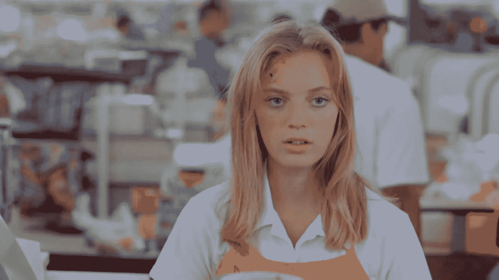
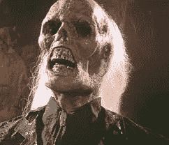

# 如何在 NFT 熊市中粉碎它

> 原文：<https://medium.com/geekculture/how-to-crush-it-in-nft-bear-markets-a12478c22578?source=collection_archive---------9----------------------->

NFT 市场现在很不景气。至少，对脚蹼来说是这样。当市场繁荣时，抛售非金融资产很容易。你所要做的就是买一个 NFT，把它拿出来出售，并设定好你的目标利润，然后等待市场达到你的价格。熊市是不同的，它们需要不同的赚钱策略。以下是你在 NFT 熊市中粉碎它的方法。

**长期持有的经常性收入**

2021 年的 NFT 投资模式是低买高卖。你的投资组合越多，你赚的钱就越多。很多人利用买了就卖的模式赚了很多钱，但这种模式本质上是不可持续的。最终，有人会在顶部买入，而无法通过翻盘获利。我们称那个人为持袋人。

我们很多人现在都是包包持有者。我们的钱包里装满了没有任何用处的漂亮照片。他们只是坐在那里。嘲笑我们。锁定我们的流动性。让我们质疑生活中的决定。

其中一些项目可能会重现往日的辉煌，但目前我们需要一种策略，让我们能够利用市场上 NFT 的低价格，这意味着我们需要创造一些收入。为了战胜 NFT 熊市，我们可以从股票市场借鉴一个策略——股息再投资。

**关注经常性收入**

那里有一些令人惊叹的 NFT 艺术品。他们拍出很棒的个人资料照片，表明你是一个社区的成员。不幸的是，你不能吃社区会员，也不能用它来购买更多的 NFT。

Uh, no. We don’t accept Azukis.

然而，你可以使用索尔、瑞士法郎、WRLD 或其他几十种硬币，许多 NFT 项目将按日或周支付。

提供经常性收入的非金融信托并非没有风险。他们中的许多人冒着通过[豪威测试](/cryptostars/the-hidden-risk-of-nfts-that-no-one-is-talking-about-963d3f0296ed)的风险，这使他们受制于他们可能没有遵守的法规。我将介绍你可以通过非功能性交易获得经常性收入的不同方式，以及与之相关的风险。我让你来决定你愿意接受什么样的风险。一如既往，记得做自己的研究。我只是一个带着键盘的密码专家，而不是财务顾问。

**赌博 NFTs**

给你网上赌场股份的 NFT 似乎很受欢迎——尤其是在索拉纳区块链。这些项目承诺建立一个游戏网站，人们可以在那里玩掷硬币、掷骰子或其他游戏。赌场的利润然后支付给他们的 NFT 持有者。听起来不错…表面上。

赌博式非功能性金融交易可能会带来双重问题。首先，它们很有可能通过豪威测试，并被美国证券交易委员会(SEC)视为证券。第二，他们不太可能得到适当的许可，这本身就是另一个问题。即使是试图获得正当许可的项目也可能遇到法律问题。以[拉斯维加斯金沙赌场俱乐部](https://sandvegascasino.club/)为例。他们是一个试图启动一个合法赌场项目的项目，他们仍然遇到法律问题。我有一个他们的 OG 赌徒 NFT，它最近被从 OpenSea 除名。这个项目没有死，但我很难交易 NFT，直到他们能够解决他们在美国的法律问题。这是一个非常冒险的领域，但它可以有巨大的回报。

**GameFi**

GameFi 是我最喜欢的用 NFTs 赚钱的方式之一。NFT 让你有能力一边玩自己喜欢的游戏一边赚钱。一些例子是[冰上扑克](https://decentral.games/)、[盛大游戏](https://app.gala.games)和 [Axie Infinity](https://axieinfinity.com/) 。一些游戏甚至给你提供了被动赚取的选择，通过将你的 NFTs 借给其他人来获得他们的一部分收入。这些项目不太可能通过豪威测试，因为你必须实际做一些事情——玩游戏——来赚钱。我有几个冰扑克可穿戴设备，尽管$ICE 的价格大幅下跌，但通过将它们委托给优秀的玩家，它们仍能让我每天赚到约 20 美元。

**打桩**

赌注是另一个受欢迎的技巧。以 [CryptoKongz](https://www.cyberkongz.com/about) 为例。每个 NFT 人每天可以挣 10 美元香蕉。这些硬币可以用来培育下一代 CryptoKongz(以及做一些其他事情)。$BANANA 的效用赋予了它价值。在写这篇文章的时候，一个$香蕉的价值是$5.75。

现在很多项目都在使用跑马圈地模式。它产生收入，并使该项目的非金融交易远离二级市场，二级市场可以通过减少供应来提高底价。只要确保你明白奖励从何而来。一些项目是基于版税支付的。我不太喜欢这种模式——尤其是在熊市。熊市意味着交易减少，价格降低。如果你想分享版税，这也不是你想要的。

**DAOs**

分散的自治组织是 NFT 项目的另一个受欢迎的特点，它们可以盈利。NFT 赋予你从普通企业中赚钱的权利。美国证券交易委员会(SEC)已经明确要求 Dao(道指证券)作为豪威测试下的证券，所以要非常小心这些 NFT。也就是说，一些项目正在围绕它提出创造性的方法。

以[被诅咒的实验室](https://cursedlabs.io/)为例。诅咒实验室有一个多管齐下的盈利方法。他们有咨询业务，经营航空公司。他们的 NFT 持有者有权获得这些收益的一部分，但他们非常谨慎地表示，他们的 NFT 持有者在业务中没有所有权。相反，他们是企业的附属机构。这种区别足以阻止他们通过豪威测试并被认为是一种安全吗？我不知道。我是一个堕落的 NFT 交易员，而不是律师。我拥有一个被诅咒的 NFT 实验室，但我也明白风险，如果它变为零，我也没问题…不开心，但还好。

**利用你的 NFTs**

要不要全力德根，孤注一掷？那么你可能是 NFT 贷款的候选人。有了 NFT 贷款，你可以在不放弃所有权的情况下为你的 NFT 获得加密。然后，你可以用这些资金投资其他项目——可以给你带来收入的项目。明智地选择，看着你的利润飙升。选择不当，嗯-

He chose…poorly.

像 NFTfi.com[和 Drops.com](https://www.nftfi.com/)这样的网站会帮助你获得流动性，但是要小心——这是一个高风险的游戏。如果你的 NFT 下限低于某个阈值，你将面临清算——这意味着该网站出售你的 NFT。杠杆可能意味着巨大的收益，但更多的潜在收益意味着更多的风险。这条路不适合胆小的人或没有钱包的人。

**太好了，但我还是想翻翻**

翻转是有趣的，我绝不会嘲笑一个退化的策略。在熊市中，你仍然可以通过抛售 NFT 来获利，但是你必须更有洞察力……并且如果你错了，愿意承担后果。以下是你如何在熊市中通过倒卖 NFT 赚钱的方法。

**白名单研磨**

我真的很讨厌这种方式，但这是在 NFT 赚钱的一种行之有效的方式。白名单通常保证你能够打造热门项目，有时还会打折。白名单研磨包括在 Twitter 上的大量转发，同时标记朋友和许多不和谐的闲聊。如果你的迷因游戏很强大，或者你有足够的天赋创作出伟大的粉丝艺术，这也会有所帮助。

不过，这种折磨是有原因的。这需要很长时间才能被 mods 注意到，也不能保证你的努力会得到回报。此外，仅仅因为你保证了一个薄荷并不意味着你保证了利润。很少有什么事情会让你感觉如此糟糕，比如为了一份白名单而无休止地努力，结果却发现这是一个无用的项目。

一个不太费力的方法是在其他 Discords 中加入 collab 赠品。在这里，您可以利用您拥有的其他 NFT。项目通常会把最好的机会给持有非技术转让证书的人。我就这样赢了好几个白名单。这比推特上的先令好多了。只要在你最喜欢的不和谐中寻找“赠品”频道。大多数项目都有。

**买蘸料**

买入 Dip 是从股市借鉴来的一种屡试不爽的方法。这个想法是所有的项目都会在熊市中走下坡路——即使是非常好的项目。利用这次下跌，以折扣价购买好项目，然后等待市场复苏。当他们这样做的时候，兑现并拿走你的利润。这再容易不过了…只要市场复苏。

买入 dip 是一项长期投资。没有人知道下一轮牛市是否或何时会到来，所以如果你打算买入，请确保你不会很快需要流动性。

**结论**

NFT 投资在市场上涨时很有趣，但在熊市时可能会很痛苦。当市场开始下跌时，你不能使用同样的投资策略。当市场对你不利时，创收项目可能比常规的个人资料照片更有弹性。它们给你带来了持续的现金流，你可以在价格低迷的时候用它来接其他项目。目标是在价格低的时候明智地购买，这样你就能在下一轮牛市中处于有利位置。

**揭秘**

我拥有这篇文章中提到的几个项目，包括金沙拉斯维加斯赌场俱乐部、冰上扑克和诅咒实验室。本文仅供娱乐，并非财务建议。我不是律师或财务顾问。在根据本文提供的任何信息采取行动之前，请自行研究并咨询财务顾问和/或法律顾问。

***如果你想继续对话，可以在 Twitter 上联系我***[***@ cryptodegenml***](https://twitter.com/cryptodegenfml)***或者***[***cryptodegenml***](/@cryptodegenfml)***这里上媒。如果你喜欢这篇文章，请为它鼓掌(高达 50 倍)，让我知道你喜欢它。这对我意义重大。谢谢你，德根兄弟！***