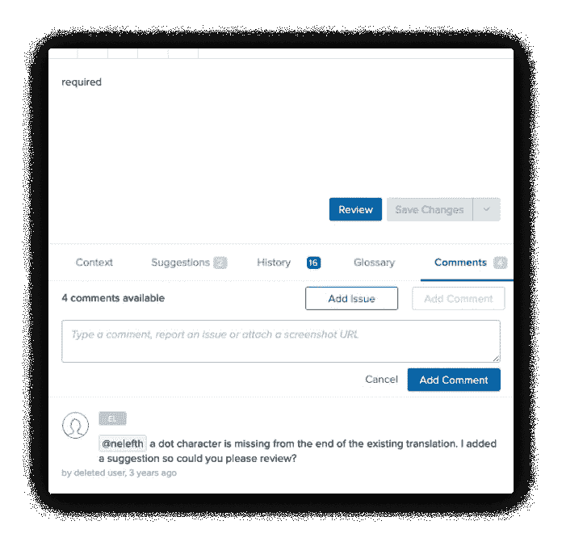
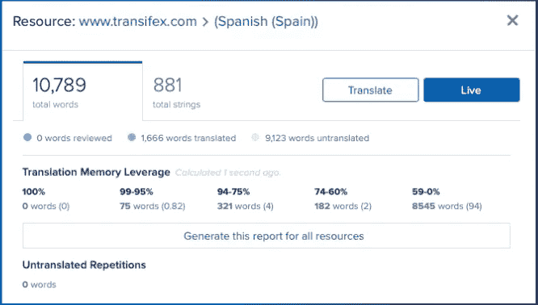

# 如何削减本地化成本

> 原文：<https://medium.com/geekculture/how-to-cut-localization-costs-8b5523c2cc45?source=collection_archive---------14----------------------->

寻找降低本地化成本的方法？

通过实施伟大的本地化战略和使用正确的工具，您可以在不牺牲质量和产量的情况下削减开支。事实上，你甚至可以提高你的质量和产出更高质量的工作，从而也增加了你的投资回报率(ROI)。

[例如，Vida Health 通过利用翻译记忆数据库中的现有内容，每月节省高达 25%的成本](https://www.transifex.com/case-studies/vida-health/)。

这里有 6 种方法，您也可以在保持高质量翻译的同时降低本地化成本！

# 1:实施内容本地化战略计划

在一个拥有无限时间和资金的完美世界里，我们都可以将所有东西本地化。但在现实中，我们投资的一切，都被期望能带来回报。

增加投资回报的最佳方式之一是首先将最有可能带来最佳结果的东西本地化。

你可以从看看你的哪些内容已经表现良好开始，无论是在你的网站上还是应用程序上。例如，你在哪里得到最多的访问，来自哪些地区？在决定去未探索的区域冒险之前，先关注这一点。

还有一件事要记住，是什么完善了用户体验，这样你就不会损害你的品牌形象。

例如，在你的 5 个产品页面中，可能只有 2 个获得了大部分的转化率。但这并不意味着你应该只翻译一半的产品功能。你不会希望一个潜在客户浏览你的网站，发现只有一半的信息是他们想要的。这是不专业的，也不符合他们的最大利益。

对于更高级的策略提示，我们建议查看其他公司如何通过本地化发展的[本地化案例](https://www.transifex.com/blog/2022/localization-strategy-examples/)。

# 2:瞄准你的理想受众

本地化中最棘手的问题之一是针对哪些语言和地区。由于[世界上有 7100 多种语言](https://blog.busuu.com/most-spoken-languages-in-the-world/#:~:text=What%20are%20the%20world's%20most,less%20widely%20spoken%20than%20others.)，我们绝对负担不起为所有语言本地化应用和网站的费用。

一个好的起点是瞄准已经访问你的平台的地区，但是不要以和母语使用者一样的速度转换。毕竟，[研究表明，76%的人更喜欢购买有母语信息的产品，而 40%的人从不从其他语言的网站上购买](https://www.transifex.com/resources/localization-roi-by-the-numbers/)。

如果你没有必要的工具来获得这些见解，这里有 3 个最重要的:

1.  [Google Analytics](https://analytics.google.com/) 用于跨地区监控您的流量
2.  [Ahrefs](https://ahrefs.com/) 用于监控网站的健康状况、有机 SEO 和国际 SEO 工作
3.  [HubSpot](https://www.hubspot.com/) 用于管理您的联系人

一旦你已经过了为现有受众进行本地化的阶段，并且需要进一步扩展，问自己这些问题:

*   你的竞争对手瞄准了哪些地区？
*   谁最有可能对你提供的东西感兴趣？
*   哪些地方对你的行业感兴趣，而你的竞争对手尚未涉足？

# 3:优先考虑国际化

我们都想发展我们的业务，并利用我们所掌握的一切来实现这一目标，例如本地化。但是让我们记住，本地化最初的诞生和存在是由于从 1980 年[开始软件的兴起。](https://en.wikiversity.org/wiki/Localization#History)

也就是说，你不能只是从你的网站/应用程序中抓取你的内容，翻译它，再扔回去，然后期望一切都完美无缺。您必须确保您的网站和应用程序从一开始就为本地化做好了适当的准备和优化。

这个过程就是我们所说的[国际化](https://www.transifex.com/blog/2021/what-is-internationalization-i18n-in-software/)。国际化很重要，因为如果你做得不好，从长远来看，你将会投入更多的资源来修复错误。

如果你想要一个国际化在实践中如何运作的例子，看看这些 [5 个国际化技巧](https://www.gala-global.org/knowledge-center/professional-development/articles/5-software-internationalization-i18n-best)。

说到从第一次开始就把事情做好，强烈建议从设计阶段就开始您的本地化过程。这意味着，你不用本地化你的网站或应用程序，然后回去修复 UI 问题，而是在本地化和测试一切如何无缝工作的同时开始设计 UI。

这允许你在开发开始前预览翻译的效果，并主动捕捉错误。

您可以通过将翻译管理工具与诸如 [Sketch](https://www.transifex.com/integrations/sketch/) 或 [Figma](https://www.transifex.com/integrations/figma/) 之类的软件集成来实现这一点。

# 4:自动化重复性任务

典型的[本地化流程](https://www.transifex.com/blog/2018/software-localization-process/)通常是这样的:

1.  从您的平台中提取内容
2.  将它上传到您的本地化团队可以访问的地方
3.  使用任何你可以使用的交流工具来有效地翻译
4.  执行质量保证(字符限制、样式一致性等)
5.  提取您的翻译内容
6.  让工程师上传并部署翻译后的内容

每次你想推送更新的时候都卡在 repeat 上。在这些步骤之间，很多事情可能会出错，最终增加总成本。相反，想象一下这个过程更像这样:

1.  使局部化
2.  按一个按钮开始直播

如果这看起来是一个更好的选择，你需要使用正确的软件。就像销售使用 CRM，营销人员依赖营销自动化软件一样，本地化经理也有[本地化工具](https://www.transifex.com/blog/2022/localization-tools/)。

以下是你如何用软件解决上述每一个重复性的问题。

# 内容提取、上传、编辑、部署

没有软件，你将陷入一个无休止的循环，不得不把你的内容从你的平台拿到翻译者那里，然后工程师把它部署到你的平台。

要解决这个问题，你真正需要的是一个[翻译管理系统](https://www.transifex.com/blog/2021/what-is-a-translation-management-system/) (TMS)，比如 Transifex。然后，您只需通过持续集成/持续交付解决方案将 TMS 连接到您的平台，如针对应用的 [Transifex Native](https://www.transifex.com/native/) 或针对网站和 web 应用的 [Transifex Live](https://help.transifex.com/en/articles/6244596-introduction-to-transifex-live) 。

这解决了重复的内容提取，因为在设置后，TMS 与您的平台“通信”,只需按一下按钮即可自动同步翻译。

# 沟通和质量保证

适当的沟通是本地化的重要组成部分。你要确保你的翻译得到正确的指示和反馈。

但是当您处理包含成千上万工作的内容时，这很快就会发生混乱。我们谈论的是寻找上下文的译者，指出错误翻译及其译者的审阅者，滚动数百张表格寻找所需内容的本地化经理，等等。

您可以使用翻译管理系统自带的内置工具来提高效率，例如:

*   视觉语境让译者知道他们在翻译什么
*   [搜索字符串](https://help.transifex.com/en/articles/6240799-search-strings)让每个人都能轻松找到自己要找的内容
*   [质量保证](https://www.transifex.com/features/translation-quality-and-speed/)供审阅者使用的工具，如翻译检查，这样您可以自动确保翻译符合您的标准
*   [评论和问题](https://help.transifex.com/en/articles/6318944-other-tools-in-the-editor#h_6d80277855)供翻译人员在提供帮助时提及，或供审阅者和本地化经理提供上下文

更多，取决于本地化团队的工作方式。

将这些任务自动化并使之更容易进行会提高您的效率，从而也降低了本地化成本。

# 5:利用机器和人力资源

对于任何想知道如何削减本地化成本的人来说，首先想到的事情之一就是[机器翻译](https://www.transifex.com/blog/2021/what-is-machine-translation/)。这种想法是有用的。

人工智能的工作速度比翻译快几倍，成本只是费用的一小部分。

但是不要忘记为什么我们要投资本地化。

本地化不仅仅是翻译内容。你想让你的业务对全球各地的人更有吸引力，这主要是通过调整你的内容以适应当地人的喜爱来实现的。

机器非常适合快速翻译一两个单词的句子，但它们无法与人类联系起来。

你需要两全其美。

*   机器翻译，完成尽可能多的简单单词和句子
*   翻译人员为您提供高质量的翻译

在我们的翻译管理系统中，MTs 内置于平台中，这允许您与[译者](https://www.transifex.com/translation-vendors/)和 MTs 无缝协作！

简单来说，你可以先有一个像 Google Translate 或者 [DeepL](https://www.transifex.com/blog/2021/deepl/) 这样的 MT 工具，把你的内容快速翻译成粗略的第一遍。然后，翻译人员可以进来，审查 MT 做了什么，并在 MT 缺乏的地方添加高质量的翻译。

# 6:重用现有翻译

如果您有一个大型的本地化项目，遇到相同的翻译是很常见的。例如，也许你的桌面和移动应用程序共享相同的内容。或者你可能有一个电子商务平台，用很多相似的词来描述相似的产品。

在这种情况下，您可以使用一个名为“[翻译记忆库](https://www.transifex.com/blog/2021/translation-memory-software/)”的工具。顾名思义，翻译记忆库创建的是一个包含您已完成的翻译的数据库，您只需按一下按钮就可以选择使用它们。

减少需要处理的单词量可以加快交付速度，减少翻译、审校和本地化经理的工作量，从而降低您的本地化成本。

更具体地说， [Juntos 的本地化成本降低了 40%](https://www.transifex.com/case-studies/juntos/),解决全球客户关系问题所需的时间减少了 60%,主要依靠翻译记忆库和 Transifex 翻译管理系统。

# 包扎

你来到这里寻求如何削减本地化成本，并希望完成你的追求。但是我们知道所有这些都需要处理，所以让我们以一种简化的方式总结一下:

*   实施内容本地化策略:不要盲目地将所有内容本地化。从最有可能产生最大影响的事情开始。
*   锁定你的理想受众:一些市场可能对你提供的东西更感兴趣。关注他们。
*   优先考虑国际化:在进行本地化之前，确保你的网站和应用程序在技术方面做好了适当的准备，以避免额外的 bug 修复费用。
*   自动化重复性任务:使用本地化软件使内容管理和团队管理更容易，减少手动任务的时间。
*   利用机器翻译和人力资源:不要简单地依赖其中之一。将两者结合在一个翻译管理系统下，以获得两个世界的最佳效果。
*   重用现有的翻译:使用翻译记忆库，这样你就不必浪费资源去翻译相同的内容。

此文为[原载于本页面](https://www.transifex.com/blog/2022/how-to-cut-localization-costs/)。