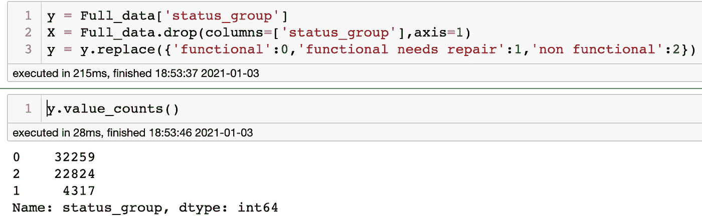
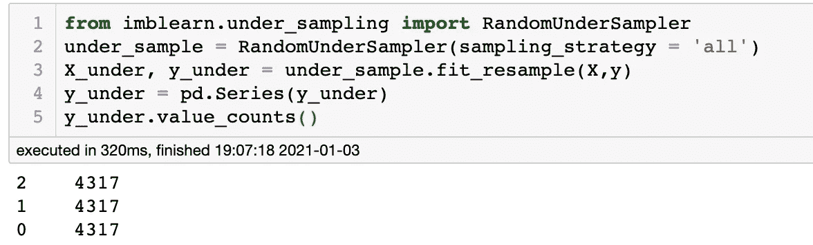
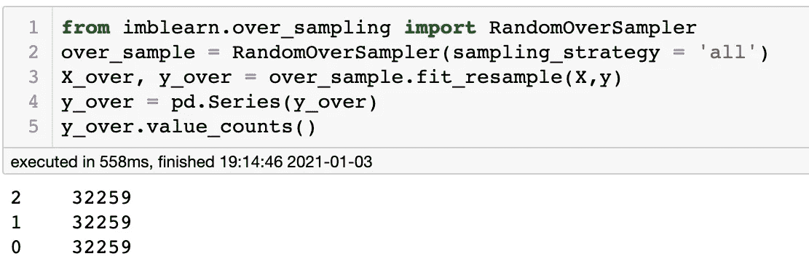
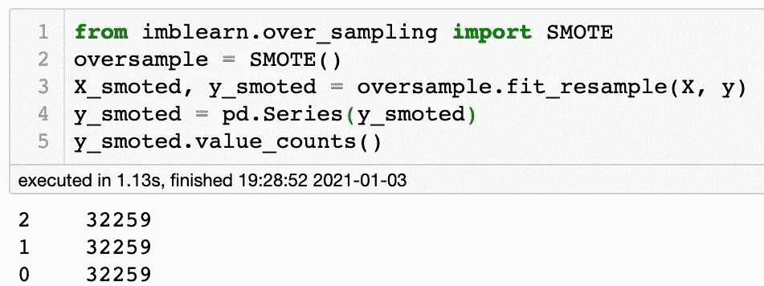

# Python 中处理类不平衡的简单方法

> 原文：<https://medium.com/geekculture/how-to-deal-with-class-imbalances-in-python-960908fe0425?source=collection_archive---------0----------------------->

Photo by [Sebastian Herrmann](https://unsplash.com/@officestock?utm_source=medium&utm_medium=referral) on [Unsplash](https://unsplash.com?utm_source=medium&utm_medium=referral)

处理真实世界的数据可能会非常令人沮丧。它通常缺少数据点，一些值可能输入错误，一些数据类型可能表示不足。这些都会导致处理非常混乱的数据。在对真实世界的数据做分类问题时出现的一个这样的因素是“类别不平衡”。这篇文章将特别提出在我们的数据集中解决这个问题的方法。

那么什么是阶层失衡呢？类别不平衡是指一个类别与数据集中的其他类别数量不同。在运行分类模型时，这通常会成为一个大问题。例如，让我们想象有人在一个农场对动物进行了一次随机调查。在这次调查中，测量员数出了 20 头猪，21 只山羊和 3 头牛。在这种情况下，奶牛是不平衡的一类。类别不平衡在数据集中经常发生，这可能是由于数据收集不良，没有足够的样本，甚至只是因为类别不丰富。当使用不平衡的数据训练分类模型时，它可以显著地扭曲模型，导致显著有偏差的模型。拥有合适的训练数据是开发稳健模型的关键。

可以做很多事情来解决数据集中类不平衡的问题。在这篇文章中，我们将涵盖 3 种不同的方法。

对于本文中的示例，我们将使用我最近参与的一个项目的数据，该项目旨在查看水井是否正常工作。为简单起见，将使用的三个类别是 0、1 和 2。

# **1。收集更多数据**

这似乎是常识，但是你可以尝试收集更多的数据。尽管这是解决问题最直接的方法，但它往往是最困难的。收集更多数据可能成本高昂，可能有时间限制，或者可能有其他因素限制数据收集。幸运的是，还有其他技术可以处理你所拥有的数据。

# 2.欠采样/过采样

处理类别不平衡的另一个选择是对数据集中的数据进行欠采样/过采样。当有大量数据时，这通常是首选。

## 欠采样

欠采样是一种从多数类中移除样本的方法。这可以在替换或不替换的情况下随机完成。欠采样方法是开始解决类不平衡问题的一种非常快速和简单的方法。然而，这并不都是积极的，因为您最终会丢弃数据，所以数据集上有用的见解/信息可能会被丢弃。

这是一个使用 imblearn 实现欠采样的例子。如您所见，只有 3 行代码，类别 0 和类别 2 被欠采样以匹配类别 1。

## 过采样

过采样是解决类不平衡的另一种快速简单的方法。过采样是一种添加少数类副本的方法。这可以在更换或不更换的情况下随机进行。就像欠采样一样，这种方法也有一些潜在的缺点。因为数据只是被复制，所以被训练的模型有可能变得过拟合。

过采样也可以通过使用 imblearn 来完成，实现起来和欠采样一样简单。这里有一个例子，我们复制类别 2 和 1 的条目，直到它们与类别 0 的条目数量相同。

# 3.通过 SMOTE 创建合成数据

我们将在本文中讨论的最后一个选项是创建合成数据。这种技术类似于过采样。然而，这并不是复制精确的数据，而是基于现有的少数类创建新的数据。对我们来说幸运的是，已经有算法可以自动为我们做这些。一种这样的算法叫做 SMOTE，代表[合成少数过采样技术](https://imbalanced-learn.org/stable/generated/imblearn.over_sampling.SMOTE.html)。SMOTE 算法接受最接近的少数类数据条目，并基于这些条目创建新的组合。请记住，SMOTE 不能很好地处理文本数据，因此如果有任何分类数据，应该将其更改为二进制或数字数据。下面是一个如何实现 SMOTE 的示例:

正如您在上面看到的，SMOTE 还能够进行过采样，并将 1 类和 2 类数据提高到与类别 0 相同的数量。

# 结论

处理分类问题时，遇到不平衡数据集的可能性非常高。我希望上面谈到的三种方法(收集更多数据、欠采样/过采样和 SMOTE)有助于深入了解如何解决阶层失衡问题。这些方法不是唯一可用的方法，但它们是最容易实现的一些方法。我强烈建议在研究其他方法之前尝试这些技术。