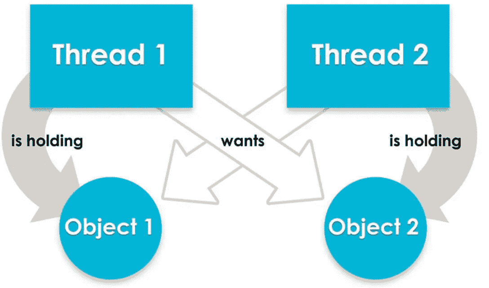

# 如何处理 mysql 中的死锁

> 原文：<https://medium.com/geekculture/how-to-deal-with-deadlocks-in-mysql-58f4d830788b?source=collection_archive---------13----------------------->

死锁是一个常见的问题，但对一些人来说很神秘。大多数情况下，这是无害的，因为事务将被回滚。但是如果治疗不当，有时会变得很难看。

# 定义



死锁是指多个(通常是 2 个)事务(进程)等待对方锁定的情况。通常 mysql 可以通过回滚事务来检测和解决这个问题，除非死锁检测被关闭。

死锁不仅限于数据库系统。哪里有并发，哪里就有死锁！

# 战略

处理死锁的策略包括 3 个步骤:

1.  识别违规交易
2.  在源代码中定位违规的事务
3.  找出合适的解决方案

## 1.识别违规交易

第一步是获取死锁信息。一个简单的 *SHOW ENGINE INNODB STATUS* 就可以了，但是它只显示最新的死锁，这对于了解一段时间内死锁的全貌没有太大帮助。

幸运的是，mysql 5.5.30 中有一个名为*的设置，可以帮助将所有死锁打印到 mysql 错误日志中。启用此功能不会导致任何停机。*

无论如何，检索后的日志会是这样的:

```
*** (1) TRANSACTION:
TRANSACTION 450913541522, ACTIVE 0 sec starting index read
mysql tables in use 1, locked 1
LOCK WAIT 7 lock struct(s), heap size 1136, 3 row lock(s), undo log entries 2
MySQL thread id 93608210, OS thread handle 47321957033728, query id 10802490531 10.0.64.165 db updating
update `table1` set `scroll_to` = 3901, `updated_at` = ‘2021–08–17 11:30:53’ where `id` = 668126442
*** (1) WAITING FOR THIS LOCK TO BE GRANTED:
RECORD LOCKS space id 1455 page no 5719543 n bits 0 index PRIMARY of table `db`.`table1` trx id 450913541522 lock_mode X locks rec but not gap waiting
Record lock, heap no 95 PHYSICAL RECORD: n_fields 24; compact format; info bits 0*** (2) TRANSACTION:
TRANSACTION 450913541519, ACTIVE 0 sec inserting
mysql tables in use 1, locked 1
LOCK WAIT 9 lock struct(s), heap size 1136, 4 row lock(s), undo log entries 4
MySQL thread id 93608214, OS thread handle 47339872995072, query id 10802490581 10.0.63.235 admin update
insert into `table2` (`user_id`, `company_id`, `date`, `steps`, `updated_at`, `created_at`) values (491031, 1, ‘2021–08–17’, 359, ‘2021–08–17 11:30:53’, ‘2021–08–17 11:30:53’)
*** (2) HOLDS THE LOCK(S):
RECORD LOCKS space id 1455 page no 5719543 n bits 0 index PRIMARY of table `db`.`table1` trx id 450913541519 lock_mode X locks rec but not gap
Record lock, heap no 95 PHYSICAL RECORD: n_fields 24; compact format; info bits 0*** (2) WAITING FOR THIS LOCK TO BE GRANTED:
RECORD LOCKS space id 5817 page no 4486 n bits 0 index PRIMARY of table `db`.`user` trx id 450913541519 lock mode S locks rec but not gap waiting
Record lock, heap no 99 PHYSICAL RECORD: n_fields 29; compact format; info bits 0
```

这里有很多信息，但是由于我只对哪个事务/查询持有哪个锁以及等待哪个锁感兴趣，所以我可以总结如下:

```
*Transaction 1: update `table1` set `scroll_to` = 3901, `updated_at` = ‘2021–08–17 11:30:53’ where `id` = 668126442* -> Holding an X lock on `db`.`user`
-> Wait for an X lock on `db`.`table1`*Transaction 2: insert into `table2` (`user_id`, `company_id`, `date`, `steps`, `updated_at`, `created_at`) values (491031, 1, ‘2021–08–17’, 359, ‘2021–08–17 11:30:53’, ‘2021–08–17 11:30:53’)* -> Hold an X lock on `db`.`table1`
-> Wait for an S lock on `db`.`user`
```

注意，虽然日志没有指定事务 1 持有的锁，但是我们可以推断事务 1 持有 *`db`.`user`* 上的锁，事务 2 正在等待该锁。

还要注意，事务 1 只更新*表 1* ，但是它持有表*用户的锁；*同样的事情也适用于事务 2:它插入到*表 2* 中，但持有*表 1* 的锁，并等待表*用户*的锁。乍一看，这似乎很奇怪，但原因是这里显示的查询只是整个事务的一部分。这意味着在`update `table1``之前，事务 1 已经对*用户*表做了一些事情，因此它持有 X 锁。同样的解释适用于交易 2。这种锁持有/等待信息对于查明这些事务在应用程序源代码中的位置是必要的。

## 2.在源代码中定位违规的事务

下一步是在应用程序代码中搜索事务，通常是通过编辑器的搜索引擎。事务应该包括持有/等待锁的查询，这些锁对应于我们在步骤 1 中发现的锁。

对于大型代码库来说，这可能是一项艰巨的任务，尤其是对于那些使用 ORM 进行数据库交互的人来说。虽然表名有助于缩小搜索范围，但这需要耐心。您可能还想检查应用程序日志中由死锁产生的错误，这些错误也包含一些关于违规代码行的信息。

## 3.找出合适的解决方案

在深入研究了应用程序代码之后，我想您已经找到了罪魁祸首。最后一步是找到解决它们的方法。

并发是死锁的根源。为了减少死锁发生的机会，事务应该是快速的，以防止被其他事务干扰。通过重构加速它们:

*   将业务逻辑代码放在事务之外。我见过遗留项目中充斥着业务逻辑的臃肿的事务。
*   加速缓慢的查询

另一个解决方案是通过进行同步调用来避免并发。例如:在打开应用程序时，用户的位置和用户的活动信息被异步(同时)发送到服务器，导致数据库死锁。将这些调用转换成同步调用应该可以消除死锁，因为没有并发就没有死锁。如果重构不是遗留项目中的一个选项，这是一个很好的选择。然而，如果业务逻辑不允许这样的变化，这个解决方案可能就行不通了。

# 结论

他们说这就像僵局一样令人讨厌和神秘，但是如果我们有一点耐心，知道去哪里寻找，它就会变得不那么神秘，而更像是一个肯定可以摆脱的麻烦。