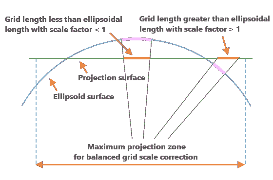
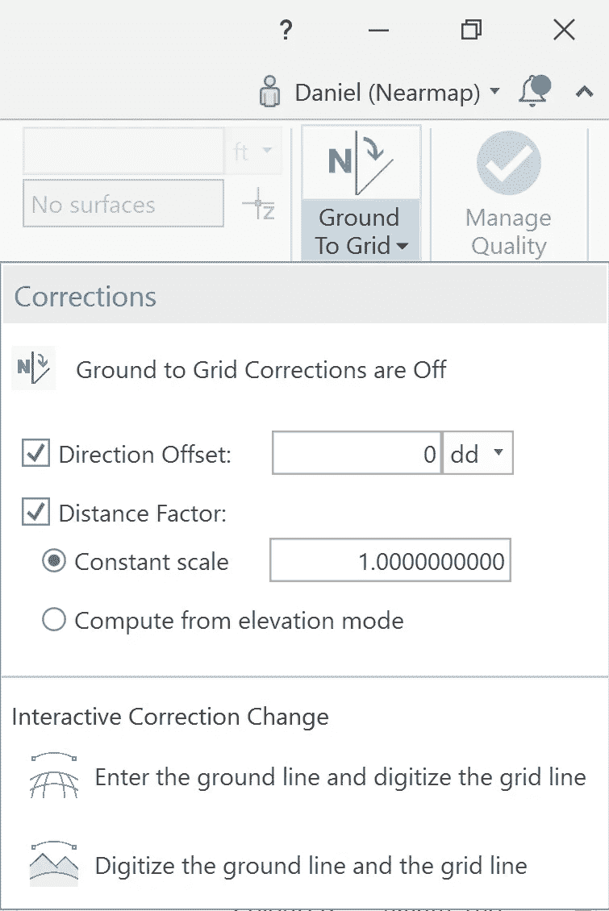

# 如何处理地面和网格坐标

> 原文：<https://medium.com/geekculture/how-to-deal-with-ground-and-grid-coordinates-205e687b757b?source=collection_archive---------15----------------------->

如果你使用的是测量员绘制的图纸，它们将基于地面坐标。要将这些绘图与标准影像一起使用，您需要将它们转换为 GIS(或格网)数据。

*Photo by* [*Scott Blake*](https://unsplash.com/@sunburned_surveyor?utm_source=unsplash&utm_medium=referral&utm_content=creditCopyText) *on* [*Unsplash*](https://unsplash.com/s/photos/survey?utm_source=unsplash&utm_medium=referral&utm_content=creditCopyText)

对于许多使用影像的人来说，主要的工作流程是将项目的所有数据导入 AutoCAD 或 ArcGIS 等平台。在大多数情况下，这就像附加栅格或链接到 WMS 连接一样简单，但有时当他们正在处理的数据是通过地面投影捕获的时，需要额外的步骤。

# 地面坐标系

测量员将收集数据点，并将它们汇集到地面坐标中。当您在基于此数据的图形上工作时，您是在地面坐标系上工作。地面坐标是在地球的实际表面进行的测量。

# GIS(网格)系统

另一方面，GIS 数据基于空间数据的坐标系统或“格网”系统进行操作。它是一种数学模型，使用椭球面来表示地球的形状。为了校正这两者之间的差异，并使我们的图像与地面测量一致，我们需要应用方向和距离的比例因子。

*图 1:地面投影的椭球面模型。***|*[*www.cad-1.com*](https://docs.nearmap.com/display/NUB/2020/01/09/www.cad-1.com)*| 2013 CAD-1。Inc**

# *方向校正*

*进行测量时，可以使用几种不同的北:真北、磁北、网格北或本地定义的北。GIS 数据将使用坐标系的北方，因此需要旋转方向以将一个方向转换为另一个方向。这个角度差就是方向偏移，需要加上或减去该方向偏移来对齐数据。*

# *距离校正*

*在地面上测量的距离是相对于当地地面高程的，而坐标系中的距离是相对于该坐标系椭球体(或简单地说，海平面)测量的。
测量计划应包含校正信息，该信息可称为方向调整的方位角或会聚角的基础，以及距离校正的比例因子。*

# *如何在 ArcGIS 和 Autodesk 中应用这种校正？*

**

*Ground to Grid tool in ArcGIS Pro*

*在 ArcGIS Pro 中，这种转换再简单不过了。编辑功能区上有一个地面转格网按钮，允许您快速输入比例因子并应用校正*

*在 Autodesk 内部，该过程略有不同，但一旦您知道步骤，仍然很容易。你需要知道你想要使用什么样的坐标系以及组合比例因子。组合比例因子将是网格比例乘以正高比例的结果。该数字应包含在验船师提供的图纸中。一旦确定了坐标系和组合比例因子，就需要创建一个新的坐标系，并将虚东距和比例缩减乘以组合比例因子。*

*例如:*

*伪东距计算:(1640416.66666667)*(1.0003672940)= 1641019.18186583666789098 缩放计算:(0.9999)*(1.0003672940)= 1.0002672572706*

*使用您刚刚创建的新坐标系会将所有数据集中到同一个坐标系下。*

*用于进行格网到地面转换的方法肯定会根据您使用的平台而有所不同，但基本概念将保持不变。*