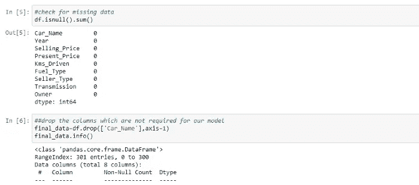

# 机器学习中如何处理缺失值

> 原文：<https://medium.com/geekculture/how-to-deal-with-missing-values-in-machine-learning-98e47f025b9c?source=collection_archive---------3----------------------->

Photo by [Campaign Creators](https://unsplash.com/@campaign_creators?utm_source=unsplash&utm_medium=referral&utm_content=creditCopyText) on [Unsplash](https://unsplash.com/s/photos/data-sciense?utm_source=unsplash&utm_medium=referral&utm_content=creditCopyText)

真实世界的数据通常有很多缺失值。如果你想让你的模型公正准确地工作，那么你就不能忽略数据中“缺失值”的部分。数据清理或预处理中最常见的问题之一是处理缺失值。本文的目的是发现有效处理缺失数据的技术。

我们开始吧，

**什么是缺失数据？**

缺少数据意味着列中缺少观察值。它出现在“0”、“NA”、“NaN”、“NULL”、“不适用”、“无”等值中。

**为什么数据集有缺失值？**

其原因可能是数据损坏、未能记录数据、缺少信息、结果不完整、人员可能无意提供数据、某些系统或设备故障等。数据集中缺少值可能有任何原因。

**为什么要处理缺失值？**

缺失数据的最大影响之一是，它会使机器学习模型的结果产生偏差或降低模型的准确性。因此，处理缺失值非常重要。

**如何检查缺失数据？**

处理缺失值的第一步是仔细查看数据，找出所有缺失值。为了检查 Python Pandas 数据框中的缺失值，我们使用 isnull()和 notnull()这样的函数来帮助检查值是否为“NaN”(真)并返回布尔值。

此外，通过可视化来浏览丢失的数据，您可以快速获得数据集完整性的可视化摘要。“Missingno”是一个 Python 库，可以帮助您可视化丢失的值。为了可视化缺失值，“缺失号”提供了**条形图、矩阵图、热图**。

**如何处理缺失数据？**

根据缺失值是连续的还是分类的，可以用不同的方式处理缺失值。因为这两种数据类型处理缺失值的方法不同。通过使用 python 中的“dtypes”函数，我们可以从数据集中过滤我们的列。

处理数据集中缺失值的三种方法如下:

*   [掉落](https://medium.com/p/98e47f025b9c/edit/#10db)
*   [实施](https://medium.com/p/98e47f025b9c/edit/#7da3)
*   [预测模型](https://medium.com/p/98e47f025b9c/edit/#0b54)

## 删除丢失的值

此方法通常用于处理空值。它很容易实现，并且不需要数据操作。这取决于你认为变量拥有的信息量。如果数据集信息很有价值或者定型数据集的记录数较少，则删除行可能会对分析产生负面影响。当缺失数据的性质完全随机缺失(MCAR)时，删除方法非常有效，但对于非随机缺失值，如果从数据集中删除大量特定类型的变量，可能会在数据集中产生偏差。

1.  删除行(列表式删除)
2.  删除列
3.  成对删除

## 输入缺失值

缺失数据插补有很多方法，它们通常取决于你的问题和你的数据算法的表现。我们会在 ***时序问题*** 和 ***一般问题*** 中看到缺失数据。

***时间序列问题*** :时间序列数据集可能包含趋势和季节性。当序列中出现长期上升或下降时，趋势模式就存在，这可能导致平均值随时间变化。当数据受到季节性因素的影响时，就会存在季节性，这些因素会导致随时间变化的方差，例如一周中的某一天、一个月以及一年中的某个季度。

所以，时间序列可以定义为三类，例如:

1.  *无趋势和无季节性的数据*有缺失数据可通过均值、中值、众数或随机样本插补等方法解决。
2.  *有趋势和无季节性的数据*有缺失数据可以用线性插值解决
3.  *有趋势性和季节性的数据*，有缺失数据可以通过季节调整加插值解决

***一般问题*** :连续数据和分类数据两种数据类型之间缺失值的处理方法不同。

1.  连续数据中的缺失值可以通过均值、中值、众数或多重插补来解决
2.  分类数据中的缺失值可以通过模式、多重插补来解决

**平均值和中位数**

如果要素是数字，您可以使用简单的方法，例如平均值或中值。这是输入数值列的缺失值的最常见方法。为此，我们可以利用 python 中的“SimpleImputer”。如果有异常值，那么平均值就不合适。在异常值的情况下，最好使用中间值进行插补。Median 是最中间的值。

**模式(频繁类别插补)**

**模式**是出现频率最高的值。它用于分类特征的情况。这种技术要求用出现频率最高的变量替换丢失的值，或者用该列的模式替换这些值。

在某些情况下，用“前一个值”(ffill)、“单个值”或“下一个值”(bfill)而不是平均值、众数或中值来估算值更合适。可用于字符串或数字数据。你可以使用 python 库的**‘fillna’**函数。

**其他插补方法:**

除了上述方法之外，还有许多其他估算缺失值的方法，下面给出了一些。

**多重插补**非常灵活，本质上是随机插补的一种迭代形式。这是处理缺失数据的统计技术。它保留了样本大小和统计功效

**KNN 估算器**或**迭代估算器**类，用于估算考虑多变量方法的缺失值。在多变量方法中，考虑不止一个特征。

**任意值插补**是插补中使用的一项重要技术，因为它可以处理数值和分类变量。当数据不是随机丢失时，或者对于基于树的算法，而不是线性回归或逻辑回归，应该使用这种方法。这种技术表明，我们将一列中缺失的值分组，并将它们分配给一个新值，如 999 或-999 或“缺失”或“未定义”。它很容易使用，但会产生离群值。

## **预测模型**

这就像运行一个预测模型来估计将替代缺失数据的值。您可以使用非缺失数据来预测缺失值。我们只需将数据集分成两个数据集，一个没有缺失数据，作为训练数据集，另一个作为有缺失值的测试数据集。然后使用定型数据集创建模型来预测目标变量和缺失值。

**结论**

在本文中，我们试图了解什么是缺失值，为什么它们在数据集中，缺失数据如何改变模型输出，以及在机器学习中处理缺失数据的不同方法。我希望你喜欢这篇文章。感谢阅读:)。

如果你想了解更多关于机器学习项目的信息，请查看以下链接:

[汽车价格预测](/geekculture/used-carprice-prediction-complete-machine-learning-project-d25559cf2d2a)ML 模型

[用于股票价格预测的机器学习模型](/@tejashree-nawale/a-machine-learning-model-for-stock-price-prediction-109c2a942519)

[机器学习模型，根据对银行营销活动的分析，帮助预测客户是否会订购](/@tejashree-nawale/machine-learning-project-in-banking-domain-2bfeeccad68b)定期存款。