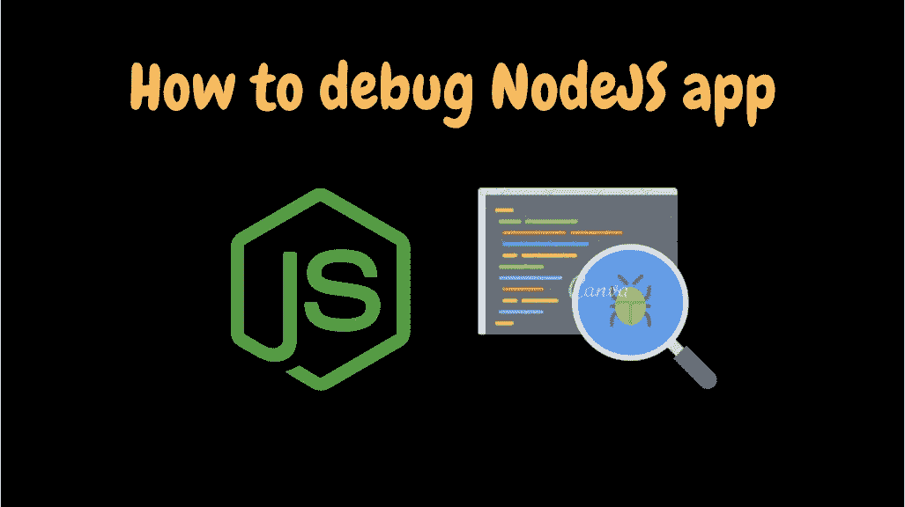
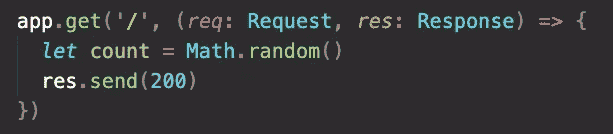
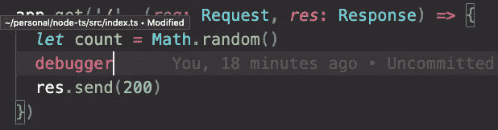
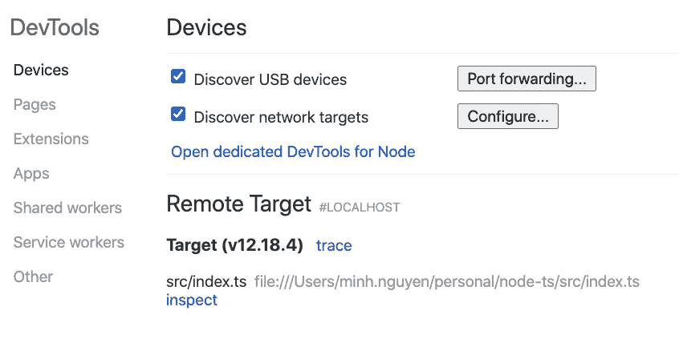
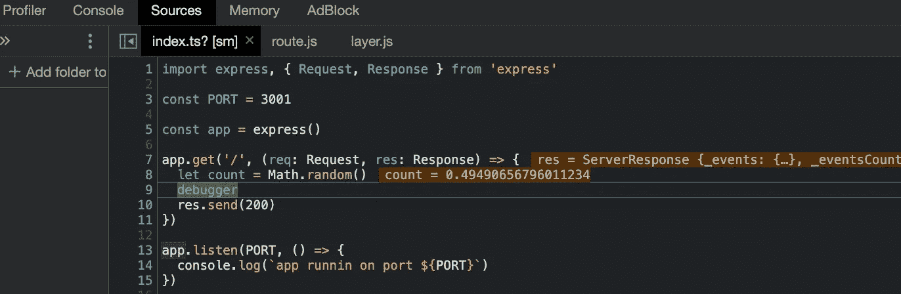
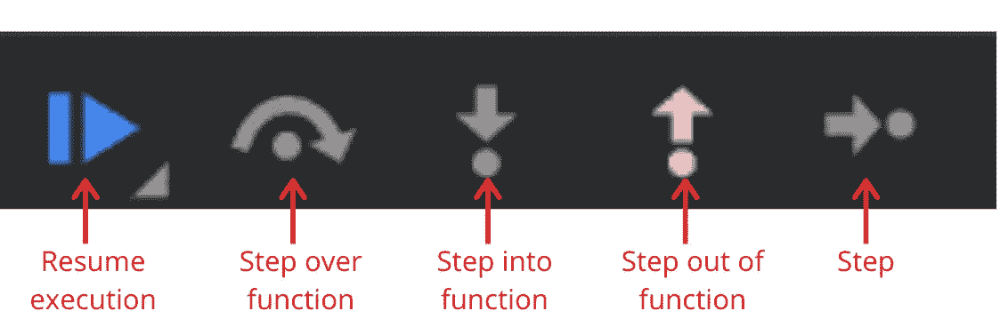
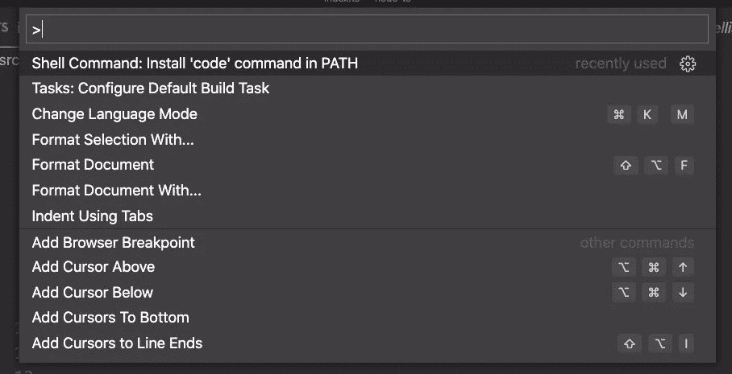
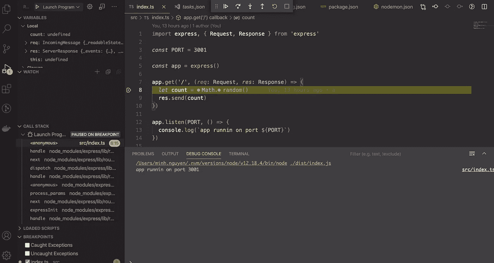

# 如何像专家一样调试 NodeJs 应用程序

> 原文：<https://medium.com/geekculture/how-to-debug-nodejs-applications-like-a-pro-20ee08226187?source=collection_archive---------34----------------------->

对于任何软件工程师来说，调试都是一项基本技能。在我看来，良好的调试能力是优秀工程师与普通工程师的区别。它还有助于在开发功能或调查问题时节省大量时间。在这篇博文中，我将向您展示调试 NodeJS 应用程序的三种技术。虽然这些技术主要面向 NodeJS 开发人员，但是它们可以应用于任何编程语言或框架，只不过使用不同的调试工具。如果你更喜欢视频教程而不是阅读，我在这里做了一个视频[。](https://youtu.be/rMLI1oC1Ak0)

我们将与一个样本项目，我准备[在这里](https://github.com/dmngu9/node-ts)。这是一个非常简单的 NodeJs 服务器，它计算一个计数值，并为路由“/”上的请求发回 200 个状态代码，如下所示。如何检查计数值？

# 简陋的控制台. log

我知道，我知道。我们以前都见过这种古老而无趣的**声明。但是请相信我，这是一个强大的技术，仍然被大多数有经验的工程师使用。在本练习中，为了找出 **count 的值，**console . log 简单地完成了这项工作。以下是这种方法的利弊。**

优点:

*   这样做很快，并帮助我们了解代码路径的某些部分的结果。

缺点:

*   如果代码库更复杂，则需要多个 **console.log** 语句，每个语句都需要额外的元数据来区分彼此。
*   它不允许我们检查结果是如何计算的，也不允许我们检查某些代码路径是如何到达的，除非我们放置多个 **console.log** 。那会很费时间。

这种技术只有在问题很小并且开发人员已经熟悉代码库的情况下才最有效。

# 在 Chrome 浏览器中使用 NodeJS 内置检查器功能

由于 console.log 方法的所有缺点，因此需要更好的调试技术。其中之一就是使用 NodeJS 内置的 inspector。在上面的示例代码中，让我们在。

然后使用**node-inspect index . js 再次运行服务器。**如您所知，我们在这里使用**-inspect**标志将 NodeJS 服务器置于检查模式。

现在，打开你的 Chrome 浏览器，进入这条路线 **chrome://inspect。**在**远程目标**部分，你应该看到你的 **index.js** 作为目标。点击**检查**链接。它将带你到 Chrome debugger tool for NodeJS。

如果我们向'/'路由发出请求，请求处理将在如下所示的**调试器**行停止。

在第 8 行，您可以观察到 **count** 变量的值。轻松右转！！

在 Chrome 调试器的右边，你会看到这些按钮。

*   **恢复执行**:继续执行脚本。它将在下一个**调试器**处停止。如果没有更多的**调试器**，它将执行脚本的剩余部分。
*   **跳过功能**:执行不感兴趣的功能，但不检查。它将在执行该功能后停止。
*   **进入函数**:如果我们的 **count** 变量是由一个函数或者嵌套函数计算的，你可以进入那个函数，逐行检查其中的所有操作。
*   **跳出函数**:如果您正在检查一个函数，并且想要返回到调用该函数的行，您可以使用该功能。
*   **步骤**:执行脚本的单行，将**调试器**移动到下一行。

有了所有这些特性，你可以很容易地观察到你的程序是如何一步一步地运行的。我相信在调查复杂的 bug 时，这种技术比 **console.log** 更优越。

# 使用 VSCode 调试器

如果您每天都在使用 VSCode，这可能是最好的调试方法。我很喜欢 VSCode 在过去几年中的发展。

首先，让我们在你的 VSCode 中运行 **Cmd + Shift + p** 。这会给你一个下坠。然后，选择**任务:配置默认构建任务**选项。

它将弹出另一个下拉菜单，您可以在其中选择 package.json 中的脚本作为构建任务运行。我们将选择运行 index.js 的脚本。vscode 文件夹。

在 VSCode 的左侧。点击 bug and play 按钮，选择**创建一个 launch.json 文件**。类似的下拉菜单将出现在下图中。我们将选择 **Node.js(预览)**选项。

launch.json 文件是在。vscode 文件夹。在这个文件中，让我们将**程序**字段修改为 index.js 的路径。如果您的 index.js 在 src 文件夹中，那么您的**程序**字段应该是$ { workspace folder }/src/index . js。

现在，让我们单击代码行的左侧，在 count 变量行上放置一个断点。断点显示为红点。我们可以通过单击创建 launch.json 文件的同一个选项卡下的绿色 play 按钮来运行我们的服务器。如果我们现在请求'/' route，程序将在断点处停止，如下所示。

在这里，你会看到一个类似于上一节 Chrome 浏览器调试器的调试器。我发现这种方法比使用 Chrome debugger 要好，因为我不必离开我的 VSCode。此外。可以在 Git 中提交 vscode 文件夹供其他团队成员使用。

希望这三个技巧对你有用。

关注我了解更多软件开发方面的内容。