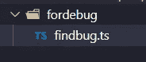
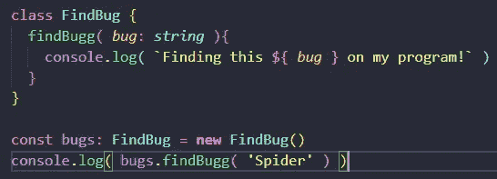
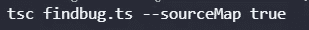
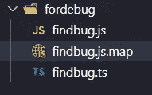
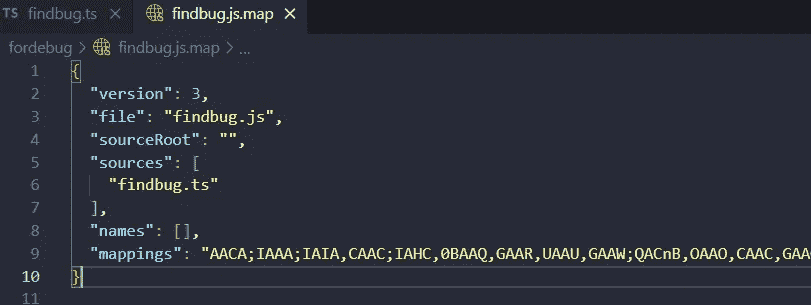
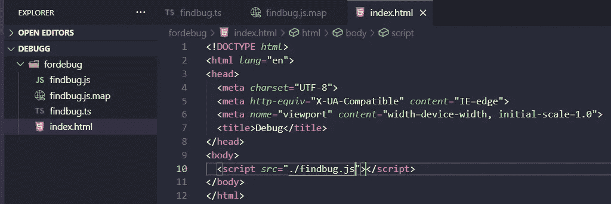
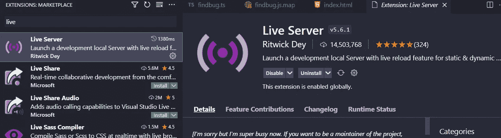
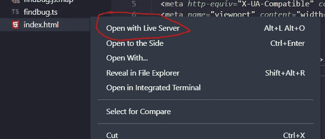
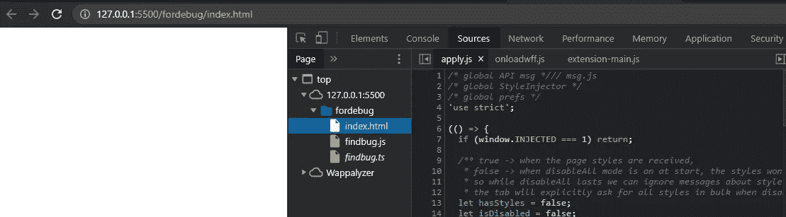
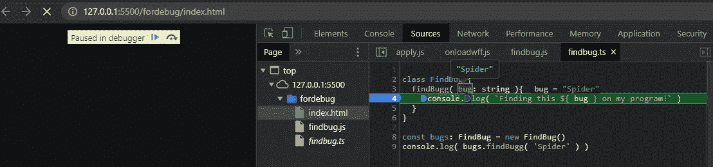

# 如何调试🐞使用 Chrome 浏览器键入脚本文件🐛

> 原文：<https://medium.com/geekculture/how-to-debug-typescript-files-with-chrome-browser-83a4911996e2?source=collection_archive---------6----------------------->


这是调试 TypeScript 文件的一个非常有用的方法，而且一点也不困难，让我们调试 TypeScript 文件并找出错误吧！🦗🐌🐛🕷🐞

# 如果你愿意，可以看看视频

# 目录

您需要创建一个名为“fordebug”的目录，或者其他您想要的名称，然后在这个文件夹中，我们将创建一个名为 findbug.ts 的类型脚本文件



Example directory to debug TypeScript files

现在我们需要向我们的 TypeScript 文件添加一些代码



Adding code to our TypeScript File

```
class FindBug {
findBugg( *bug*: *string* ){
console.log( `Finding this ${ *bug* } on my program!` )
}}const bugs: FindBug = **new** FindBug()
console.log( bugs.findBugg( 'Spider' ) )
```

# 源地图

这是调试 TypeScript 文件的关键，但是为什么呢？因为如果你生成了 sourceMap，它有足够的信息来调试 TypeScript 文件，而且它是一个非常好的工具，在 sourceMap 里面我们有数据，但是是 JSON 格式的。

要创建我们的源地图，我们需要这个命令

```
tsc findbug.ts --sourceMap true
```



command to create sourcemap

这将创建我们的 souceMap，它将创建我们的 findbug.js JavaScript 文件，sourceMap 具有 js.map 扩展名，让我们打开它



Example sourcemap



Example inside findbug.js.map sourcemap

如果你看到它有一个包含所有信息的源文件和映射。

# 调试类型脚本

为了调试 TypeScript，我们需要创建一个 index.html，并在其中链接我们的 findbug.js 文件，这是因为我们将使用 Chrome DevTools，我们将能够调试我们的 TypeScript 文件。



Example create an index.html file and linked with finding.js

```
<!DOCTYPE *html*>
<html *lang*="en">
<head>
<meta *charset*="UTF-8">
<meta *http-equiv*="X-UA-Compatible" *content*="IE=edge">
<meta *name*="viewport" *content*="width=device-width, initial-scale=1.0">
<title>Debug</title>
</head>
<body>
<script *src*="./findbug.js"></script>
</body></html>
```

之后，我们需要安装 live-server 或者使用 VS 代码的 live-server 扩展。

```
npm i -g live-server// run server inside of the project
liver-server
```



Example extension Liver Server



Example Open live server

它将在 Chrome 浏览器上打开我们的 index.html，如果你点击源文件，有三个文件 index.html、findbug.js 和 finbug.ts



Example files on Chrome DevTools

然后我们需要添加断点，玩得开心！因为它工作得很好，我们现在可以找到我们项目中的所有错误，最好的部分是我们将在 TypeScript 文件中找到它们。



Debugging TypeScript files on Chrome DevTools

# 结论

这是令人惊讶的，因为 TypeScript 确实是一种伟大的编程语言，但有了它，我们可以使用 Chrome DevTools。

# 来源

 [## TSConfig 参考-每个 TSConfig 选项的文档

### 从 allowJs 到 useDefineForClassFields，TSConfig 参考包括关于所有活动编译器的信息…

www.typescriptlang.org](https://www.typescriptlang.org/tsconfig#sourceMap) [](https://www.amazon.com/TypeScript-Quickly-Yakov-Fain/dp/1617295949/ref=sr_1_8?dchild=1&keywords=TypeScript&qid=1631065064&sr=8-8) [## 快速打字

### 在 Amazon.com 上快速打字[费恩，雅科夫，莫伊瑟夫，安东]。*符合条件的优惠可享受免费*运输。打字稿…

www.amazon.com](https://www.amazon.com/TypeScript-Quickly-Yakov-Fain/dp/1617295949/ref=sr_1_8?dchild=1&keywords=TypeScript&qid=1631065064&sr=8-8)