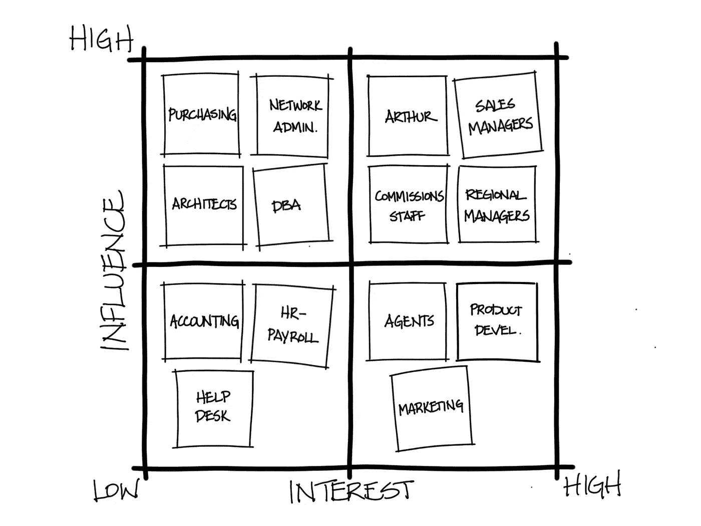
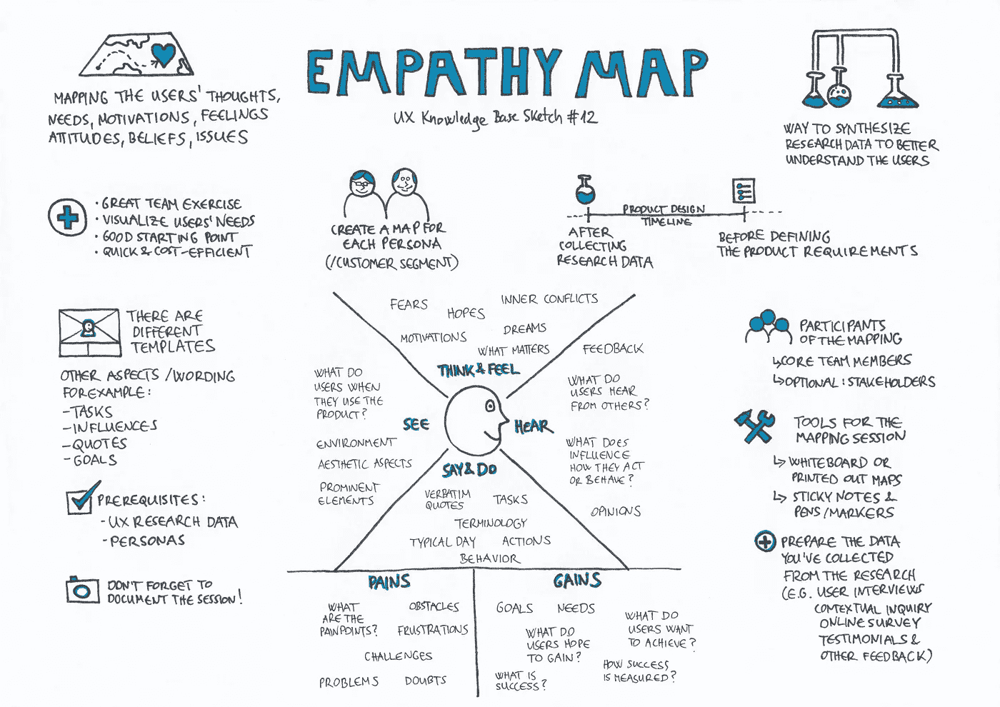
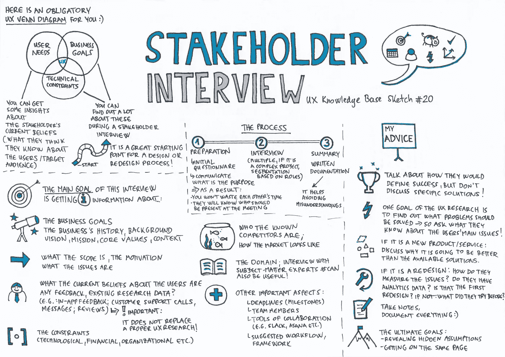
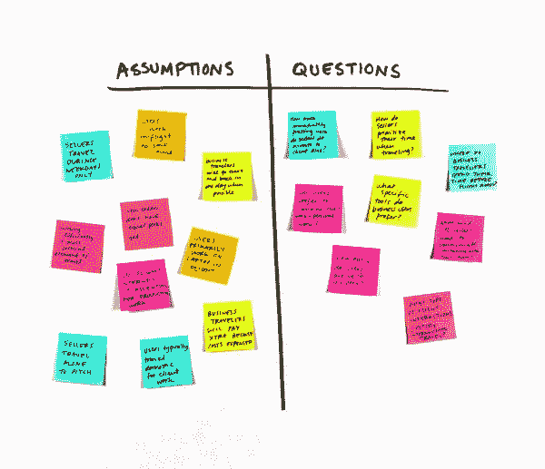
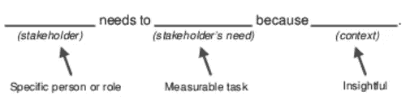
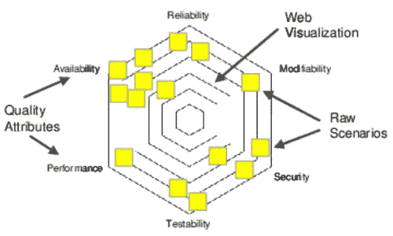
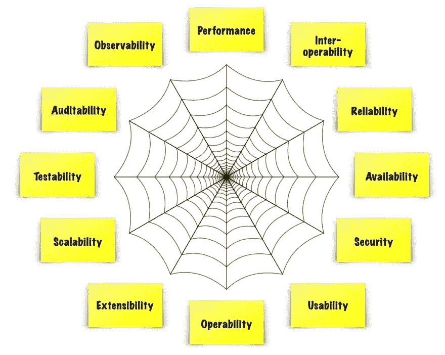
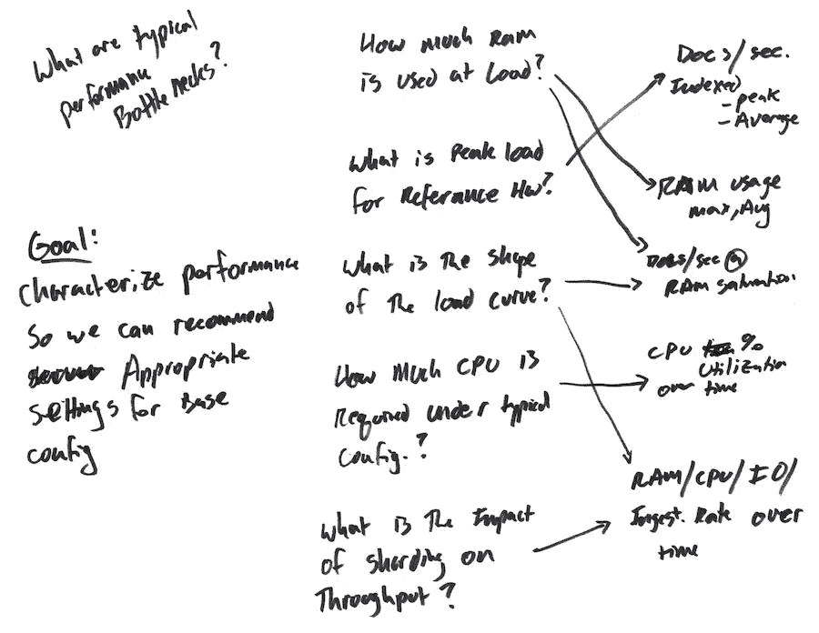

# 如何定义和理解系统设计中的问题？

> 原文：<https://medium.com/geekculture/how-to-define-and-understand-the-problem-in-system-design-da3a5390c9d4?source=collection_archive---------43----------------------->

> 如果我有一个小时来解决一个问题，我会花 55 分钟思考问题，花 5 分钟思考解决方案。[人名]阿尔伯特·爱因斯坦(犹太裔理论物理学家)

在找到并实施解决方案之前，您应该深入了解并尽可能清晰地描述问题。此时，你可以用具体的方法来描述一个问题。我将尝试在两个不同的主题下解释这些方法。

*   **一般方法**
*   **系统设计中的领域特定方法**

# 一般方法

*   重新表述这个问题

我们通常会尝试用一句话来表达一个问题，比如“提高 X 的生产率”。我们应该给出更多的细节，并且在定义问题时能够使用不同的词语。丰富的词汇在这里起着重要的作用，所以你可能想使用词典或扩大你的词汇量。

*   揭露和挑战假设

它将包含假设——不管问题有多简单。这是不可否认的事实。没有假设就不可能有问题。你必须优先考虑所有假设，并逐一挑战它们，以找到正确的解决方案。

*   凑上去

每个问题都是更大问题的一小部分。你需要从一个不同的或更普遍的角度来看，以便更好地理解这个问题。你可以问自己这些问题:

——“这是什么的一部分？”

——“这是什么例子？”

——“这背后的意图是什么？”

不过，你也可以使用[这个方法。](https://litemind.com/boost-brainstorm-effectiveness-why-habit/)

*   大块放下

如果每个问题都是一个更大问题的一部分，这也意味着每个问题都是由许多更小的问题组成的。事实证明，将一个问题分解成许多更小的问题——每个问题都比原来的问题更具体——也可以提供更多关于它的见解。

如果你发现这个问题让人不知所措或令人畏惧，那么“把问题分块(chunking down)”特别有用。

你可以问自己这些问题:

——“这是什么部分？”

——“这方面有什么例子？”

*   使用多重视角

利用不同的视角永远是找到解决方案的最有效方法。不同的视角往往包含不同的经历。不同的经历揭示了解决共同问题的尝试方法。

*   使用有效的语言结构

没有一个放之四海而皆准的公式来恰当地制作完美的问题陈述，但是有一些语言结构总是有助于使其更有效，比如**假设无数的解决方案，使其积极，以问题的形式框定你的问题等等。**

*   让它引人入胜

除了使用有效的语言结构，提出一个真正让你兴奋的问题陈述也很重要，这样你就处于创造性解决问题的最佳状态。如果这个问题对你来说太枯燥了，投资时间给它增加活力，同时保持它的真实性。让它变得诱人。你的大脑稍后会感谢(并奖励)你。

*   逆转问题

当你被一个问题困住的时候，一个通常有用的技巧是把它颠倒过来。这种看似复杂的方法起初可能看起来不直观，但是将问题颠倒过来可以发现原始问题的相当明显的解决方案。

*   收集事实

调查问题的原因和环境。探究关于它的细节——比如它的起源和原因。特别是如果你有一个太模糊的问题，调查事实通常比试图马上解决它更有成效。

*   问题-解决你的问题陈述

我知道我在这里有陷入无限循环的风险，但是你可能已经注意到了，获得一个问题的正确视角本身就是一个问题。因此，请随意使用你所知道的任何创造性思维技巧来帮助你。有很多选择:你可能想给自己一个问题陈述的想法配额。或者写一张要解决的 100 个问题的清单。跳过你的问题定义。这些只是你可以尝试的许多技巧中的一部分。

当然，你在定义问题上投入了多少努力，与你在解决实际问题上投入了多少努力相比，这是一个很难达到的平衡，尽管通过实践是可以达到的。

# **系统设计中的领域特定方法**

我们现在对解决问题所需的一般方法有了一个概念。现在我们将试图找到在设计系统时如何定义问题。你有十种不同的方法来定义这个问题。

*   利益相关者地图
*   共情地图
*   与利益相关者的访谈
*   假设列表
*   观点疯狂图书馆
*   应对措施稻草人
*   质量属性网络
*   小型质量属性研讨会
*   GQM 研讨会(目标-问题-指标)
*   COT(选择一项)

## 利益相关者地图

它是软件系统所涉及或影响的人员的网络图。您可以可视化所有对要构建的软件系统感兴趣的人之间的关系、层次和交互。

**好处**

*   识别更多的利益相关者，而不仅仅是通常的嫌疑人
*   确定与谁谈论需求
*   帮助团队理解他人，而不仅仅关注技术
*   创建系统环境和相关人员的快照
*   用作文档，帮助新队友提高速度或协助架构验证

你可以查看[这个链接](https://www.ibm.com/design/thinking/page/toolkit/activity/stakeholder-map)了解更多信息。

## 共情地图

集体讨论并记录特定利益相关者的责任、想法和感受，以帮助团队对利益相关者的目标产生更大的共鸣。

**好处**

*   在开发架构描述之前，发现受众的需求
*   帮助决定包含或排除哪些信息
*   创建一个评价架构描述有效性的标准

你可以查看[这个链接](https://www.ibm.com/design/thinking/page/toolkit/activity/empathy-map)了解更多信息。

## 与利益相关者的访谈

面试可以是结构化的，也可以遵循一套非结构化的脚本。非结构化面试更倾向于对话，通常更容易回答问题，但是你仍然应该带着一套计划好的话题去参加面试。面试可以是面对面的，也可以通过问卷或调查的方式进行。有许多利益相关者访谈资源，包括清单和问题模板。你可以阅读[这本书](https://www.amazon.com/Designing-Digital-Age-Human-Centered-Products/dp/0470229101)了解更多信息。

**好处**

*   关注一般信息收集
*   格式允许开放式的来回讨论
*   快速验证质量属性场景和其他 ASR
*   在利益相关者和架构师之间建立直接联系

你可以查看[这个链接](https://www.sciencedirect.com/topics/computer-science/stakeholder-interview)了解更多信息。

## 假设列表

假设是我们认为理所当然的系统的真相。隐藏的假设扼杀项目。在列出假设活动中，我们通过写下尽可能多的假设，将假设从阴影中带出来。使用这些信息来计划进一步的设计工作，确定后续步骤的优先级，改进 ASR，并提高团队对体系结构的共享知识。

**好处**

*   避免对真正目标和要求的误解
*   非常适合即席分析。不需要正式的研讨会或议程。
*   避免遗漏重要的需求

您可以查看[此链接](https://www.ibm.com/design/thinking/page/toolkit/activity/assumptions-and-questions)了解更多信息。

## 观点疯狂图书馆

POV mad lib 以一种令人难忘、引人入胜的格式总结了业务目标和其他利益相关者的需求。这种格式应该为任何写过敏捷故事的人所熟悉，尽管重点是利益相关者的需求，以及整个系统将如何提供价值，而不是特定的特性或功能。你可能会认为这是一个用户的奥德赛，一个包含潜在的多个史诗和故事的声明。

**好处**

*   培养对利益相关者需求的同情心
*   以用户为中心的方式阐明业务目标
*   用于开始关于业务目标的对话

## 应对措施稻草人

响应措施稻草人的目标是给利益相关者一些可以敲打的东西，直到他们得出自己的答案。我们通过为一些质量属性场景发明一个合理的响应措施来达到这个目的，作为一种引发讨论的方式。

**好处**

*   提供了一个可衡量的响应和响应措施的示例
*   Jump 开始考虑质量属性场景
*   通过提供可编辑的内容而不是从头开始创建响应措施，克服了空白页综合症

## 质量属性网络

质量属性网站是一个集思广益和可视化的活动，有助于引出、分类、提炼和优先处理涉众关注的问题和原始质量属性场景。质量属性网抓住了涉众的关注点。我们将每个问题写在单独的便笺条上。

**好处**

*   引导涉众考虑质量属性而不是特性
*   提供可视化效果，显示一个系统与另一个系统之间基于高度期望的属性的不同之处
*   在细化质量属性场景之前，帮助涉众区分它们的优先级

## 小型质量属性研讨会

小型质量属性研讨会是一个精简的、便利的研讨会，旨在帮助您在系统生命周期的早期与利益相关者讨论质量属性。在小型 QAW 中，你们将作为一个小组协作，在质量属性分类法的帮助下，快速识别、开发和阐明质量属性。在迷你 QAW 结束时，你将有一个质量属性场景的优先列表，以及大量关于要设计的系统的上下文信息。

**好处**

*   在几个小时内完成传统质量属性研讨会的基本步骤
*   快速识别原始质量属性，并在细化为完整场景之前对其进行优先排序
*   为利益相关者提供相互交流想法的机会
*   为涉众之间的公开讨论创建一个表格，以讨论质量属性问题、风险和其他关于软件系统的一般问题

## GQM 研讨会(目标-问题-指标)

一种用于识别度量和响应措施的方法，以便我们能够将数据与业务目标结合起来

## COT(选择一项)

向利益相关者提出一个极端的选择，与他们讨论优先事项:如果你只能得到一样东西，会是什么？这种方法可以帮助利益相关者在面临困难的取舍时做出决策。

**好处**

*   显然是通信，
*   就为什么做出某个选择以及利益相关者需要做出哪些改变来改变他们的想法展开对话。
*   当利益相关者不同意时，这一点很明显。

总之，

在任何情况下，我们都应该清楚地定义问题，以便应用或创建最有效的解决方案。问题定义中的每个小故障都会导致解决方案出现偏差。此外，倾斜的解决方案会导致越来越多的问题。

希望你能用我上面说的方法更有效的定义问题。

编码快乐！

## 相关链接

*   [https://www . Amazon . com/exec/obi dos/ASIN/1580083110/phaedrus 0 b](https://www.amazon.com/exec/obidos/ASIN/1580083110/phaedrus0b)
*   【https://www.stakeholdermap.com/ 号
*   [https://www . Amazon . com/Design-Programmer-Architect-practical-Programmers/DP/1680502093](https://www.amazon.com/Design-Programmer-Architect-Pragmatic-Programmers/dp/1680502093)
*   [https://www . Amazon . com/Just-Enough-Software-Architecture-Risk-Driven/DP/0984618104](https://www.amazon.com/Just-Enough-Software-Architecture-Risk-Driven/dp/0984618104)
*   [https://www . Amazon . com/Design-Programmer-Architect-practical-Programmers/DP/1680502093](https://www.amazon.com/Design-Programmer-Architect-Pragmatic-Programmers/dp/1680502093)
*   [https://www . research gate . net/publication/226144839 _ Problem _ Definition _ in _ Designing _ Product-Service _ Systems](https://www.researchgate.net/publication/226144839_Problem_Definition_in_Designing_Product-Service_Systems)
*   [https://www . tutorialspoint . com/programming _ methodologies/programming _ methodologies _ understanding _ the _ problem . htm](https://www.tutorialspoint.com/programming_methodologies/programming_methodologies_understanding_the_problem.htm)