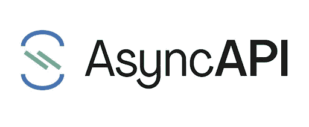

# 如何使用 AsyncAPI 定义事件驱动架构

> 原文：<https://medium.com/geekculture/how-to-define-event-driven-architectures-using-asyncapi-63c7e1025093?source=collection_archive---------15----------------------->



Source: [www.asyncapi.com](http://www.asyncapi.com)

事件驱动的应用程序本质上是分布式和松散耦合的，这可能导致您的架构中有许多独立的组件，由多个团队管理。

AsyncAPI 提供了允许您以机器可读的格式定义[消息驱动的 API](https://www.youtube.com/watch?v=U8Z806b7-lg&list=PLQbzkJk10-f4f6kn9jLFpPOIW-_GP54k9&index=5)的规范。

本文将描述如何使用 AsyncAPI 定义来定义事件驱动的架构。

**async API 规范的各个部分是什么？**

*   **API 版本**:定义了 AsycnAPI 的版本。
*   **Info** :在这个部分中，您将定义一些关于 API 的元数据。
*   **服务器**:这个部分描述了您想要连接的服务器或代理。
*   **通道**:此部分包含消息通道信息。
*   **组件**:该部分定义了您将在通道内引用的消息定义。

**async API 最小定义示例**

下面是一个连接到 Kafka 的 API 定义示例；

```
asyncapi: 2.0info:title: Shopping processversion: 1.0servers:development:url: localhost:{port}protocol: kafkavariables:port:default: '9092'channels:shopping.events.01:description: |-This contains events related to shopping.publish:operationId: consumeShoppingEventmessage:$ref: '#/components/messages/shoppingEvent'bindings:kafka:groupId: myGroupIdcomponents:messages:shoppingEvent:name: shoppingEventcontentType: 'application/json'payload:$ref: '#/components/schemas/ShoppingEventPayload'schemas:ShoppingEventPayload:type: objectproperties:ShoppingId:description: Shopping Idtype: stringamount:type: integer
```

**如何阅读 AsyncAPI 定义**

通过[异步通信](https://github.com/asyncapi/spec)，应用程序可以使用事件，也可以发出事件。

上述示例中的一个通道部分如下所示:

```
channels:shopping.events.01:description: |-This contains events related to shopping.publish:operationId: consumeShoppingEventmessage:$ref: '#/components/messages/shoppingEvent'bindings:kafka:groupId: myGroupId
```

channel 部分中的 publish 部分包含操作 Id、消息和绑定。

当您阅读定义时，您必须从查看者的角度阅读，查看已经由提供者应用程序实现的 API 定义。

如果您希望与提供者的应用程序(实现了 API 定义的应用程序)进行交互，您必须使用 shopping.events.01 主题中的事件。

**代码生成**

AsyncAPI 提供了不同的模板来从 API 定义中创建代码。Java、Nodejs、HTML 和 python 等语言有相当多的代码生成模板。

要从模板生成代码，您需要使用异步生成器命令，您可以通过命令行安装该命令，或者使用 docker 映像来运行该命令。

要安装命令行实用工具，您需要运行以下命令；

```
npm install -g @asyncapi/generator
```

在上面给出的例子中，您将使用@asyncapi/java-spring-template 来生成 api 提供者和查看器的代码。

然而，如果您使用 [docker 方式](https://www.youtube.com/watch?v=a9OEC7lcZaY)来创建代码，可能需要一些时间来生成，因为它会在您每次运行命令时下载模板。

**结论**

本文介绍了 AsyncAPI 的定义，并使用代码模板生成代码。即使初学者使用 AsyncAPI 定义和生成代码看起来很复杂，但它的文档可以帮助您完成。

**参考文献**

https://www.asyncapi.com/docs/specifications/v2.0.0

【https://github.com/asyncapi/spec 

[https://www.avenga.com/magazine/async-api/](https://www.avenga.com/magazine/async-api/)