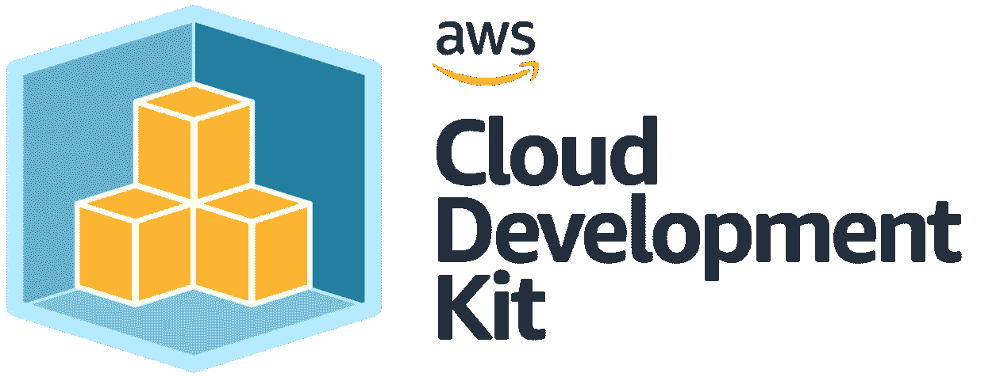

# 如何使用 AWS Lambda 和 CDK 部署基于 Docker 的 API

> 原文：<https://medium.com/geekculture/how-to-deploy-a-docker-based-api-with-aws-lambda-and-cdk-51aa5b434417?source=collection_archive---------3----------------------->

AWS CDK ([link](https://aws.amazon.com/blogs/devops/developing-application-patterns-cdk/))

在这篇短文中，我们将介绍使用 [AWS CDK](https://aws.amazon.com/cdk/) 部署 [AWS Lambda](https://aws.amazon.com/lambda/) 功能的过程。Lambda 函数将被部署为 docker 映像。CDK 函数将负责构建 docker 图像，将其上传到 AWS ECR，然后使其作为 Lambda 函数可用。

# AWS 函数