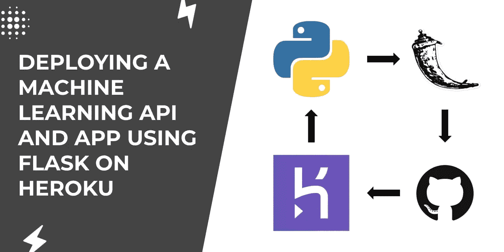
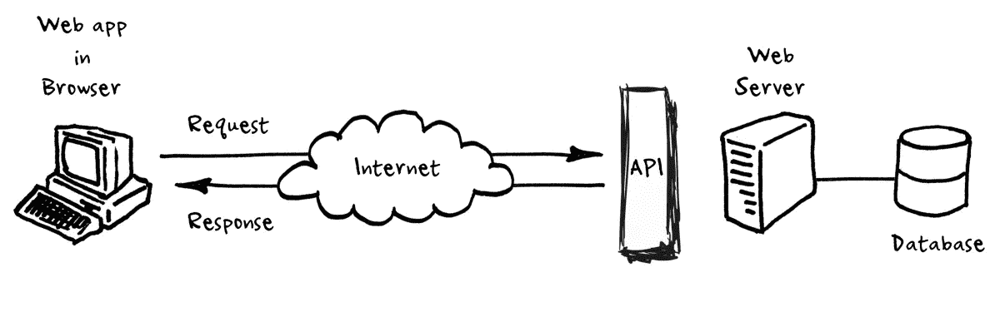
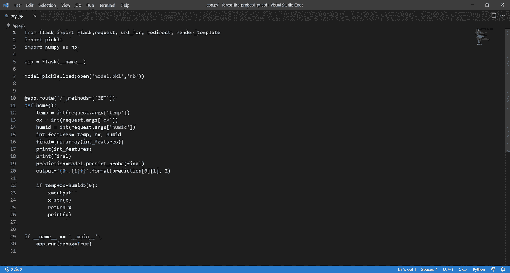
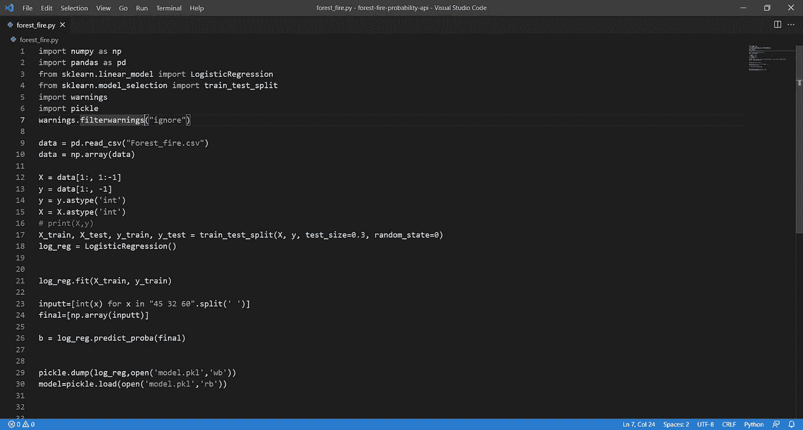
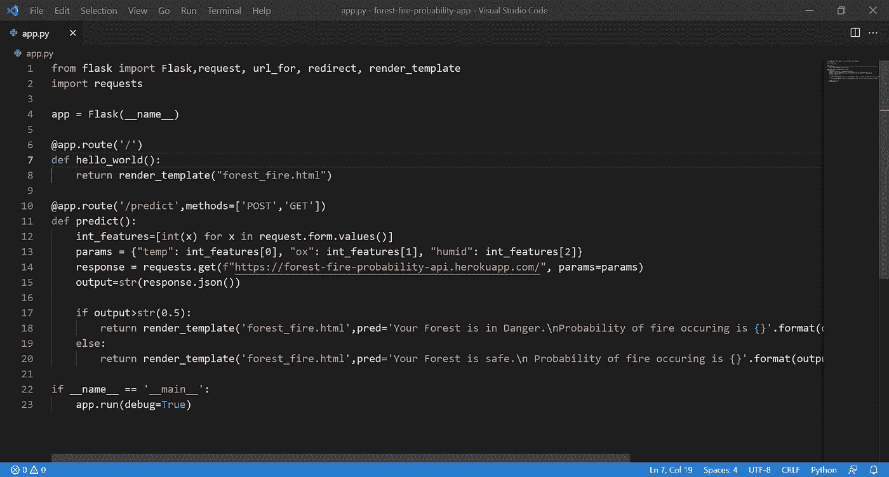

# 如何在 Heroku 上使用 Flask 部署机器学习 API 和 App

> 原文：<https://medium.com/geekculture/how-to-deploy-a-machine-learning-api-and-app-using-flask-on-heroku-dc8dcd4317f?source=collection_archive---------42----------------------->



本文将教你如何在 Heroku 上使用 Flask 部署一个机器学习 API 和 app。机器学习 API 将使用三个值来预测森林火灾的概率:温度、氧气和湿度。请记住，概率可能不完全准确，在现实生活中不应该依赖它。

# 蜜蜂

什么是 API？从技术上讲，API 代表应用程序编程接口。API 用于访问应用程序的特定功能或数据，并且可以在不同的应用程序中使用。



比方说，你想做一个机器学习模型，评估过去的股票价格，并给出一只股票的未来价格。你需要过去的股票数据。这就是 API 的用途。您可以请求 Google Finance API 接收您需要的所有股票的数据。

有不同类型的 API 架构和协议。一些包括 REST、JSON-RPC & XML-RPC 和 SOAP。每个 API 架构都有不同的特定需求。我们将用来创建 API 的 API 架构是 REST。REST 有六种不同的需求:无状态、客户机-服务器、统一接口、可缓存、分层系统和按需编码。要了解更多关于 REST API 架构及其需求的信息，您可以[阅读这篇](/edureka/what-is-rest-api-d26ea9000ee6)。

我们正在创建的应用程序中的 API 不是完全必要的，因为该 API 只在一个应用程序中使用，但它可能在未来有用。该应用程序中的 API 接收这三个值，应用机器学习模型，并以小数形式返回概率。现在我们对 API 有了更多的了解，让我们开始构建一个 API。

# 步骤 1 -上传 API 和 App 到 GitHub

让我们从 API 开始。你可以在 https://github.com/Coder-bot21/forest-fire-probability-api[的](https://github.com/Coder-bot21/forest-fire-probability-api)获得 API 的代码。

API 中有两个主要文件。第一个是评估数字的机器学习模型，第二个是应用程序，它是 API 的一部分，接收输入并返回输出。

这是 API 的 app 部分。



该应用程序首先导入必要的库。然后它创建了一个 flask 应用程序。然后，存储在 pickle 文件中的机器学习模型被加载到变量模型中。

一旦初始化 API 所需的所有代码都写好了，接下来就是 API 了。API 使用 GET 方法。此方法用于检索资源信息。其他 API 方法包括 POST、PUT、PATCH 和 DELETE。每种方法都有不同的用途，可用于各种应用。首先，定义一个名为“home”的函数。该函数创建三个整数形式的参数温度、氧气和湿度。这些是 API 将从应用程序接收的值。然后，API 应用程序将参数中获得的值设置为“int_features”。使用 numpy 将“int_features”变成数组，然后使用机器学习模型运行。

一旦机器学习模型计算出一个概率，它就被格式化并使用 API 作为字符串返回给应用程序。

现在我们知道了 API 框架，让我们更仔细地看看机器学习模型。



机器学习模型从导入必要的库开始，类似于 API 应用程序。然后，模型提取将用于测试和训练模型的数据。因为这个数据是一个 CSV，所以它被转换成一个 numpy 数组。

然后，模型会对数据进行一些格式化，以便可以在模型中使用。X 和 Y 值被定义并转换成整数。训练和测试数据被分成 70%和 30%。然后使用逻辑回归对模型进行训练和测试。存在几种不同类型的机器学习模型。逻辑回归通常用于预测特定类别或事件存在的概率。由于模型将预测森林火灾的可能性，逻辑回归是一个完美的拟合。

既然模型已经过训练和测试，它就被加载到 pickle 文件中。该文件用于存储模型，以便在 API 应用程序中使用。

通过输入文件并使用下面的命令，您可以克隆 GIT 存储库或下载它并在您的计算机上运行代码。

```
python app.py
```

让我们继续应用程序。API 和 app 是两个不同的部分。该应用程序将 API 集成到自身中。该应用程序的代码可在 https://github.com/Coder-bot21/forest-fire-probability-app 获得。

应用程序中有两个主要文件。实际的应用程序文件，它发送参数值并接收整数形式的概率，以及 HTML 文件，它显示用户看到的内容。



上面的文件是 app.py 文件的图像。该文件从导入库开始，然后启动 flask 应用程序。然后，文件呈现一个 HTML 模板(稍后我会详细解释这个模板)，用户可以看到这个模板。

这个文件也使用 GET 方法接收信息。定义了一个名为“预测”的函数。这个函数从用户提交的表单中获取值，将它们作为参数，然后发送给 API。API 接收这些值并返回一个输出。

然后将输出从字符串转换成整数，并转换成 JSON。如果输出概率超过 50%，那么应用程序会告诉用户他们的森林处于危险之中，并告诉他们发生森林火灾的可能性。

app.py 文件占了应用程序的很大一部分，但是 forest_fire.html 文件也很重要。

由于 HTML 文件非常简单，我将只做一个快速概述。该文件包含负责用户所见内容的代码。它还创建用户可以输入值的表单。用户输入他们的值后，app.py 将预测发送到 HTML 文件，该文件显示预测。

如果你想在你的计算机上运行这段代码，你可能需要编辑几行，你可以在这里停下来，但是如果你要在线部署这段代码，你可以继续阅读。

# 步骤 2 -将代码部署到 Heroku

现在你应该在不同的 Github 仓库中有 API 和 app 了，如果你还没有的话，现在就做吧，因为有必要继续前进。

创建一个 Heroku 帐户开始。

在右上角，应该有一个写着“新建”的按钮。如果你点击它，你会看到两个选项:新应用或新渠道。由于我们将部署一个应用程序和一个 API，您应该选择新的应用程序选项。您可以随意命名该应用程序，但与 GitHub 存储库同名会更容易找到。

创建应用程序后，您可以选择您的部署方法。由于您的代码已经上传到 Github 存储库，您可以将 Heroku 连接到 GitHub 并选择您想要的存储库。

您可以通过选择部署方法下的部署分支选项来部署代码。app 部署完成后，按右上角的打开 app 即可在线访问。

您可以对 API 和 app 重复这个过程来部署这两者。你可以在[https://forest-fire-probability-api.herokuapp.com](https://forest-fire-probability-api.herokuapp.com/)访问一个工作 API，在[https://forest-fire-probability-app.herokuapp.com](https://forest-fire-probability-app.herokuapp.com/)访问一个功能 app。

在部署应用程序之前，应该将 app.py 的第 14 行改为使用自己的 API。

API 和 app 的一些代码来自 GitHub 上的[森林火灾预测网站，所以要感谢 Nachiketa Hebbar。](https://github.com/nachi-hebbar/Forest-Fire-Prediction-Website)

我是尼耶尔，13 岁，对人工智能、基因编辑、区块链等新兴技术感兴趣。我现在是 TKS 的学生，这是一个人体加速器项目。我很好奇，总是对新事物感兴趣。
[**LinkedIn**](https://www.linkedin.com/in/niyelhassan/)**|**[**Youtube**](https://www.youtube.com/channel/UCm3l2-pEmhWqKMH5atYNsyw)**|**[**网站**](https://niyelhassan.ml/)