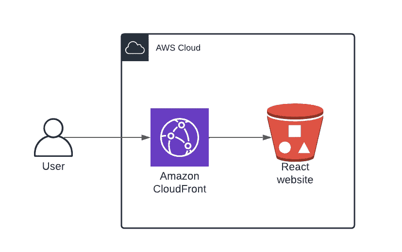
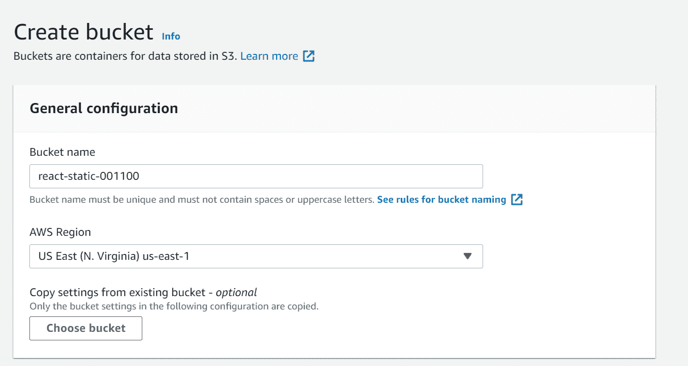
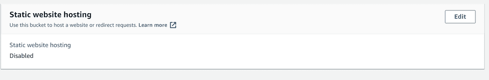
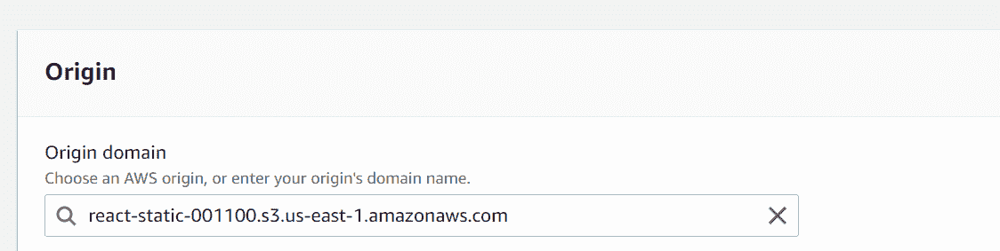
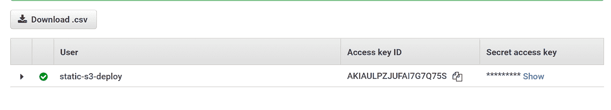
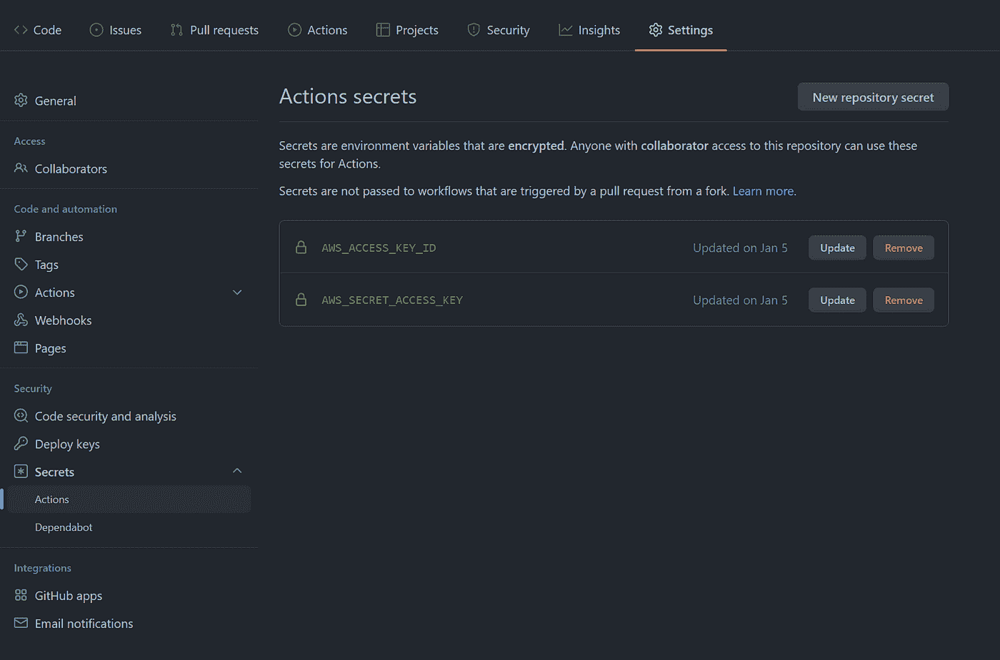

# 如何将静态 React 应用程序部署到 AWS

> 原文：<https://medium.com/geekculture/how-to-deploy-a-static-react-app-to-aws-53ae5a662fac?source=collection_archive---------10----------------------->

## 在不到 7 分钟的时间内为您的静态 React 网站设置到 AWS 的持续部署

Photo by [NASA](https://unsplash.com/@nasa?utm_source=medium&utm_medium=referral) on [Unsplash](https://unsplash.com?utm_source=medium&utm_medium=referral)

# 介绍

在这个简短的教程中，您将学习如何使用管理控制台将您的静态 React 应用程序部署到 AWS。你的网站的静态文件将被保存在一个 S3 桶中，并通过 CloudFront 分发给你的用户。连续部署将使用 GitHub 操作进行设置，并将您的更改推送到 S3 存储桶，并使 CloudFront 缓存中的旧文件失效。

# 高级概述

## **服务**

*   CloudFront 是一项 AWS 服务，允许您使用内容交付网络(CDN)向用户交付内容。
*   S3 是一种高度可用的基于对象的存储服务。

## 高层架构

Basic architecture diagram (Image by user)

该架构相当简单，网站文件存储在 S3 桶中，当用户连接到 CloudFront 发行版时，CloudFront 将请求发送到源(S3)并返回响应。如果离用户最近的边缘或区域边缘位置有缓存内容，CloudFront 也会返回缓存内容。

## 定价

将使用 **S3 标准**层存储桶，主要定价组件将是存储，并请求&数据检索[1]。

**CloudFront** 成本基于数据传输和 HTTP(S)请求的数量[2]。

对于一个大小为 100 MB、每月访问量为 10，000 次的网站，在撰写本文时，美国东部的存储成本为每月 0.0023 美元，请求成本为 0.05 美元(不包括缓存命中)。

CloudFront 不会产生任何成本，因为免费层每月可传输 1 TB 的数据和 10，000，000 个 HTTP(S)请求。部署过程将使用缓存失效，每月前 1000 次部署将免费使用[3]。

# 履行

现在您已经了解了高级设置和相关成本，您已经准备好开始实施了！我假设你的电脑上已经有一个 React 应用程序，如果你没有，你可以参考参考库。

从登录 [AWS 管理控制台](https://console.aws.amazon.com/console/home)开始，如果您还没有 AWS 帐户，现在是注册的好时机！

## S3

我们将使用 S3 来托管网站构建文件，一旦登录，导航到 S3，然后单击“创建桶”

**一般配置**

*   选择一个存储桶名称(这必须是全局唯一的)、区域，并将其余设置保留为默认值，然后单击“创建存储桶”

**初始上传**

*   为你的 React 应用创建一个构建(`npm run build`)我们将把构建文件夹的内容上传到 S3
*   单击 Upload > Add files，选择构建文件夹中的文件，保留所有默认设置，然后单击 Upload。
*   同样添加静态文件夹，单击 Upload > Add folder 并在您的构建文件夹中选择静态文件夹，保留所有默认设置，然后单击 Upload。

值得注意的是，不需要 S3 静态网站托管，因为 S3 桶将保持私有，CloudFront 发行版将配置为使用原始访问身份(OAI)。这提高了网站的安全性，因为它防止用户使用 bucket 端点直接访问 S3 内容[4]。

*   在我们继续学习 CloudFront 之前，复制 bucket 名称和 Amazon 资源名称(ARN)以备后用

## 云锋

**产地**

*   在 AWS 控制台中导航到 CloudFront，然后单击“创建发行版”

*   选择您的 S3 存储桶作为原始域

*   选择“是，使用 OAI”和“是，更新存储桶策略”，然后单击“创建新 OAI”

更新存储桶策略时，它只会为新创建的 OAI 添加权限，如果我们已为您的存储桶配置了公共访问权限，它不会删除这些权限。

*   给你的 OAI 命名，然后点击“创建”

**默认缓存行为**

*   将查看器策略更新为“将 HTTP 重定向到 HTTPS ”,以确保用户流量的安全
*   使用推荐的缓存策略。

默认策略规定 TTL(文件在缓存中的有效期)为 1 天，并且在缓存密钥中仅使用 URL 路径和分发域名。

**设置**

*   将默认根对象更新为`index.html`
*   将其余设置保留为默认设置，然后单击“创建发行版”

创建完成后，打开发行版并复制发行版域名。在你的浏览器中访问这个 URL，你应该会看到你的网站出现！

如果您得到一个 403 禁止错误，请确保您的发行版的默认根对象设置正确。

在 General 页面上，您还应该看到您刚刚创建的发行版的一个 ARN (Amazon 资源名称)——保存它以备后用，因为您需要它来配置您的部署

## 部署

为了部署到 AWS，我们将使用 AWS CLI 将构建文件夹的内容与 S3 桶同步，并使 CloudFront 缓存无效，这样用户就看不到您站点的先前版本。

您需要创建一个 IAM 用户，其凭证将用于部署。用户访问将限于 S3 bucket 和 CloudFront 发行版，以遵循最小特权的惯例。

**创建 IAM 策略**

我们将创建定义 IAM 用户权限范围的策略。

要部署到 S3，需要对 bucket 资源的权限为`ListBucket`，对 bucket 内的对象的权限为`GetObject`、`PutObject`和`DeleteObject` ——使用通配符`*`表示对象路径。为了在每次部署后清除缓存，需要获得 CloudFront 发行版的许可。

*   导航到 IAM >策略，然后单击“创建策略”
*   复制上面嵌入的策略，并用之前保存的策略替换 S3 和 Cloudfront ARNs
*   继续查看，命名您的策略，然后单击“创建”

**创建 IAM 用户**

*   导航到 IAM >用户，然后单击“添加用户”
*   输入用户名，选择访问类型“访问密钥”，点击“下一步:权限”
*   选择“直接附加现有策略”并选择之前创建的策略
*   继续查看保留默认设置，然后单击“创建用户”

*   在成功屏幕上，保存访问密钥 ID 和秘密访问密钥

**手动部署(可选)**

为了测试一切是否正常，我们将使用 AWS CLI 手动部署，这一步是完全可选的，但将提供对连续部署期间发生的事情的深入了解。

*   在此为您的操作系统安装 AWS CLI
*   安装后打开终端并运行`aws configure`
*   输入先前创建的 IAM 用户的访问密钥 ID 和秘密访问密钥。如果您使用的地区不是 us-east-1，请更改默认地区
*   对 React 网站进行更改，并创建一个新的版本，以便您可以部署这些更改
*   更新 S3 桶:`aws s3 sync ./build s3://<bucket-name> --delete`(替换<桶名>)

`(AccessDenied) when calling the PutObject operation: Access Denied`如果您看到这样的错误，请确保您的策略在`PutObject`、`GetObject`和`DeleteObject`的资源末尾包含了`/*`

*   无效缓存:`aws cloudfront create-invalidation --distribution-id <distribution-id> --paths "/*"`(替换<分配标识>)

访问您的分布域名，您应该看到您的变化出现！

## 持续部署

我们将定义一个 GitHub 动作，这样你就可以不断地对你的网站进行修改。如果您没有使用 GitHub，同样的步骤可以应用到您选择的 CI/CD 管道中。

*   在你的库的根目录下创建文件夹，路径:`.github/workflows`

*   在`workflows`文件夹中创建一个名为`build-deploy.yml`的文件，添加上面的代码，替换<桶名>和<分发 id >。如果您使用了不同于 us-east-1 的地区，也要更新它。

每当您向`main`分支提交一个新的提交时，这个工作流就会运行，但是在它准备好之前，您需要添加两个包含访问密钥 ID 和秘密访问密钥的秘密。

*   在 GitHub 中，导航到设置>秘密>操作
*   添加两个新的储存库机密，名为`AWS_ACCESS_KEY_ID`和`AWS_SECRET_ACCESS_KEY`
*   提交并推送您的最新更改，打开 Actions 选项卡以查看您的部署运行情况

# 结论

恭喜你。您已经完成了本文的结尾，并成功地将静态 React 应用程序部署到 AWS。如果您觉得这很有用，请留下您的反馈👏，或者参考[库](https://github.com/mattpodolak/react-s3-cloudfront)上的 a⭐️。

在以后的文章中，我将向您展示如何在 AWS 中为您的网站设置自定义域名。在下一节中，我还描述了一些未来的改进，这些改进将提高您的网站的安全性和可靠性。

## 未来的改进

*   在 CloudFront 发行版上设置标准日志记录
*   创建一个 WAF，并将其与 CloudFront 发行版相关联
*   在 S3 时段上启用版本控制和生命周期策略

## 参考

[1][https://aws.amazon.com/s3/pricing](https://aws.amazon.com/s3/pricing)

[https://aws.amazon.com/cloudfront/pricing](https://aws.amazon.com/cloudfront/pricing)

[3][https://docs . AWS . Amazon . com/Amazon cloud front/latest/developer guide/validation . html # payingforvalidation](https://docs.aws.amazon.com/AmazonCloudFront/latest/DeveloperGuide/Invalidation.html#PayingForInvalidation)

[4][https://docs . AWS . Amazon . com/Amazon cloud front/latest/developer guide/private-content-restricting-access-to-S3 . html](https://docs.aws.amazon.com/AmazonCloudFront/latest/DeveloperGuide/private-content-restricting-access-to-s3.html)