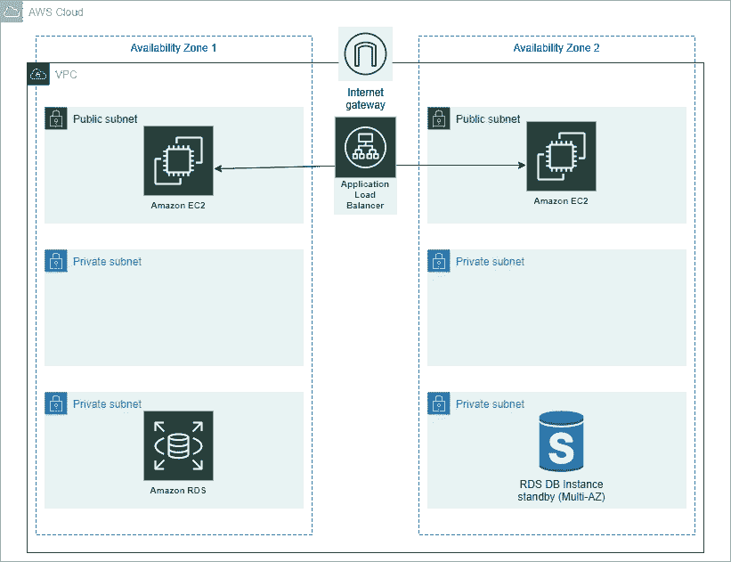

# 如何使用 Terraform 在 AWS 中部署三层架构？

> 原文：<https://medium.com/geekculture/how-to-deploy-a-three-tier-architecture-in-aws-using-terraform-e5dfd7b6d38f?source=collection_archive---------1----------------------->

# 什么是 Terraform？

Terraform 是一个开源的基础设施代码(IAC)工具，允许创建、管理和部署生产就绪环境。Terraform 将云 API 编码成声明性的配置文件。Terraform 可以管理现有的服务提供商和定制的内部解决方案。

从 [**这里**](https://www.terraform.io/intro/index.html) 阅读更多关于地形的信息


Terraform

在本教程中，我将使用 Terraform 在 AWS 中部署一个三层应用程序。



Three-Tier Architecture

# 先决条件:

*   **AWS** & **地形**的基础知识
*   AWS 帐户
*   **AWS 访问** & **密钥**

> 在这个项目中，我使用了一些变量，我将在本文后面讨论。

**第一步:-** 为 **VPC** 创建一个文件

*   创建`vpc.tf`文件并将下面的代码添加到其中

```
# Creating VPC
resource "aws_vpc" "demovpc" {
  cidr_block       = "${var.vpc_cidr}"
  instance_tenancy = "default"tags = {
    Name = "Demo VPC"
  }
}
```

**步骤 2:-** 为**子网**创建一个文件

*   对于这个项目，我将为前端层和后端层创建总共 6 个子网，混合使用公共和私有子网
*   创建`subnet.tf`文件，并将下面的代码添加到其中

```
# Creating 1st web subnet 
resource "aws_subnet" "public-subnet-1" {
  vpc_id                  = "${aws_vpc.demovpc.id}"
  cidr_block             = "${var.subnet_cidr}"
  map_public_ip_on_launch = true
  availability_zone = "us-east-1a"tags = {
    Name = "Web Subnet 1"
  }
}# Creating 2nd web subnet 
resource "aws_subnet" "public-subnet-2" {
  vpc_id                  = "${aws_vpc.demovpc.id}"
  cidr_block             = "${var.subnet1_cidr}"
  map_public_ip_on_launch = true
  availability_zone = "us-east-1b"tags = {
    Name = "Web Subnet 2"
  }
}# Creating 1st application subnet 
resource "aws_subnet" "application-subnet-1" {
  vpc_id                  = "${aws_vpc.demovpc.id}"
  cidr_block             = "${var.subnet2_cidr}"
  map_public_ip_on_launch = false
  availability_zone = "us-east-1a"tags = {
    Name = "Application Subnet 1"
  }
}# Creating 2nd application subnet 
resource "aws_subnet" "application-subnet-2" {
  vpc_id                  = "${aws_vpc.demovpc.id}"
  cidr_block             = "${var.subnet3_cidr}"
  map_public_ip_on_launch = false
  availability_zone = "us-east-1b"tags = {
    Name = "Application Subnet 2"
  }
}# Create Database Private Subnet
resource "aws_subnet" "database-subnet-1" {
  vpc_id            = "${aws_vpc.demovpc.id}"
  cidr_block        = "${var.subnet4_cidr}"
  availability_zone = "us-east-1a"tags = {
    Name = "Database Subnet 1"
  }
}# Create Database Private Subnet
resource "aws_subnet" "database-subnet-2" {
  vpc_id            = "${aws_vpc.demovpc.id}"
  cidr_block        = "${var.subnet5_cidr}"
  availability_zone = "us-east-1a"tags = {
    Name = "Database Subnet 1"
  }
}
```

**步骤 3:-** 为**互联网网关**创建一个文件

*   创建`igw.tf`文件，并添加以下代码

```
# Creating Internet Gateway 
resource "aws_internet_gateway" "demogateway" {
  vpc_id = "${aws_vpc.demovpc.id}"
}
```

**第四步:-** 为**路由表**创建一个文件

*   创建`route_table_public.tf`文件，并将下面的代码添加到其中

```
# Creating Route Table
resource "aws_route_table" "route" {
    vpc_id = "${aws_vpc.demovpc.id}"route {
        cidr_block = "0.0.0.0/0"
        gateway_id = "${aws_internet_gateway.demogateway.id}"
    }tags = {
        Name = "Route to internet"
    }
}# Associating Route Table
resource "aws_route_table_association" "rt1" {
    subnet_id = "${aws_subnet.demosubnet.id}"
    route_table_id = "${aws_route_table.route.id}"
}# Associating Route Table
resource "aws_route_table_association" "rt2" {
    subnet_id = "${aws_subnet.demosubnet1.id}"
    route_table_id = "${aws_route_table.route.id}"
}
```

*   在上面的代码中，我创建了一个新的路由表，并将所有请求转发到`0.0.0.0/0` CIDR 块。
*   我还将这个路由表附加到前面创建的子网。因此，它将作为公共子网工作

**第五步:-** 为 **EC2 实例**创建一个文件

*   创建`ec2.tf`文件，并将下面的代码添加到其中

```
# Creating 1st EC2 instance in Public Subnet
resource "aws_instance" "demoinstance" {
  ami                         = "ami-087c17d1fe0178315"
  instance_type               = "t2.micro"
  count                       = 1
  key_name                    = "tests"
  vpc_security_group_ids      = ["${aws_security_group.demosg.id}"]
  subnet_id                   = "${aws_subnet.demoinstance.id}"
  associate_public_ip_address = true
  user_data                   = "${file("data.sh")}"tags = {
    Name = "My Public Instance"
  }
}# Creating 2nd EC2 instance in Public Subnet
resource "aws_instance" "demoinstance1" {
  ami                         = "ami-087c17d1fe0178315"
  instance_type               = "t2.micro"
  count                       = 1
  key_name                    = "tests"
  vpc_security_group_ids      = ["${aws_security_group.demosg.id}"]
  subnet_id                   = "${aws_subnet.demoinstance.id}"
  associate_public_ip_address = true
  user_data                   = "${file("data.sh")}"tags = {
    Name = "My Public Instance 2"
  }
}
```

*   我已经使用了`userdata`来配置 EC2 实例，我将在本文后面讨论`data.sh`文件

**步骤 6:-** 为**前端** **层**的**安全组**创建一个文件

*   创建`web_sg.tf`文件，并将下面的代码添加到其中

```
# Creating Security Group 
resource "aws_security_group" "demosg" {
  vpc_id = "${aws_vpc.demovpc.id}"# Inbound Rules
  # HTTP access from anywhere
  ingress {
    from_port   = 80
    to_port     = 80
    protocol    = "tcp"
    cidr_blocks = ["0.0.0.0/0"]
  }# HTTPS access from anywhere
  ingress {
    from_port   = 443
    to_port     = 443
    protocol    = "tcp"
    cidr_blocks = ["0.0.0.0/0"]
  }# SSH access from anywhere
  ingress {
    from_port   = 22
    to_port     = 22
    protocol    = "tcp"
    cidr_blocks = ["0.0.0.0/0"]
  }# Outbound Rules
  # Internet access to anywhere
  egress {
    from_port   = 0
    to_port     = 0
    protocol    = "-1"
    cidr_blocks = ["0.0.0.0/0"]
  }tags = {
    Name = "Web SG"
  }
}
```

*   我已经为入站连接打开了 **80，443 & 22** 个端口，并为出站连接打开了所有端口

**步骤 7:-** 为**数据库** **层**的**安全组**创建一个文件

*   创建`database_sg.tf`文件并将下面的代码添加到其中

```
# Create Database Security Group
resource "aws_security_group" "database-sg" {
  name        = "Database SG"
  description = "Allow inbound traffic from application layer"
  vpc_id      = aws_vpc.demovpc.idingress {
    description     = "Allow traffic from application layer"
    from_port       = 3306
    to_port         = 3306
    protocol        = "tcp"
    security_groups = [aws_security_group.demosg.id]
  }egress {
    from_port   = 32768
    to_port     = 65535
    protocol    = "tcp"
    cidr_blocks = ["0.0.0.0/0"]
  }tags = {
    Name = "Database SG"
  }
```

*   我已经为入站连接打开了 **3306** 端口，也为出站连接打开了所有端口。

**步骤 8:-** 创建文件**应用负载均衡器**

*   创建`alb.tf`文件，并将下面的代码添加到其中

```
# Creating External LoadBalancer
resource "aws_lb" "external-alb" {
  name               = "External LB"
  internal           = false
  load_balancer_type = "application"
  security_groups    = [aws_security_group.demosg.id]
  subnets            = [aws_subnet.public-subnet-1.id, aws_subnet.public-subnet-1.id]
}resource "aws_lb_target_group" "target-elb" {
  name     = "ALB TG"
  port     = 80
  protocol = "HTTP"
  vpc_id   = aws_vpc.demovpc.id
}resource "aws_lb_target_group_attachment" "attachment" {
  target_group_arn = aws_lb_target_group.external-alb.arn
  target_id        = aws_instance.demoinstance.id
  port             = 80depends_on = [
    aws_instance.demoinstance,
  ]
}resource "aws_lb_target_group_attachment" "attachment" {
  target_group_arn = aws_lb_target_group.external-alb.arn
  target_id        = aws_instance.demoinstance1.id
  port             = 80depends_on = [
    aws_instance.demoinstance1,
  ]
}resource "aws_lb_listener" "external-elb" {
  load_balancer_arn = aws_lb.external-alb.arn
  port              = "80"
  protocol          = "HTTP"default_action {
    type             = "forward"
    target_group_arn = aws_lb_target_group.external-alb.arn
  }
}
```

*   上述负载平衡器是类型**外部**
*   负载平衡器类型设置为**应用**
*   **AWS _ lb _ Target _ Group _ attachment**资源会将我们的实例附加到**目标组**。
*   负载平衡器将监听**端口 80** 上的请求

**第 9 步:-** 为 **RDS 实例**创建一个文件

*   创建一个`rds.tf`文件，并将下面的代码添加到其中

```
# Creating RDS Instance
resource "aws_db_subnet_group" "default" {
  name       = "main"
  subnet_ids = [aws_subnet.database-subnet-1.id, aws_subnet.database-subnet-1.id]tags = {
    Name = "My DB subnet group"
  }
}resource "aws_db_instance" "default" {
  allocated_storage      = 10
  db_subnet_group_name   = aws_db_subnet_group.default.id
  engine                 = "mysql"
  engine_version         = "8.0.20"
  instance_class         = "db.t2.micro"
  multi_az               = true
  name                   = "mydb"
  username               = "username"
  password               = "password"
  skip_final_snapshot    = true
  vpc_security_group_ids = [aws_security_group.database-sg.id]
}
```

*   在上面的代码中，需要更改`username` & `password`的值
*   `multi-az`设置为真，以获得高可用性

**第十步:-** 为**输出**创建一个文件

*   创建`outputs.tf`文件并将下面的代码添加到其中

```
# Getting the DNS of load balancer
output "lb_dns_name" {
  description = "The DNS name of the load balancer"
  value       = "${aws_lb.external-alb.dns_name}"
}
```

*   从上面的代码中，我将获得应用程序负载平衡器的 DNS。

**步骤 11:-** 为**变量**创建一个文件

*   创建`vars.tf`文件并将下面的代码添加到其中

```
# Defining CIDR Block for VPC
variable "vpc_cidr" {
  default = "10.0.0.0/16"
}
# Defining CIDR Block for 1st Subnet
variable "subnet_cidr" {
  default = "10.0.1.0/24"
}
# Defining CIDR Block for 2nd Subnet
variable "subnet1_cidr" {
  default = "10.0.2.0/24"
}
# Defining CIDR Block for 3rd Subnet
variable "subnet2_cidr" {
  default = "10.0.3.0/24"
}
# Defining CIDR Block for 3rd Subnet
variable "subnet2_cidr" {
  default = "10.0.4.0/24"
}
# Defining CIDR Block for 3rd Subnet
variable "subnet2_cidr" {
  default = "10.0.5.0/24"
}
# Defining CIDR Block for 3rd Subnet
variable "subnet2_cidr" {
  default = "10.0.6.0/24"
}
```

**步骤 12:-** 为**用户数据**创建一个文件

*   创建`data.sh`文件，并将下面的代码添加到其中

```
#!/bin/bashyum update -y
yum install -y httpd.x86_64
systemctl start httpd.service
systemctl enable httpd.service
echo "Hello World from $(hostname -f)" > /var/www/html/index.html
```

*   上面的代码将在 **EC2 实例**中安装一个 **apache webserver**

所以，现在我们的全部代码都准备好了。我们需要运行以下步骤来创建基础架构。

*   `terraform init`初始化提供者的工作目录和下载插件
*   `terraform plan`是为我们的代码创建执行计划
*   `terraform apply`是创建实际的基础设施。它会要求您提供**访问密钥**和**秘密密钥**，以便创建基础架构。因此，与其硬编码**访问密钥**和**秘密密钥，**不如在运行时应用。

**步骤 13:-** 验证 th **e 资源**

*   Terraform 将创建以下资源

1.  **VPC**
2.  **应用负载平衡器**
3.  **公共&私有子网**
4.  **EC2 实例**
5.  **路由表**
6.  **互联网网关**
7.  **RDS 实例**
8.  **Web 的安全组& RDS 实例**

资源创建完成后，您可以获取负载平衡器的 DNS，并将其粘贴到浏览器中，您可以看到负载平衡器将向两个实例发送请求。

现在就这样，你已经学会了如何使用 Terraform 在 AWS 中创建各种资源。你可以在这里进一步探索地形[](https://terraform.io/)

**你可以在我的 [**GitHub**](https://github.com/DhruvinSoni30/Terraform-AWS-3tier-Architecture/tree/main) 账号找到完整的代码。也可以随意查看我的其他库。**

**如果您发现此指南有帮助，请点击👏按钮，也可以随意发表评论。**

**关注更多类似的故事😊**