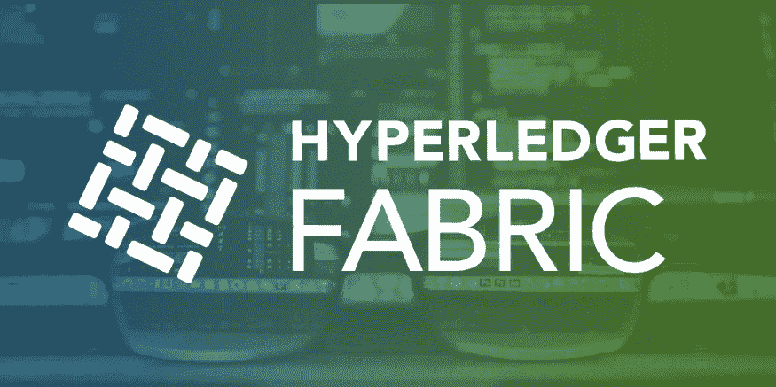
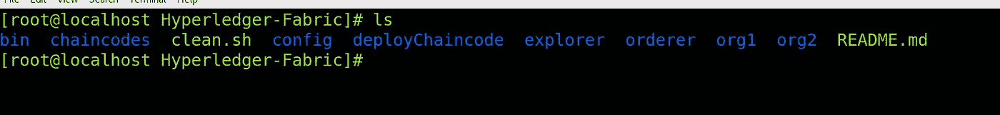
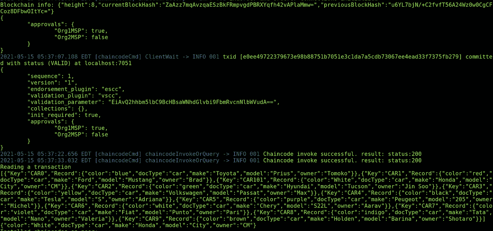
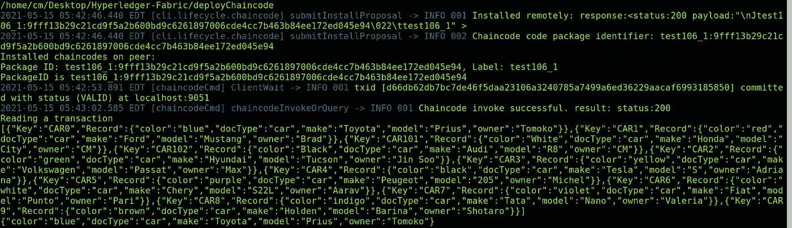

# 如何部署链码(智能合约)

> 原文：<https://medium.com/geekculture/how-to-deploy-chaincode-smart-contract-45c20650786a?source=collection_archive---------16----------------------->



Hyperledger Fabric

# 介绍

在本文中，我们将部署 JAVA、GO、JAVASCRIPT 的链代码来运行 Hyperledger Fabric 区块链网络，并将升级相同的链代码。也将讨论链码的生命周期。

> 在这里，我从织物样本中提取了链码。

# 观众

Hyperledger 结构开发人员、操作员和管理员。这是一篇实用的动手文章。在我之前的[作品](https://cmjagtap.medium.com/hyperledger-fabric-blockchain-setup-from-scratch-21890e26aac7)中，我已经解释了如何从头开始建立一个光纤网络。

# 网络安装程序

*   具有一个应用程序通道的 Hyperledger Fabric v2.3 设置。
*   JAVA 链码部署。
*   开始链码部署。
*   JAVASCRIPT 链码部署

# 文件夹结构

*   让我们克隆包含源代码的 repo。

```
**git clone** [**https://github.com/cmjagtap/Hyperledger-Fabric**](https://github.com/cmjagtap/Hyperledger-Fabric)
```



Folder Structure

文件夹结构

*   **chaincodes:** 包含用 JAVA、GO、JavaScript 编写的链码源代码。
*   **deployChaincode:** 包含链码部署脚本。

在我之前的[作品](https://cmjagtap.medium.com/hyperledger-fabric-blockchain-setup-from-scratch-21890e26aac7)中，我已经说明了其他文件夹的内容。

# 结构区块链设置

如果结构网络已经在运行，则可以跳过这一步。

让我们创建一个结构网络，执行以下命令。

```
**export PATH=${PWD}/bin:$PATH
sudo service docker start
 cd org1
./1_enrollOrg1AdminAndUsers.sh
./2_generateMSPOrg1.sh****cd ../org2** ./**1_enrollOrg2AdminAndUsers.sh** ./**2_generateMSPOrg2.sh 

 cd ../orderer** ./**1_enrollAdminAndMSP.sh
./2_artifact.sh

 cd ../org1**
.**/3_createChannel.sh

 cd ../org2**
.**/3_joinChannel.sh**
```

Hyperledger fabric 2.3 区块链已准备就绪。

> 在 Fabric 2.x 发布之前，没有链码生命周期的概念

# 链码生命周期

*   **Package chaincode:** 在这一步，我们需要创建一个压缩的 chain code packager**tar.gz**文件。这个步骤可以由一个组织完成，也可以由每个组织完成。您可以将链码打包到单个组织中，并将其复制到其它组织中，或者打包到所有其它组织中。
*   **安装:**是二进制自动触发事件。每个将使用链码背书交易或查询分类帐的组织都需要完成这一步。所有签署对等方需要执行此操作。
*   **批准**每个使用链码的组织都需要完成这一步。在链码可以在渠道上开始之前，链码定义需要得到足够数量的组织的批准，以满足渠道的生命周期管理政策(默认为大多数)。
*   **提交链代码:**一旦通道上所需数量的组织被批准，提交事务必须由一个组织提交。提交者首先从批准了链码的组织的足够多的同行收集认可，然后提交事务以提交链码定义。

## JAVA 链代码部署

让我们导航到 **deployChaincode** 目录。在这里，我们可以看到各种部署脚本。

在目录结构中，我们有***deployorg 1 _ Java . sh***脚本，其中包含部署链代码所需的生命周期命令。在当前的结构网络中，我们有两个组织。首先将在 **Org1** 上部署链码如下。

```
**cd deployChaincodes
./deployOrg1_JAVA.sh**
```



Chaincode Deployment

*   上图显示了 chaincode 的成功部署。
*   我们成功地将赛车记录推向了区块链。
*   我们成功查询了推车记录。

> 这里我们不需要 org2 的批准来提交链代码，因为我已经在 config.tx 文件中做了策略更改。
> 
> 请确保您已连接到互联网，以解析链码依赖性。

**组织 2**

```
**./deployOrg2_JAVA.sh**
```



Chaindoe Deployment

*   上图显示了 chaincode 的成功部署。
*   我们成功地查询了汽车数据。

> 在第二种组织中，我们不需要执行所有的生命周期命令。链代码提交和初始化由单个组织完成。

## JAVAScript 链码部署

在目录结构中，我们有***deployorg 1 _ JavaScript . sh***和***deployorg 2 _ JavaScript . sh***执行它们。

```
**./deployOrg1_JavaScript.sh
./deployOrg2_JavaScript.sh**
```

*   成功部署 chaincode 后，将会看到与上图相同的输出。

## 开始链码部署

在目录结构中，我们有***deployorg 1 _ go . sh***和***deployorg 2 _ go . sh***执行它们。

```
**./deployOrg1_GO.sh
./deployOrg2_GO.sh**
```

*   成功部署 chaincode 后，将会看到与上图相同的输出。

# 如何升级 Chaincode？？？

假设我们已经在光纤网络上部署了 chaincode。现在，我们想为现有的 chaincode 添加一个新特性。

*   实现之后，必须遵循相同的链代码生命周期过程来部署链代码。
*   但是这里必须升级一个链码**版本**，链码**序列、**和链码**标签。**
*   在部署中，脚本必须将 *CC_VERSION* 版本从 1 更改为 2，并将 *CC_SEQUENCE* 从 1 更改为 2。

> 我们不需要改变标签，因为我们已经改变了 CC_VERSION 和 CC_SEQUENCE *。*

# 打扫

执行以下脚本来清理所有 docker 容器和加密材料。

```
.**/clean.sh**
```

# 摘要

我们已经在 Hyperledger Fabric 区块链上成功部署了 JAVA、GO、JavaScript 链代码。