# 如何在 Netlify 上部署 React 项目

> 原文：<https://medium.com/geekculture/how-to-deploy-react-projects-on-netlify-28f72b4ceb8c?source=collection_archive---------7----------------------->

## 在 Netlify 上部署 React 应用的简单指南。


Photo by [Antonio Batinić](https://www.pexels.com/@antonio-batinic-2573434?utm_content=attributionCopyText&utm_medium=referral&utm_source=pexels) from [Pexels](https://www.pexels.com/photo/black-screen-with-code-4164418/?utm_content=attributionCopyText&utm_medium=referral&utm_source=pexels)

# 介绍

Netlify 绝对是我最喜欢的部署 React 项目的方式，因为它易于使用，而且是免费的初始带宽计划。今天，我将通过几种不同的方式向您展示如何将 React 应用程序部署到 Netlify。我将介绍如何快速部署以及如何将您的 Git 项目连接到 Netlify 以进行持续部署。

***警告*** —必须有要部署的 Netlify 帐户和要持续部署的 Git 帐户

在我们开始之前，我们需要将 Netlify 安装到您的 React 项目中，您可以进入项目目录并运行

```
npm i netlify-cli
```

一旦 Netlify 完成安装，我们将需要通过运行以下命令来创建您的应用程序的生产版本

```
npm run build
```

这将使用您的生产就绪应用程序在您的项目目录中创建一个名为“build”的文件夹。

您需要安装 Netlify，并为以下任何部署指南进行生产构建。

# 易于部署—经典

让我们从通过您的终端进行部署的经典方式开始，在安装 Netlify 并创建一个生产版本之后，现在我们运行

```
netlify deploy
```

如果你是第一次使用 Netlify，你会在默认浏览器中得到提示

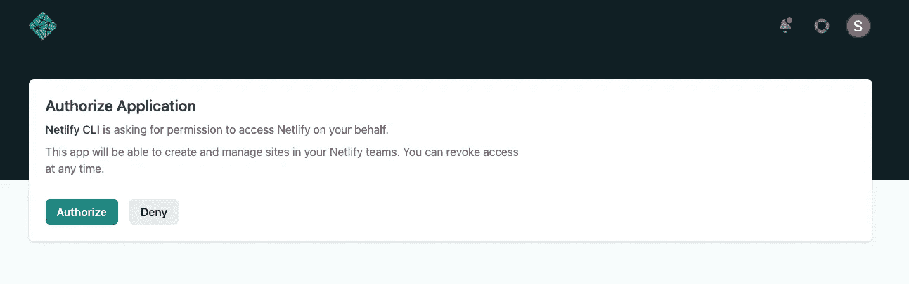

完成授权步骤后，您可以返回到您的终端，系统会提示您两个选项。今天我们将使用

*   创建和配置新网站

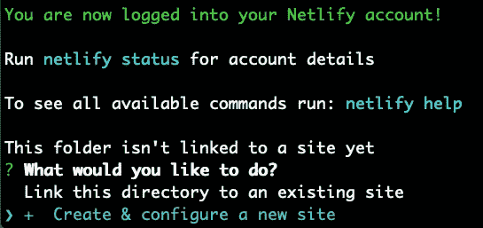

选择此选项后，系统会提示您输入一些基本信息，例如

*   您的 Netlify 客户团队
*   可选站点名称-如果名称已被占用，将提示您
*   发布目录——指向生产就绪应用程序所在的位置(我们的构建文件夹所在的位置)

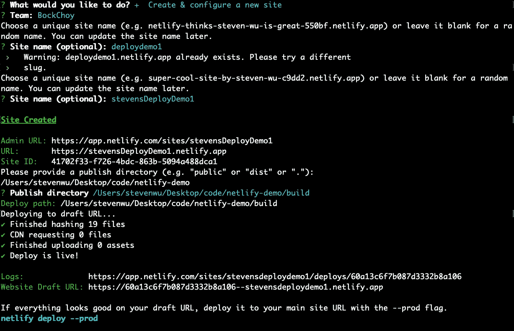

完成上述步骤后，您可以通过访问终端提供的网站草稿 URL 来预览您的网站，如果一切都符合您的喜好，那么就该使用以下命令来最终部署它了

```
netlify deploy --prod
```

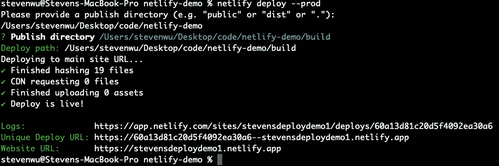

就是这样！如果一切顺利，您将获得已部署的网站 URL，如果需要，您可以进入 Netlify 的站点部分来更改项目的设置。

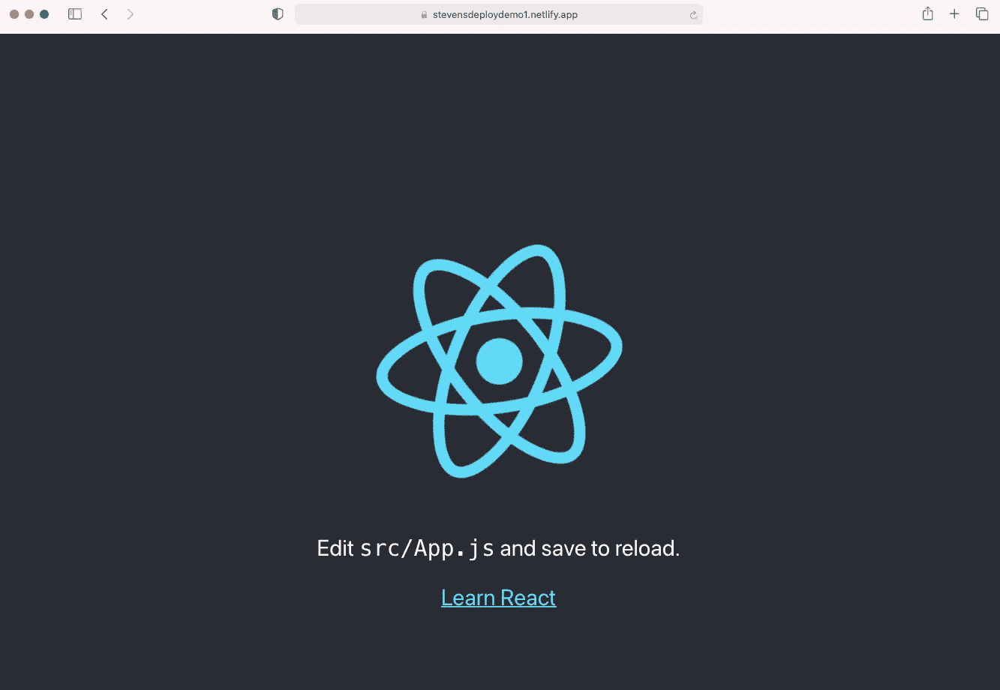

# 轻松部署-超级简单

这里有一种更简单的部署应用的方法。一旦你进入 Netlify 的站点部分，你会看到这个拖放选项，它就是这么简单。

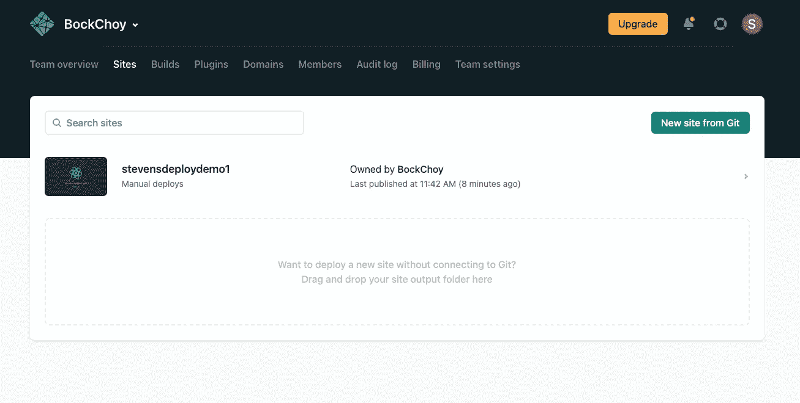

一旦您安装了 Netlify cli 并在 React 目录中创建了生产版本，您就可以右键单击构建文件夹并在 finder 中显示，您只需将构建文件夹从 finder 拖到 Netlify 即可。


这个过程是最快速和最简单的部署方式，虽然它从一些随机生成的 url 开始，但您可以简单地进入域设置来更改您的站点设置。

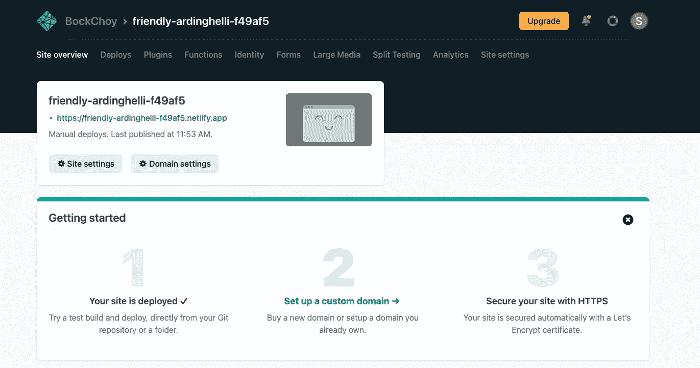

# 持续部署

这是一种更高级的部署方式，但它很棒，因为你可以将你的项目存储在 Git repo 中，每次你提交给 repo 时，Netlify 都会自动用你最新的提交更新你的站点。

您可以在 Netlify 的站点部分找到该选项。

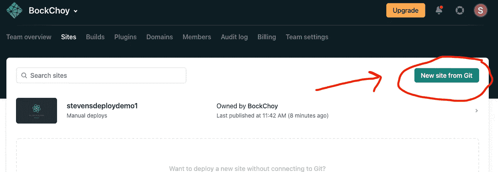

在你点击“来自 Git 的新站点”之后，你将被提示登录 Git，它将列出你的所有回购，你将可以选择搜索你想要部署的回购

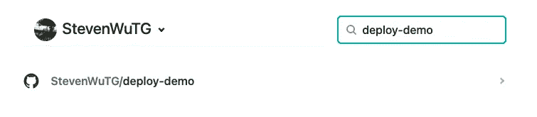

一旦你选择了你的回购，你会得到一些网站设置配置提示。

***重要-*** 如果您想要部署连续回购，您必须输入以下命令作为构建命令

```
CI= npm run build
```

该命令将回购设置为网络生命周期中的 ***C*** 连续 ***I*** 集成回购。

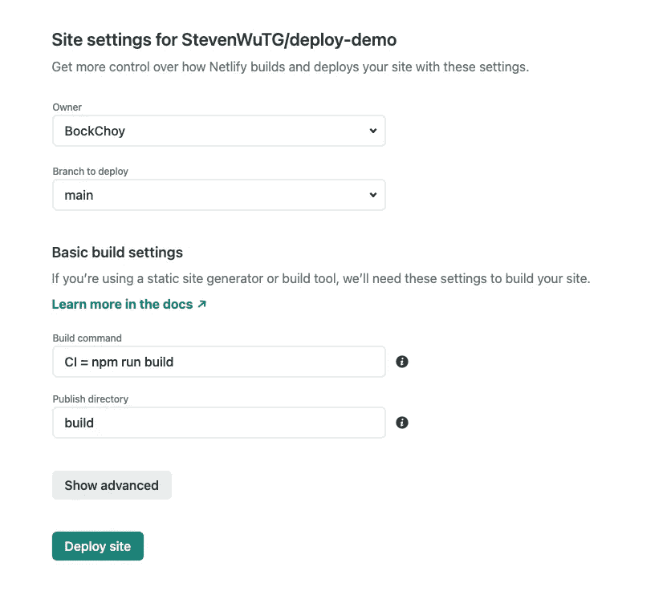

单击“部署站点”后，您将被定向到 Netlify 站点页面，在 Netlify 的服务器上构建站点需要几分钟时间。

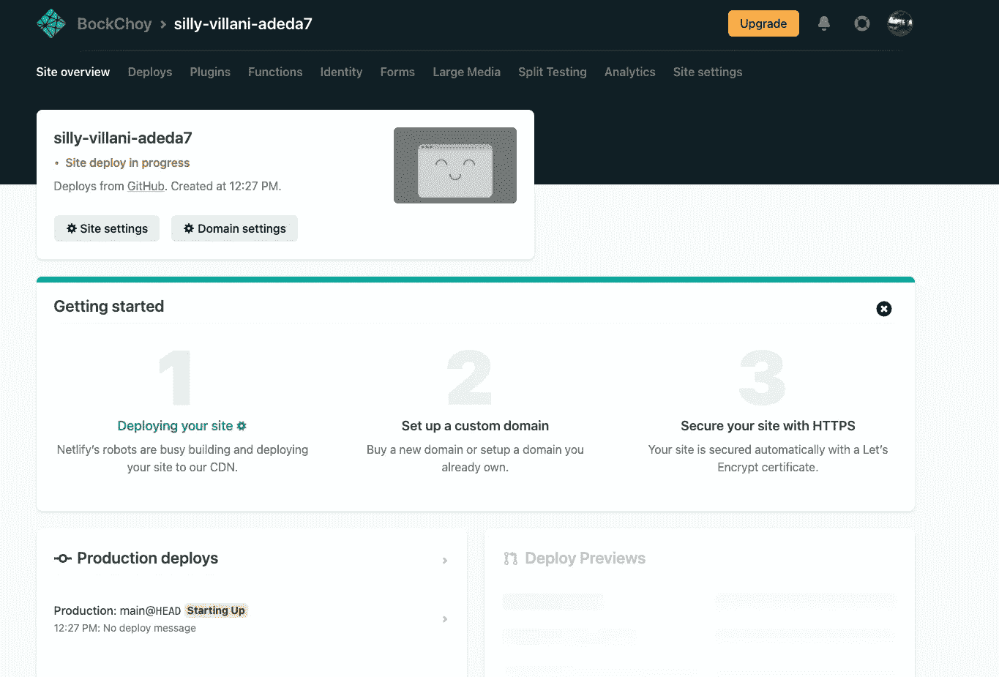

几分钟后，您的站点应该构建完成，您可以通过访问您部署的站点的 URL 进行检查。

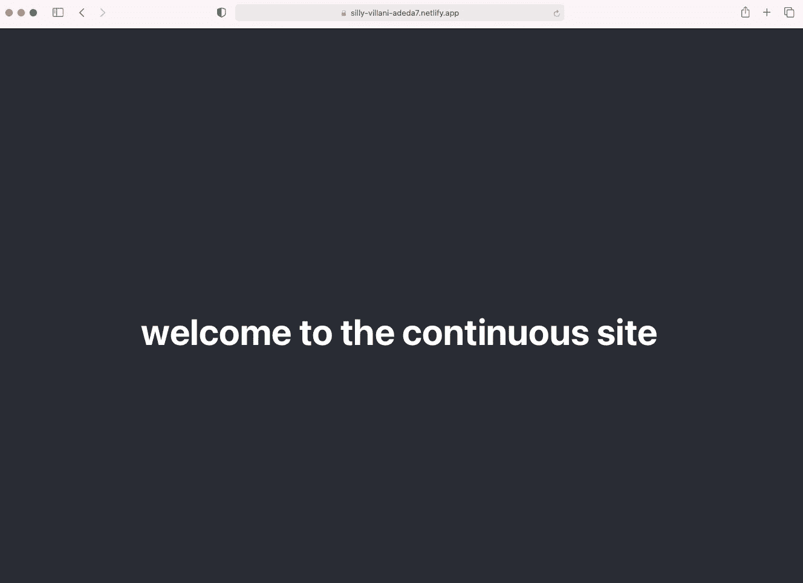

就是这样！如果你想改变你的网站，你只需要做一些改变，然后把新的提交推给你的回购协议，Netlify 就会发挥它的魔力，你会看到它建立在 Netlify 用户界面上。

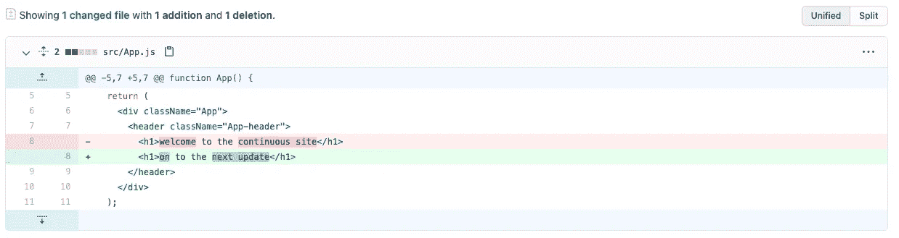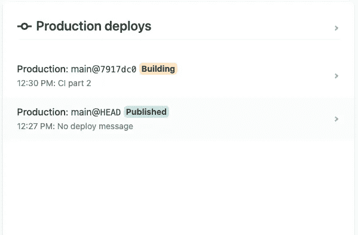

同样，由于 Netlify 正在创建您的新生产版本，这将需要几分钟的时间，但在此之后，您可以访问您的网站并检查新的更改。

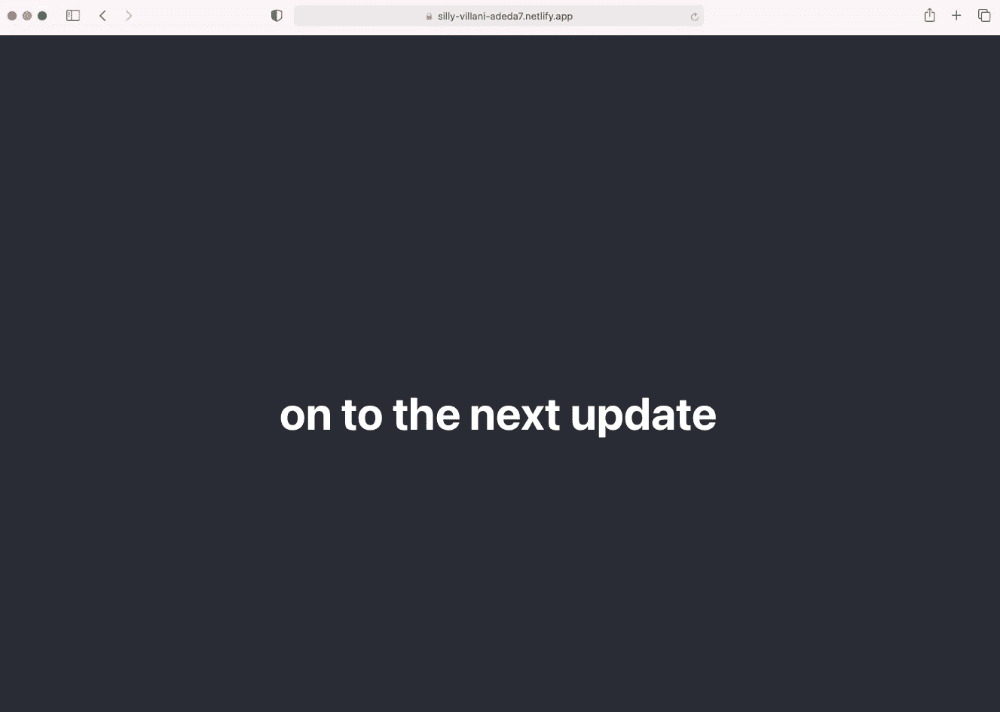

# 结论

部署可能会很复杂，所以我希望这个指南有所帮助！欢迎在评论中分享你的部署站点，如果需要的话可以寻求帮助。

希望您喜欢这份 React 部署指南！如果你这样做了，请留下评论，并关注更多的编码指南。