# 如何将 Spring Boot 和 MongoDB 部署到 Kubernetes (Minikube)

> 原文：<https://medium.com/geekculture/how-to-deploy-spring-boot-and-mongodb-to-kubernetes-minikube-71c92c273d5e?source=collection_archive---------0----------------------->

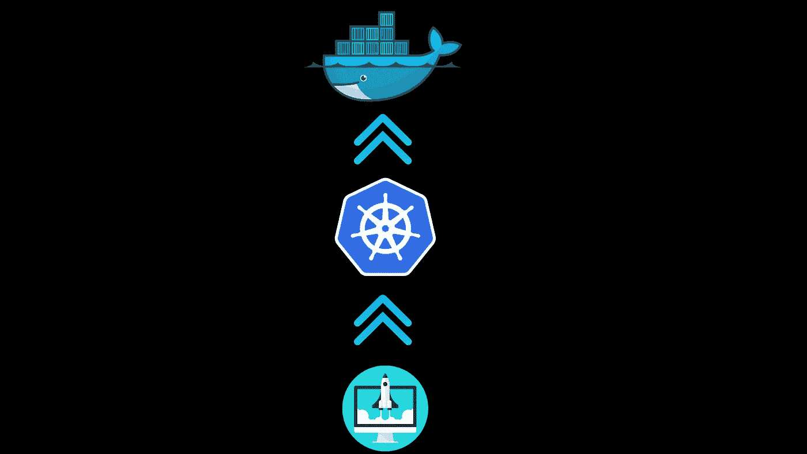

## **什么是 Kubernetes？**

Kubernetes 是一个开源平台，用于管理构建在称为容器的自包含运行时环境上的应用程序。换句话说，它的主要目标是容器编排。虽然 Kubernetes 主要与 Docker 一起使用，但它也可以与任何符合开放容器倡议(Open Container Initiative，OCI)容器图像格式和运行时标准的容器系统一起工作。

## 为什么我们需要 Kubernetes 进行容器编排？

Container 是一个虚拟化环境，其中的应用程序在运行时与底层系统相隔离。但是为了打包一个应用程序，我们需要大规模地部署和管理多个服务，这就是需要编排的地方。Kubernetes 使容器化的应用程序更容易大规模管理，已经成为容器革命的关键部分。

## Kubernetes 的成分是什么？

Kubernetes 中有许多组件，但最常用的最重要的组件是

*   结节
*   豆荚
*   服务
*   进入
*   配置图
*   秘密
*   卷
*   部署
*   状态集

## 结节

为了开始运行应用程序，我们需要一台服务器，它可以是物理服务器，也可以是虚拟机。在 Kubernetes 的术语中，它被称为节点。


## 豆荚

Pod 是 Kubernetes 中最小的单元，它是容器的抽象。我们现在已经有了一个容器，为什么我们还需要像 Pod 这样的抽象呢？

Kubernetes 是以这样一种方式设计的，我们可以使用它的技术来运行任何容器运行时。每个 Pod 都将分配有一个虚拟静态 IP 地址。此外，值得注意的是，所有的豆荚都是短暂的，如果豆荚死亡，所有与豆荚对应的资源也会丢失。

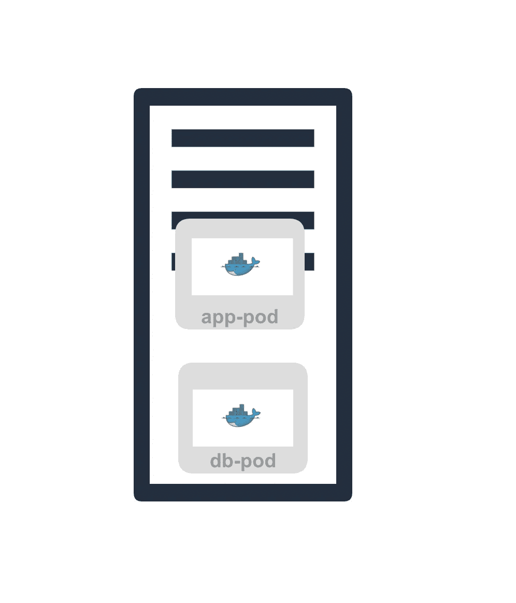

## 服务

由于 pod 本质上是短暂的，如果 pod 死亡并且新的 Pod 替换旧的 Pod，则与旧的 Pod 相关联的旧的 IP 地址也将被新的 IP 地址替换。我们需要将 IP 地址分配与 Pod 的生命周期分开，这是使用服务组件的地方。服务是一种抽象，它定义了一组逻辑单元和访问它们的策略。它们有助于将应用程序或用户与应用程序连接起来。服务将获得一个称为集群 IP 的永久 IP 地址，该地址由 Kubernetes 分配给它，并且独立于 Pod 生命周期。

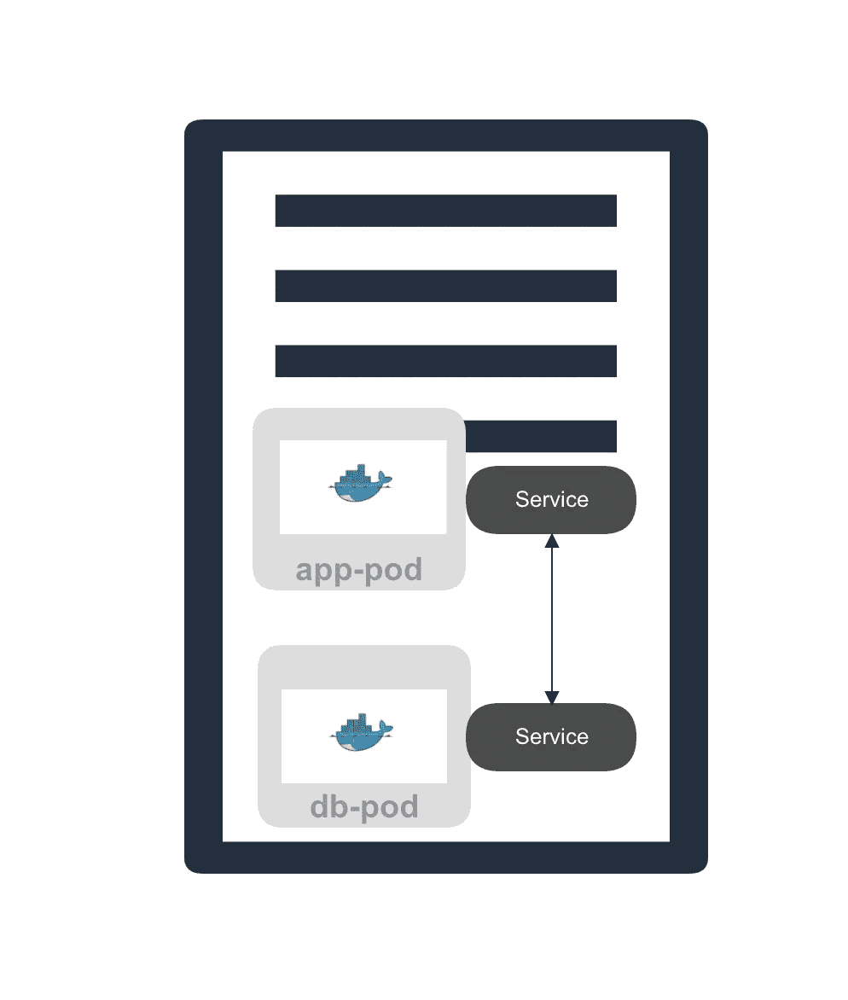

## 进入

为了从外部访问群集中的内部应用程序，您可以创建外部服务，但我们访问服务的方式是通过节点 IP 地址和使用 http 协议的端口，例如，[http://169.124.124.1:32000](http://169.124.124.1:32000)，其中 3200 是节点端口。但是您不想对外公开您的节点 IP 地址。在这种情况下，入口组件用于创建内部服务而不是外部服务，外部请求通过入口转发到内部服务，然后最终转发到适当的 pod。

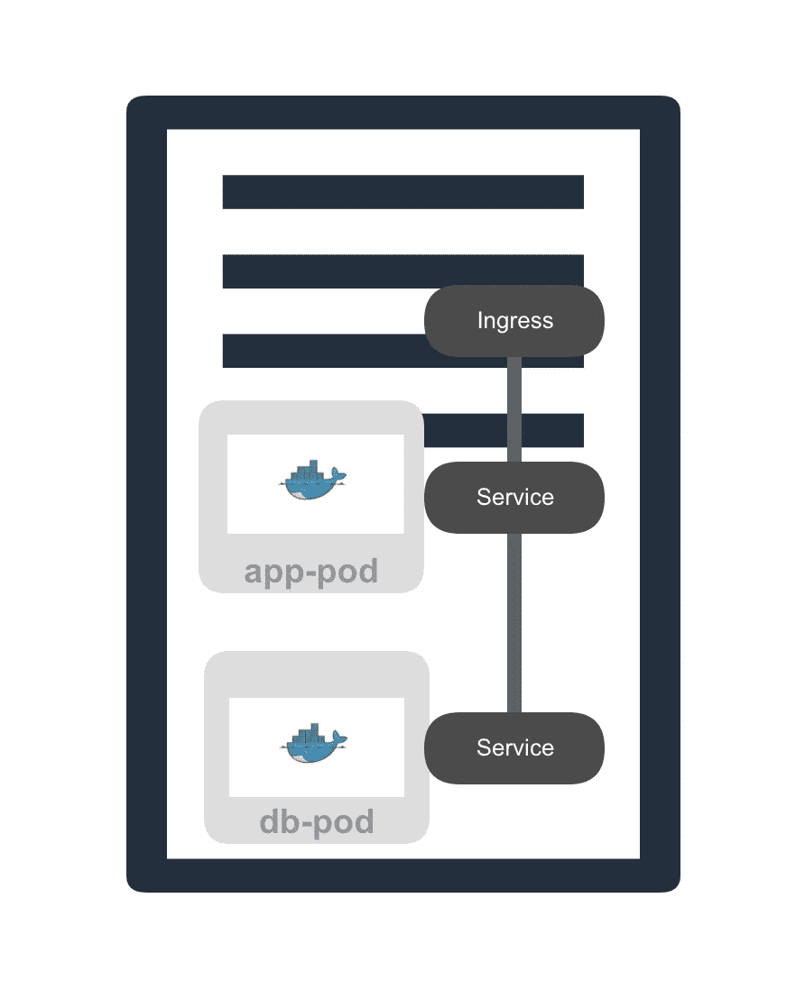

## 配置图

Kubernetes 的 ConfigMap 组件是应用程序的外部配置。如果您有一个需要连接到数据库的应用程序，您通常会将所有配置细节保存在应用程序属性文件中。如果对数据库连接字符串进行了任何更改，您必须重新编译和重新部署整个应用程序，这是一个非常痛苦和乏味的过程。为了避免这种复杂性，使用了 Kubernetes ConfigMap 组件，数据库连接字符串等信息存储在这里，该组件将链接到您的应用程序 pod。如果配置有任何变化，我们可以简单地更改配置图中的值，就这样，您不必重新构建或重新部署应用程序。

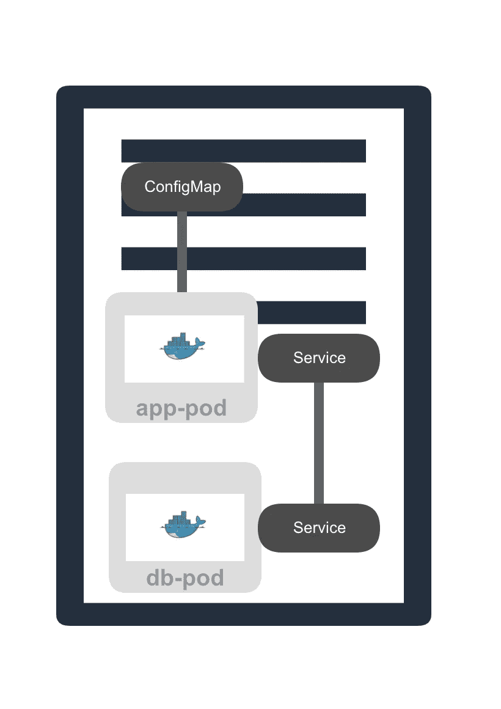

## 秘密

它类似于 Kubernetes 的 ConfigMap 组件，但在这种情况下，我们将存储应用程序秘密。这将包含数据库用户名/密码等值。所有值都以 Base-64 编码格式存储。与 ConfigMap 类似，Secretes 组件也附加到应用程序 Pod。

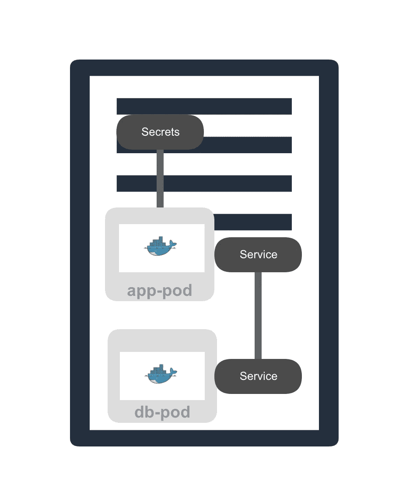

## 卷

如果您在 Kubernetes 节点上运行一个数据库 pod，并且在任何情况下重新启动该数据库 pod，那么存储在 Pod 中的所有数据都将丢失。但是我们需要我们的数据是持久的。这就是我们使用 Kubernetes 的 Volumes 组件的地方。它基本上是将硬盘上的物理存储附加到数据库 pod 上。存储可以位于运行 database pod 的同一个节点上，也可以完全位于 Kubernetes 集群之外。这里需要注意的重要一点是，Kubernetes 不管理您的数据持久性，您必须自己手动管理它，或者通过您定义的任何自动化过程来管理它。

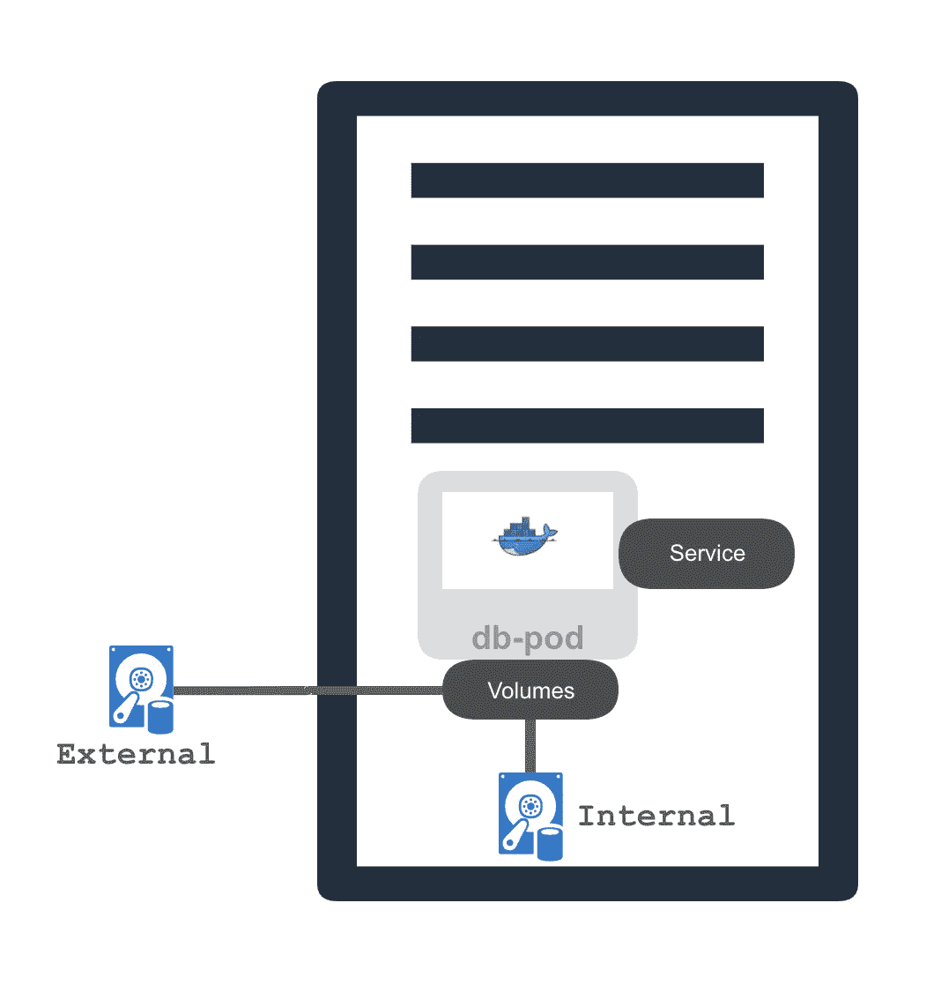

## 部署

Kubernetes 的部署组件指定了应用程序单元的蓝图。换句话说，您将不会自己创建 pod，而是为您的应用程序 pod 创建一个部署并指定需求。分布式系统的优势之一是复制。Kubernetes 的部署组件通过使用复制集提升了这一优势。

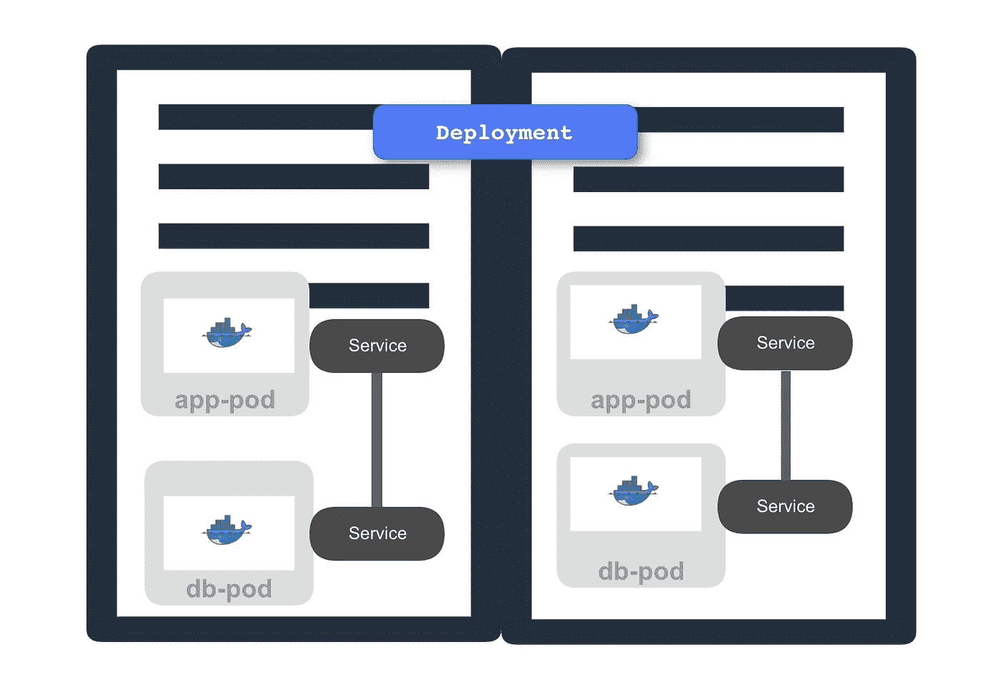

## 状态集

当应用程序需要管理有状态信息时，使用 StatefulSet 组件。例如，如果您在 Kubernetes 集群中托管一个数据库应用程序，使用部署组件是不够的，因为对数据库的所有更改/更新都应该在所有实例之间同步。这就是 Statefulset 发挥作用的地方。有状态集不仅管理复制，还管理数据同步。

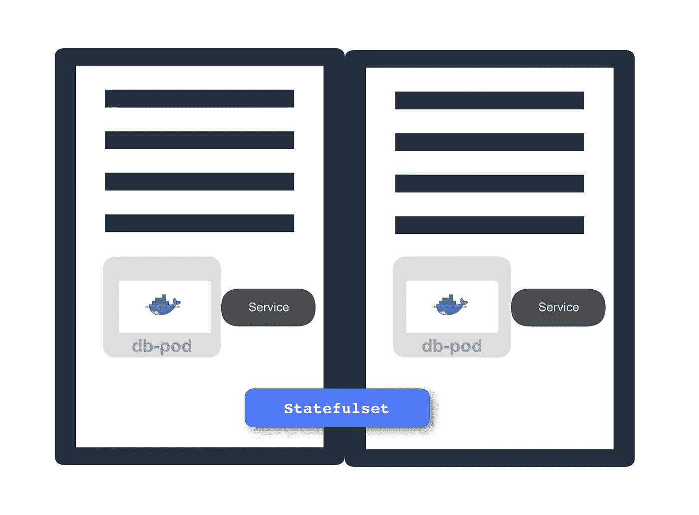

今天，我们将使用 Minikube 来部署我们所有的服务…

## Minikube 是什么？

Minikube 是一个让我们能够在本地运行 Kubernetes 的工具。与传统的 Kubernetes 集群不同，我们将有一个节点作为主节点和工作节点。

## 属国


*   [Minikube](https://kubernetes.io/docs/tutorials/hello-minikube/)
*   [库贝克特尔](https://kubernetes.io/docs/tasks/tools/install-kubectl/)
*   [App](https://github.com/karthiksai231/docker-example)

## 参考读数

[](/@kartheeksaip/how-to-dockerize-java-spring-boot-api-mongo-db-2ad5561a2592) [## 如何对接 Java Spring Boot Api & Mongo DB

### Docker 是什么？

medium.com](/@kartheeksaip/how-to-dockerize-java-spring-boot-api-mongo-db-2ad5561a2592) 

现在，是时候写些有趣的东西了…

## 配置映射文件

## 数据库部署文件

## 应用程序部署文件

## 启动 Minikube

```
minikube start --vm-driver=hyperkit
```

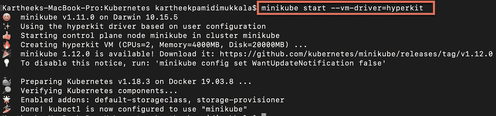

## 设置环境…

下面的命令使您能够在 Minikube 实例中重用 Docker 守护进程。

```
eval $(minikube docker-env)
```

## 在 Minikube 中建立 Docker 映像…

```
docker image build -t <your_app_image_name>:1.0 .
```

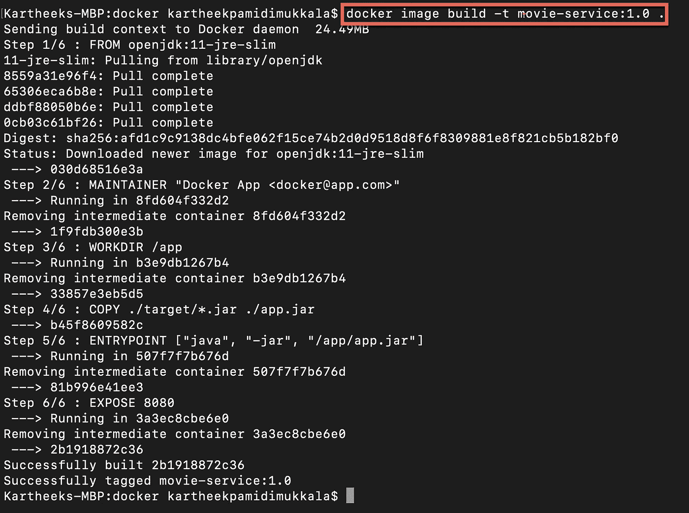

## 应用配置…

```
kubectl apply -f <your_config_file_name>
```

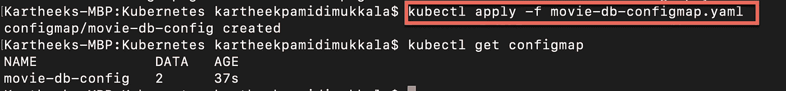

```
kubectl apply -f <your_database_deployment_file_name>
```

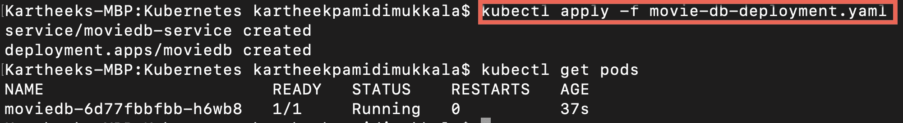

```
kubectl apply -f <your_application_deployment_file_name>
```

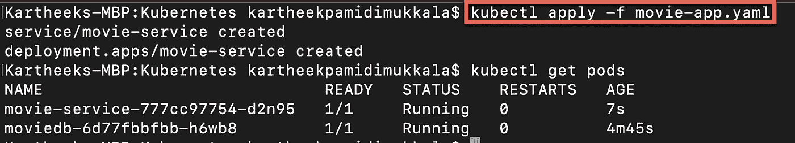

运行以下命令获取您的应用程序 url…

```
minikube service list
```

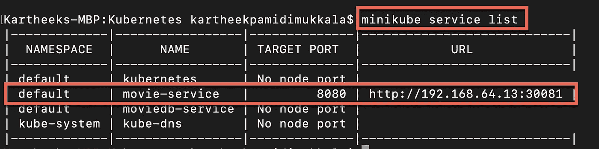

## 结论

就这样，在这种情况下，您可以从 URL[http://192 . 168 . 64 . 13:30081](http://192.168.64.13:30081)访问您的 API。

