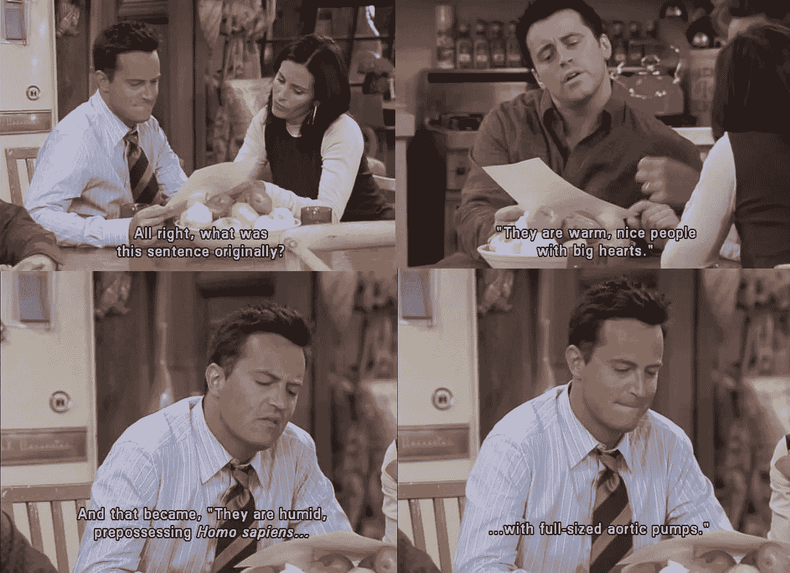
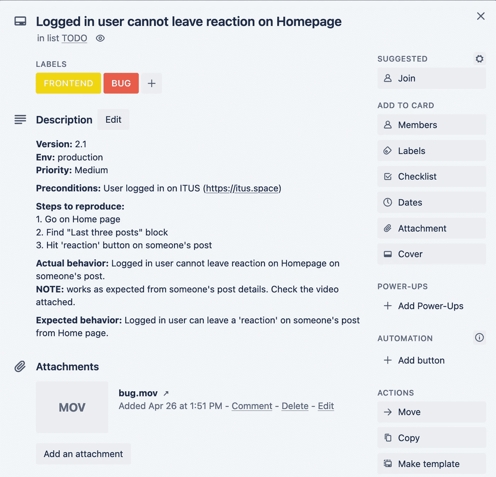

# 如何描述缺陷以便每个人都能理解(+额外提示)

> 原文：<https://medium.com/geekculture/how-to-describe-a-defect-so-everyone-could-understand-bonus-tips-7ccc666d8b03?source=collection_archive---------37----------------------->

Source: [https://i.pinimg.com/originals/14/99/a9/1499a99424bc4ba6b07c955a0cd5bfc4.jpg](https://i.pinimg.com/originals/14/99/a9/1499a99424bc4ba6b07c955a0cd5bfc4.jpg)

来自开发人员的“不能重现 bug”这句话对于 QA 工程师来说是一个真正的噩梦。以及返回的状态为“未修复”或“仍可再现”的标签对于开发人员来说是一场噩梦。

在这篇文章中，我想深入探讨 QAs 的噩梦。如果以仓促的方式描述缺陷，可能会难以理解。在这种情况下，开发人员可能会要求 QA 添加更多信息或拒绝 bug，因为他无法从混乱的文本或缺乏细节中找出它。

添加更多的结构和截图，让你的缺陷更容易阅读，并敦促开发人员修复缺陷。

作为奖励，你可以添加你对缺陷的根本原因及其性质的想法和假设，如果你能找到的话。在添加你的假设之前，先试着验证它们。如果你的假设没有任何证据，就不要把它写进你的报告。例如，如果这是一个与 API 相关的问题，您完全可以检查 API 文档并尝试模拟请求，看看缺陷是否仍然可以重现。根据结果，您可以决定是否将它们添加到您的报告中。如果应用程序崩溃了，不要花时间找出根本原因，添加重现步骤，附上日志，让开发人员处理。

在创建一个缺陷之前，我通常会尝试多次重现这个缺陷，并找到重现它的最短路径。我考虑应用程序中的每个地方，从那里我可以得到相同的结果。如果是海森堡，我会在票上注明。缺陷出现的频率会影响未来的优先级。当然，如果应用程序崩溃了一次，但在一个非常重要的部分，它应该被修复，因为它阻止了应用程序的进一步使用。任何被很好描述的缺陷都是建立在一个全面的方法之上的。

Defect example. Found on our startup https://itus.space

**正确的缺陷单包括:**

1.  **称号。**实际结果的简短版本。
2.  **形容。**内部版本号、环境、平台，对于物联网，可能是固件版本、前提条件、复制步骤、相关功能等。
3.  **实际行为。**描述你所看到的。行为、状态、状态代码等。
4.  **预期行为。**如果你不知道应该是什么行为，那就不要编。如果你在文档中找不到答案，向设计师、经理或其他更了解产品的团队成员寻求帮助。也许，没有人想到这个特殊的情况，它必须作为一个单独的任务添加。
5.  **附件。**截图、视频、文件作为测试数据由开发者复制缺陷等。
6.  **日志。**以撞车为例。
7.  **优先级。**稍后由质量保证主管、项目经理进行评估，如果管理层同意，则由质量保证进行评估。比如后来的 Bug 分类会议。

**UI bug**耗费大量时间。通常，它们被认为是次要的，可能永远不会修复。让我们考虑理想的和真实的工作流程。

作为开发人员工作的结果，QA 得到了一个包含 UI 部分和业务逻辑部分的构建。除了与业务逻辑相关的问题之外，UI 部分经常会有一些差异。例如，人为因素或从设计团队收到的错误版本。也许，任务中没有附加的设计。它迫使开发人员自己做出设计决策。

为了避免这些差异，应该有一个构建交付的规则列表，开发人员可以在向 QA 团队提供任何构建之前遵循这些规则。但我从未在真实的工作环境中见过这样的规则列表。当开发团队没有遵循规则时，QA 可能会返回设计没有遇到预期视图的构建。一旦规则列表成为构建交付过程中验收标准的一部分，它在 UI 错误报告中消耗的时间就会减少。这有助于不延迟冲刺，并为 QA 创造了关注更重要的构建调查的机会，如业务逻辑测试、性能等。

事实上，如果这是一个新功能，所有的 UI 小缺陷都可以附加到相关的标签，用户故事，并希望它将被完全修复。

其他旧的功能发现和没有被修复的与新特性相关的 UI 缺陷被放入“缺陷墓地”(我喜欢这样称呼它)。这就是为什么，可能会有不创建那些小的 UI 缺陷的诱惑，认为“哦，它永远不会被修复，我为什么要花时间在那上面”？

任何种类的小缺陷的命运都取决于未来 sprints 中的可用时间，或者由 CEO、客户支持、利益相关者等提及特定问题的事实。这立即触发了缺陷重新评估过程，并将其优先级从次要更改为其他。

因此，在一个缺陷跟踪系统中已经有了由 QA 创建缺陷是很好的。即使它存在了几个月，也比从客户或 CEO 那里了解缺陷要好。不要损害你的名誉。报告问题是 QA 的工作。如何处理这些问题将取决于许多因素。

# 额外提示

Source: [YouTube](https://www.youtube.com/watch?v=LcM4zWiikKQ)

## **提示#0**

用委婉、简洁、充分、结构化的方式描述缺陷，并使它们在视觉上清晰。一个格式良好的缺陷不应该强迫开发人员来理解它。有时可能会出现开发者需要更多细节的情况，但这种情况不应该经常发生。

## **提示 1**

向销售部门索要他们在潜在客户演示中展示的功能列表。保持这个“推销员”的场景没有 bug。否则，可能会给公司带来很多问题。

## **提示#2**

如果受影响的功能被破坏，请不要退货。为此创建一个单独的票证。

## **提示 3**

不要把几个缺陷放在一张票里。除非它们都导致一个实际的结果(相同的缺陷可能出现在应用程序的不同部分)。

## **提示#4**

关闭 bug 和开发人员的任务是 QA 的特权。QA 不应该依赖开发者的话。“它不能被 QA 测试”或“它不可能被破坏”不是开发人员关闭任务的理由。需要 QA 验证和批准。

## **提示 5**

根据您团队中的过程或情况，可能有几种方法来处理重复的缺陷。反正你会花时间的。主要问题是“到底为了什么？”。花时间去:
是有意义的⏱*搜索*中的重复项；
⏱*审查*其他 QA 的缺陷；
⏱*创建*一个缺陷；
⏱*与 QA 成员沟通*(向他们展示缺陷，并询问他们是否在方便的情况下为此创建了一个标签)。

## **提示 6**

除了需求和所有的业务逻辑，总有一些无声的、不可见的、未披露的(选择你的)需求，它们没有在文档中提到，但是在特性或验收测试中被期望看到。

通常，人们可以默认期望一些事情，而不在文档中提及它们。这是一个很大的问题，因为开发人员要编写需求中提到的所有东西。如果有什么东西不见了…嗯，他们不能读取别人的想法。

因此，在开始编码之前，确保所有团队成员都同意处理错误处理和字段验证。否则，QA 团队将创建一堆可以在第一时间避免的标签。

当涉及到创建一个缺陷时，你会有什么样的挣扎？请随意分享你关于如何改进 bug 描述的建议。