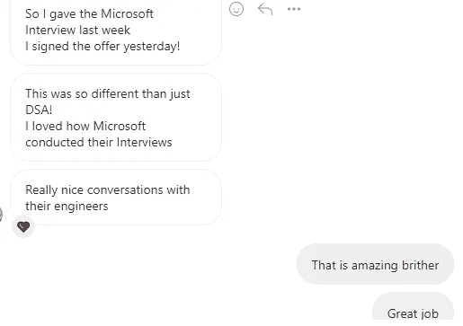
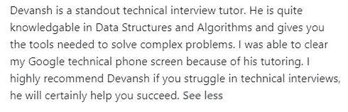

# 如何设计你的模拟面试答案来搞定你的 FAANG 面试

> 原文：<https://medium.com/geekculture/how-to-design-your-mock-interview-answers-to-nail-your-faang-interviews-23f6b9f401cf?source=collection_archive---------5----------------------->

## 一旦你发展了你的概念，用它来获得最好的结果

为了帮助我了解您[请填写此调查(匿名)](https://forms.gle/7MfQmKhEhyBTMDUD7)

最近我醒来发现了一些好消息。我的一个同事(学生)曾和我一起提高他们的模拟面试技巧，他在 Instagram 上给我发来了这条 DM:

Microsoft is apparently the best place to interview. Multiple students have praised it

自然，这是非常令人兴奋的。微软是一家科技巨头。对我来说，学生 S 特别值得注意的是，他是一个实验品。他在一个非常有趣的地方来找我。他已经练习 Leetcode 大约一年半了。和其他向我求助的人不同，他非常擅长这个。他精通各种数据结构和算法。当谈到从问题中学习时，他也有完美的心态。他对试图理解概念非常感兴趣，而不仅仅是试图学习解决问题的技巧。例如，我们花了相当多的时间来讨论递归，得到递归，例子比比皆是，优化而不是仅仅记忆一些固定的模式来解决问题。

现在你可能想知道为什么这个学生来找我。简单地说，他无法在面试中表现出他的技能。所以我们决定尝试一些不同的东西。这与脸书和谷歌帮助人们通过面试的方法不同。与我得到这样的推荐不同:

我有两篇关于在顶级科技公司谋职的文章。“[我的学生用来最大化 Leetcode 问题并赢得 FAANG 面试的 4 步法](/geekculture/the-4-step-method-my-students-use-to-maximize-leetcode-problems-and-ace-their-faang-interviews-2d5e0a6b1538)”讲述了如何在每个 Leetcode 问题上最大化你的回报。“[我是如何帮助一个非计算机科学专业的学生找到 FAANG 软件开发工作的](https://machine-learning-made-simple.medium.com/how-i-helped-a-non-computer-science-student-nail-a-faang-software-dev-job-86a4e41f95b7)”这是我帮助一个非计算机科学专业的学生在脸书获得软件开发职位的一步一步的方法。他们都强调检查许多问题的重要性。通常情况下，我会每周预留一节课，帮助学生解决他们遇到的问题。有了学生 S，我决定把所有时间都花在模拟面试上。这个想法很简单。我们有一个月的时间准备。他的知识水平相当高。因此，对我们来说，最高的投资回报率将来自于确保 S 能够以一种有组织的方式面对他的面试问题。请记住，我们主要关注硬问题和中等问题。

以下是我们为提高他的采访表现而关注的事情。

Expect results by following this checklist

# 1.边缘/基础案例

到目前为止，开始解决任何具有挑战性的编码问题的最简单的方法。查看边角案例并立即解决。它可以简单到检查某些条件并返回适当的值。但这通常是一个很好的起点。这不仅有助于递归，也有助于各种复杂的问题。

为什么我们要先做这个？三个原因:

1.  更难的问题可能会变得非常棘手。解决更明显的边缘情况会让你的头脑对主要问题有所准备。边缘案例可以为你的主要问题提供一个很好的切入点。先拿低挂的水果也会让你前进，给你动力。这在面试这样的高压情况下至关重要。
2.  通常，让人们陷入困境的是边缘案例。许多人试图先解决一般问题。当他们这样做时，他们最终会错过需要有效处理的关键案例。
3.  这些案例可以提供一些提示。对于递归问题尤其如此。

我通常建议我的学生在询问面试官澄清问题时探究这些案例。澄清问题是关于问题约束的问题，通常可以揭示问题/解决方案性质的某些属性。

# 2.手动运行您的假设解决方案

想象你有一个工作的黑盒代码。如果你打印出每个时刻的状态，会是什么样子？手动浏览一些简单的案例将有助于你对如何解决问题有一个直觉。例如，让我们考虑一个问题，我们必须只使用一个队列来插入一个栈。所以一个栈(1，2，3，4，5)就变成了(1，5，2，4，3)。谷歌爱这个问题。我能够解决这个问题，只需要一个小的堆栈，并运行通过一个解决方案会做什么。而不是如何(我们要解决的问题)。它看起来会是什么样子。要查看该过程(和代码)的完整解释，请查看此视频。音频略低，但它进入了这个问题的完整解决方案:

Don’t forget to Like and Subscribe

这个方法是避免卡住的方法。想象一下有一个非常难的问题。你不知道如何进行。仅仅通过一些你的代码可能的工作方式就可以让你的思想集中。这比坐在那里笨拙地抓着一个可能的解决方案(或者更糟，冻结)要好得多。结合您的基本案例，您甚至可以生成一些伪代码。

# 编写伪代码/实际代码

这就是你的知识和实践派上用场的地方。**当您确定了解决方案的“内容”后，我们就可以开始“如何做”**。你可以一次一点点地解决问题，逐步找到解决方案。这就是模块化和封装等实践有用的地方。这个部分没有技巧。，所以我不会在这上面浪费太多时间。我也不需要告诉你为什么这很重要。

# 探索权衡

这是很多人都忽略的部分。然而，这是真正能让你与众不同的东西。假设你有一个有效的代码。现在是你能从面试官那里获得很多印象分的时候了。怎么会？开始谈论其他可能的解决方法。我们能否用另一种数据结构来解决它。我们能增加时间复杂度，但节省空间吗？有没有可供选择的数据结构可以使用。你不必给出细节。这就是你可以高水平的地方。你已经展示了你的技术实现技能。现在是你获得创造力和知识加分的时候了。

# 关闭

使用这个清单，你会在面试中做得更好。尝试实施这种方法，并分享你是如何做到的。你一定会从中看到更好的面试效果。

作为免责声明:要从中受益，你需要一个非常强大的基础。你可以通过网上学习，使用书籍，甚至联系我进行辅导来发展这一点。

这是和一个学生 J. J 的短信交流。J .是一个有 15 年工作经验的专业人士，他甚至为简单的中等水平的 Leetcode 问题而挣扎。我们断断续续在一起工作了 2 个月。由于她忙碌的个人生活，她不能投入很多时间练习，甚至经常不得不取消我们预定的课程。到目前为止，我们要休息一段时间，因为 J 要处理一些个人事务。然而，在那段时间里，她已经能够提高自己解决问题的能力。在我们一起工作之前，她对尝试编码面试问题感到绝望。现在，用她的话说，她正在“慢慢建立逻辑”。我将在本文后面提供更多的例子。

此外，请随意订阅我的时事通讯。这里我分解了各种技术相关的东西，包括各种编码面试问题。我将开始在那里更经常地分享问题和解决方案。这是一个很好的方法来确保你可以从我的技巧中学到东西，如果你不能承诺辅导的话。它在我的子栈上:[https://devanshacc.substack.com/](https://devanshacc.substack.com/)。

# 向我伸出手

如果那篇文章(或推荐)让你有兴趣联系我，那么这一部分就是为你准备的。你可以在任何平台上联系我，或者查看我的其他内容。如果你想讨论家教，发短信给我。如果你想支持我的工作，使用我的免费罗宾汉推荐链接。我们都有免费的股票，对你没有风险。所以不使用它只是失去了免费的钱。

查看我在 Medium 上的其他文章。:【https://rb.gy/zn1aiu 

我的 YouTube:【https://rb.gy/88iwdd 

在 LinkedIn 上联系我。我们来连线:[https://rb.gy/m5ok2y](https://rb.gy/f7ltuj)

我的 insta gram:【https://rb.gy/gmvuy9 

我的推特:【https://twitter.com/Machine01776819 

我的子任务:[https://devanshacc.substack.com/](https://devanshacc.substack.com/)

twitch 现场对话:[https://rb.gy/zlhk9y](https://rb.gy/zlhk9y)

获得罗宾汉的免费股票:[https://join.robinhood.com/fnud75](https://www.youtube.com/redirect?redir_token=QUFFLUhqa0xDdC1jTW9nSU91WXlCSFhEVkJ0emJvN1FaUXxBQ3Jtc0ttWkRObUdfem1DZzIyZElfcXVZNGlVNE1xSUc4aVhSVkxBVGtHMWpmei1lWWVKNzlDUXVJR24ydHBtWG1PSXNaMlBMWDQycnlIVXNMYjJZWjdXcHNZQWNnaFBnQUhCV2dNVERQajFLTTVNMV9NVnA3UQ%3D%3D&q=https%3A%2F%2Fjoin.robinhood.com%2Ffnud75&v=WAYRtSj0ces&event=video_description)