# 如何检测玩家周围的碰撞体

> 原文：<https://medium.com/geekculture/how-to-detect-colliders-surrounding-the-player-ebdcadf3ba61?source=collection_archive---------25----------------------->

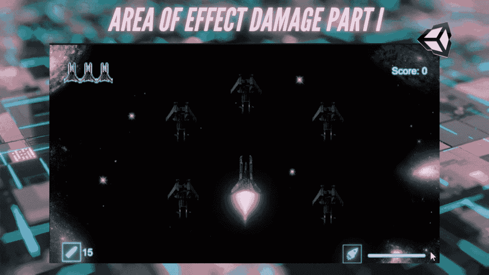

作为一名游戏玩家，我一直是效果区域(AoE)攻击的粉丝——它们在人群控制方面令人惊叹，并且可以很容易地成为你武器库中最有用的工具之一。在接下来的文章中，我将详细说明我是如何为我的 2D 太空射手增加一个有效攻击区域的。

**目标**:在给定区域内，从玩家周围的特定物体中检测出碰撞者。

# 使用物理 2D。OverlapCircleAll

[物理 2D。OverlapCircleAll](https://docs.unity3d.com/ScriptReference/Physics2D.OverlapCircleAll.html) 返回一个圆形区域内的所有碰撞器，并允许我们对每个碰撞器执行一个操作。

出于 AoE 的目的，我们将重点关注它的三个参数:

*   **点**:圆的中心或原点。
*   **半径**:圆的半径，即从圆心或原点到圆周上任意一点的距离。
*   **layerMask** :检查指定图层中特定对象的过滤器。这将使 AoE 只影响敌人。

> **注意**:如果你在为 3D 游戏创建 AoE，使用 [**物理。OverlapSphere** 改为](https://docs.unity3d.com/ScriptReference/Physics.OverlapSphere.html)。

## 让我们一步一步来！

1.  创建一个带有 SerializeField 的[类型的全局变量 LayerMask](https://docs.unity3d.com/ScriptReference/LayerMask.html) 以在检查器中分配它。我把我的命名为 AoE，因为这个图层蒙版中的任何东西都将被设置为受攻击范围的影响。

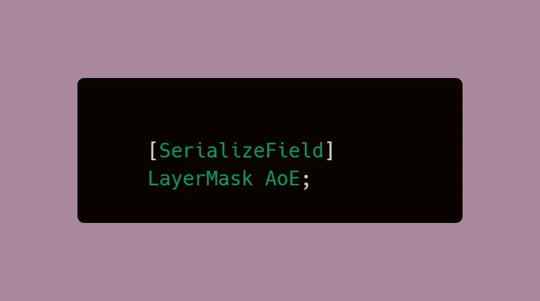

2.要指定新的 LayerMask 变量，我们只需要为敌人对象创建一个层。正如你所看到的，我已经添加了我的图层，但是你可以按照下面的步骤来创建一个图层。

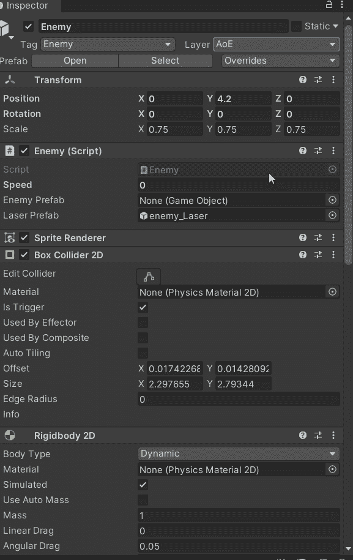

3.然后，我们可以在上一步创建的字段中选择所需的图层。

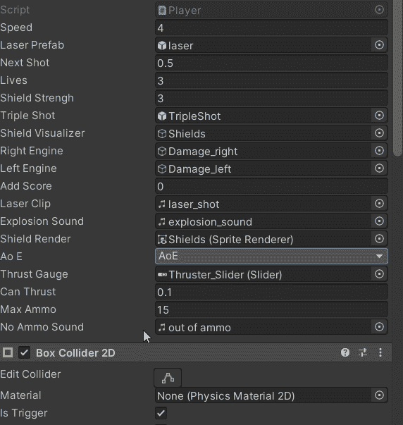

4.为效果区域行为创建一个 void 方法。在 void 方法中，添加一个 vector2 作为圆原点。

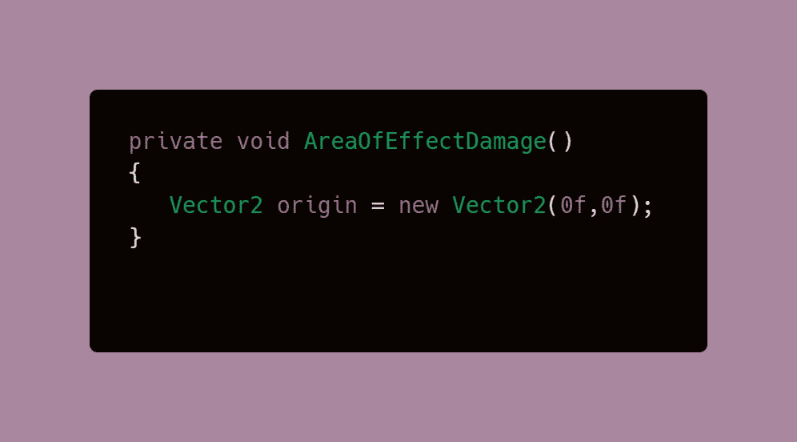

5.所有参数就绪后，我们可以添加 Physics2D.OverlapCircleAll。这将存储为一个碰撞器数组。

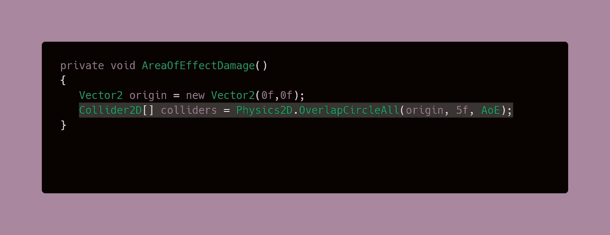

括号中的 5f 是圆的半径，这可以是你喜欢的任何数字，取决于 AoE 有多大。

> **注意**:使用 physics2D 时。OverlapCircleAll，您无法直观地看到您创建的圆形区域。然而，有一个使用**小发明的工作。**

6.创建一个 Foreach 循环，这样我们的代码就可以用于这个区域内的每一个碰撞器。在这里，c 只是一个变量，可以给它取任何名字，但是对于碰撞器，我们保留 c。

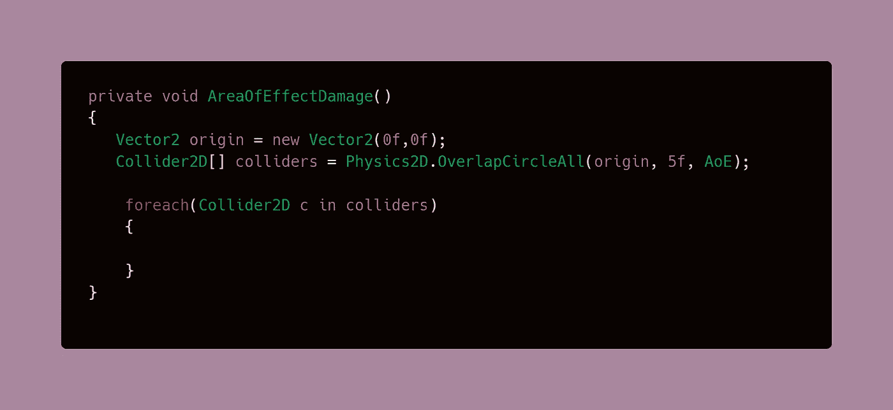

7.在循环中添加一个 if 语句，这个 if 语句将在碰撞器中搜索附加到碰撞器上的敌方类脚本组件。

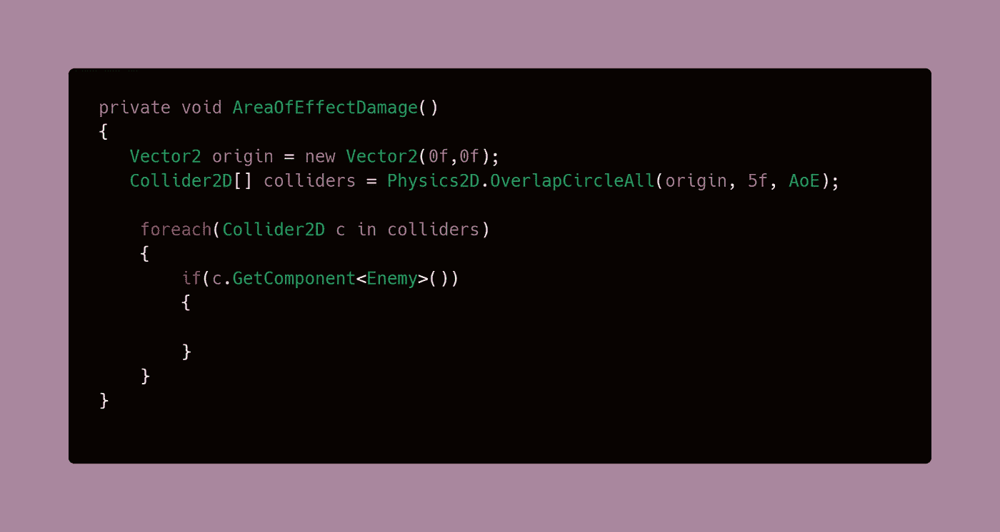

8.如果组件被找到，我们将进一步进入敌人类，并调用摧毁敌人的方法。

> **注**:调试。出于测试目的，日志是可选的。

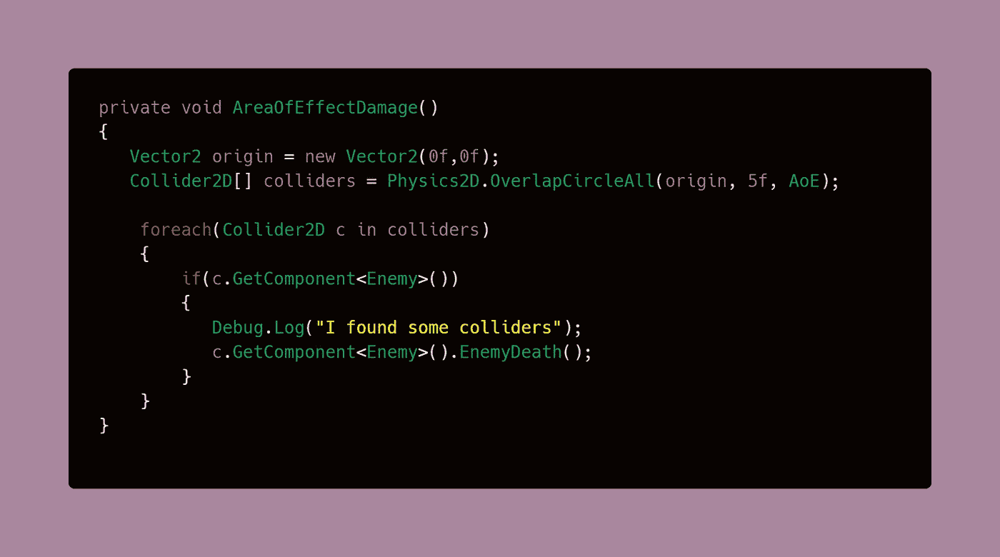

9.最后，您需要在您认为适合您的脚本的任何地方调用该方法。在我的情况下，这意味着是一个辅助武器的一部分，因此，它将被称为按下一个键。

> **注意**:这将在以后被用来代替常规武器，所以现在，我将使用 K 键来测试 behvario，而不是空格键，这是我的 2D 太空射手的发射按钮。

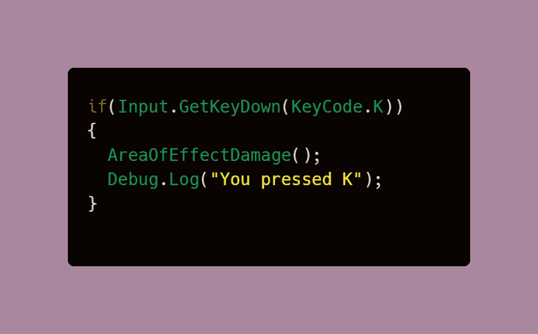

## 结果是:

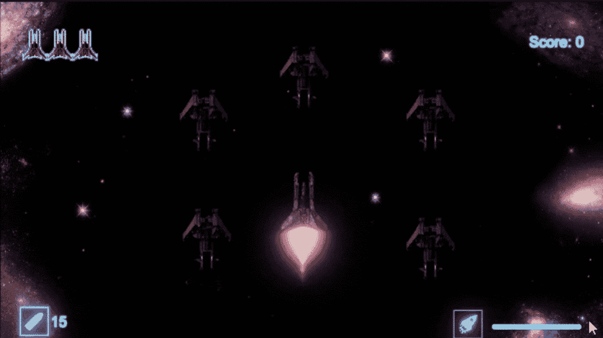

我会在下一篇文章继续我的 AoE 分解！