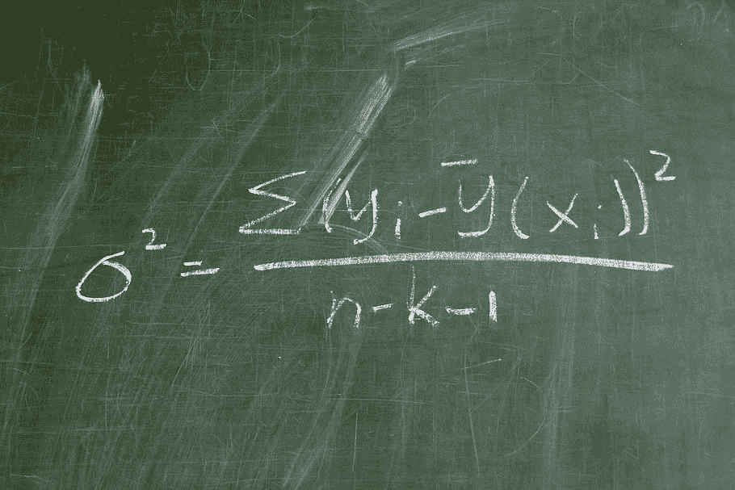

# 如何在 Python 中确定两个数据集的方差相等还是不相等

> 原文：<https://medium.com/geekculture/how-to-determine-if-two-datasets-have-equal-or-unequal-variance-in-python-b941dbaaae8?source=collection_archive---------14----------------------->

差异

方差是离差的一种度量，它考虑了数据集中所有数据点的分布。这是最常用的离差度量，还有标准差，它仅仅是方差的平方根。方差公式如下所示:-