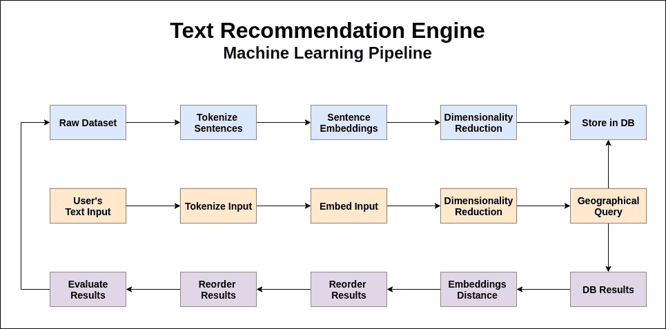

# 如何开发一个文本推荐引擎

> 原文：<https://medium.com/geekculture/how-to-develop-a-text-recommendation-engine-99d3b46effdb?source=collection_archive---------21----------------------->

## 使用 TensorflowJS、TypeScript、ReactJS 和 MongoDB



Flow Diagram of a Serverless Recommendation Engine.

深度学习领域的最新进展使得**将人工智能的力量扩展到网络浏览器**成为可能。TensorflowJS 于 2018 年推出，使 web 开发人员能够在其应用程序中集成最先进的模型。其中一个模型，[通用句子编码器](https://github.com/tensorflow/tfjs-models/tree/master/universal-sentence-encoder)，利用自然语言处理的进步将单词和句子转换成数学向量，称为单词嵌入。

由深度学习领域的开创性论文开发，包括谷歌的 word2vec 和斯坦福的 GloVe。单词嵌入开启了各种应用:映射同义词和反义词，破译类比，测量偏差。**文本推荐引擎可以理解为一个相似性优化问题。**在向量空间中，这转化为寻找一组初始条件的最近点。

使用 TensorflowJS 将 ML 操作外包到前端有几个好处，包括:隐私、成本效益、速度和方便。例如，**联邦学习是一种分布式人工智能范式**，它与移动电话和物联网等部署的设备共享训练和预测任务。

以下构建文本推荐引擎的方法**将深度学习的最新进展与地理数据库查询**配对，以创建流畅的用户体验。这在需要快速响应时间和廉价计算成本的数据稀缺应用中特别有效，如社交网络。

# 1.准备我们的数据集

假设要提供的潜在推荐的现有数据集已经存在。第一步是**将文本分词**成句子。之后，输入就可以输入 TensorflowJS 了:

```
import { Tensor2D } from '@tensorflow/tfjs-node'
import { UniversalSentenceEncoder } from '@tensorflow-models/universal-sentence-encoder'const embed = async(sentences: string[]):Promise<Tensor2D> => {
    const model = await use.load()
    const embeddings = await model.embed(sentences)
    return embeddings
}
```

在前面的代码中，导入了 Tensorflow 和句子编码器模型。然后，加载模型，在单行代码中将**句子嵌入到矢量**中。结果是一个由 512 维向量组成的 2D 张量，每个向量代表一个句子。

寻找两个 512 维点之间的距离是一项缓慢而昂贵的任务。然而，数据库处理空间关系有着悠久的传统。特别是， **MongoDB 支持创建 2D 索引**并在坐标对上执行查询。为此，我们将使用 ml-PCA 节点模块来降低单词嵌入的维数。首先，我们训练模型:

```
import { PCA, IPCAModel } from 'ml-pca'
import { promises as fs } from 'fs'const trainPCA = async(embeddings:number[][]) => {
    const pca = new PCA(embeddings)
    await fs.writeFile(PCA_ROOT, JSON.stringify(pca))
}
```

然后我们做出预测:

```
import PCA_Model from PCA_ROOTconst reduceDimensions(embeddings:number[][]) => {
    const pca = PCA.load(PCA_Model as IPCAModel)
    const points = pca.predict([embeddings], {nComponents:2})
    return points
}
```

将结果保存到 MongoDB 后，我们就有了一个干净的推荐数据集，可以随时提供服务了。


Photo by [Beth Jnr](https://unsplash.com/@bthjnr?utm_source=medium&utm_medium=referral) on [Unsplash](https://unsplash.com?utm_source=medium&utm_medium=referral)

# 2.处理用户的输入

要获得提供建议的初始条件集，有两个选项:

1.  用户所做选择的历史。
2.  要求用户输入文本。

第一个选项很简单:首先，我们只需要找到一个函数来平均用户所做选择的位置。处理文本输入也不难，但是我们需要实现用于处理建议的相同管道。无论如何，我们将会剩下从其中获取 DB 的 **2D 坐标:**

```
const makeRecommendations = async(x:number, y:number) => {
    const geoNear = {$geoNear: {near:[x,y], distanceField:'dist'}}
    const limit = { $limit: 100 } // Get the top 100 Recommendations from the DB collection.
    const recs = await Recs.aggregate([geoNear, limit]).toArray()
    return recs
}
```

我们现在已经准备好提供建议了，但是我们还可以再做一件事来**提高我们建议的准确性**:重用最初的 512 维单词嵌入！


Photo by [Noah Buscher](https://unsplash.com/@noahbuscher?utm_source=medium&utm_medium=referral) on [Unsplash](https://unsplash.com?utm_source=medium&utm_medium=referral)

# 3.提供建议

使用单词嵌入来排列前 100 个推荐是两个世界中最好的:2D 索引的速度；以及 512 维向量的精度。但是要实现它，我们需要定义和**计算两点之间的距离**。在本例中，我将使用绝对值距离对建议进行排序:

```
// Absolute Value Distance Computation.
const similarity = (userInput:number[], recommendation:number[])=> {
    if (userInput.length !== recommendation.length) return Infinity // Iterate through each dimension and compute the difference.
    const delta = userInput.reduce((d, i, idx) => 
        d + Math.abs(i - recommendation[idx])
    , 0) return delta
}const sortRecomendations = (userInput:number[], recs:iRec[]) => { 
    return recs.sort(({embeddings:a}, {embeddings:b}) => 
        similarity(userInput, a) > similarity(userInput, b) ? 1 : -1
    )
}
```

然后，使用绝对值距离在 React 应用程序中呈现排序的建议:

```
import { useEffect, useState } from 'react'const Recommendations = (recs: iRecs[], userInput:number) => {
    const [ sorted, setSorted ] = useState<iRecs[]>()
    useEffect(() => { 
        const sortedRecs = sortRecomendations(userInput, recs)
        setSorted(sortedRecs)
   }, [recs]) return sorted.map((r, k) => <Recommendation {...r} key={k} />
}
```

最后，为了关闭我们的机器学习管道，我们需要一个系统来**评估和提高结果的准确性**。我建议将匿名化的事件发送到一个产品智能工具，比如 Amplitude。这些想法可以让你开始评估模型的性能:

*   建议的贴近度和点击率之间的相关性。
*   推荐越靠前，点击**的**就越多。
*   **测量**基于时间和日期存在效率差异。
*   **根据搜索和兴趣对**用户进行细分。


Review of the flow diagram for a Machine-Learning Text-Recommendation Engine’s Pipeline.

# 结论:潜在应用

感谢您的阅读；作为奖励，我将向你展示六个想法，你可以在这些想法中应用这项技术来建立一个产品或业务:

1.  一个阅读推荐引擎:类似于网飞对电影所做的**；或者谷歌的应用程序。你可以创建一个应用程序或时事通讯，根据用户的兴趣提供阅读建议。**
2.  文档索引:学术、医学或法律等领域可以受益于基于重要查询的分类和快速检索相关信息的能力。
3.  搜索文档:AWS 文档包含数千页和数百种产品。AWS Kendra 使用机器学习为其搜索引擎提供动力。有了这种算法，你可以创造一种竞争的、非专有的技术来在其他文档中搜索答案。
4.  了解你的用户:如果你的网站或应用有一个搜索组件:你可以**通过了解你的客户基于他们的搜索想要什么来指导你的营销工作**。
5.  有意义的视觉化:试图从视觉上理解一次会议或一周的电子邮件后发生的事情是很困难的。想象一下基于单词嵌入创建图表来**总结和测量非数字交互。**
6.  社交网络:通过推荐最好的内容，在用户中发展有意义的关系，建立**智能自动调节**工具，来建立下一个繁荣的利基社交网络。

我希望你喜欢这个故事，并觉得它有用。如果你有兴趣阅读更多关于前端的创业型 AI，请考虑给我一个关注。像往常一样，你们的掌声和鼓励的话语会受到高度赞赏。