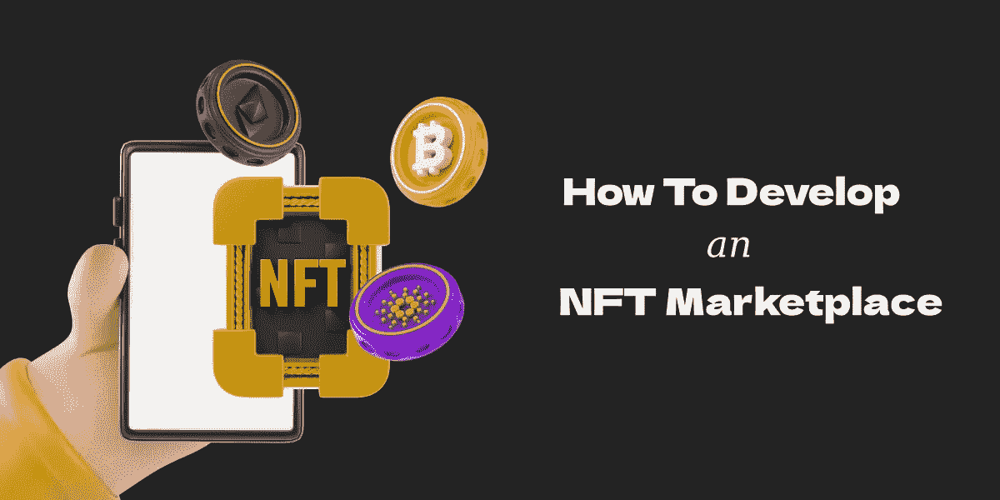

# 如何开发 NFT 市场，并成为利润丰厚的数十亿美元的 NFT 市场的一部分

> 原文：<https://medium.com/geekculture/how-to-develop-an-nft-marketplace-and-be-a-part-of-a-lucrative-billion-dollar-nft-market-aa63e5b34590?source=collection_archive---------19----------------------->

你不需要是一个密码爱好者，至少听说过 NFTs。非功能性测试已经全球闻名。NFT 在很短的时间内就达到了十亿美元的市场。NFT 的市值在 2021 年达到近 110 亿美元，预计未来 8 年将增长 34 倍。每天都有数以百万计的 NFT 被铸造和交易；这就是非功能性测试的市场和需求有多大。为了满足这种对非正规金融服务的需求，许多 NFT 市场正在建立。许多领先的公司如福克斯娱乐公司、NBA、可口可乐也开始开发自己的*。NFT 市场的发展在 NFT 有着巨大的潜力。因此，让我们更深入地了解一下 NFT 市场的发展，以及它是如何回报商机的。*

## ***NFT 市场***

*NFT 市场是一个建立在区块链上的去中心化平台，用户可以在这里铸造、购买和交易非功能性交易。这些 NFT 可以是数字艺术、模因、视频、音乐等。一个 NFT 市场显示与 NFT 的价格、稀有性和所有权相关的信息。NFT 市场有用户友好的功能，如高级搜索选项，排序，和店面。*

*要开始使用 NFT 市场，用户必须通过连接他们的加密钱包来注册 NFT 市场。然后，用户可以通过指定支付方式、描述等细节在市场上上传他们的作品。NFT 创作者还可以选择 NFT 的上市和销售方式。*

* [## NFT 市场开发|不可替代代币市场|白标 NFT 市场|…

### NFT 市场的发展正在塑造即将到来的创业公司的未来，以在竞争中胜出。构建您自己的…

bit.ly](https://bit.ly/3EbZJok) 

## **如何发展 NFT 市场？**

➤ **构思和白皮书起草:**集思广益，构思你的市场开发项目。为你的 NFT 市场选择一个通用的利基市场来吸引更多的观众。对市场的全面研究对你所在市场的长期成功非常有帮助。

➤ **区块链:**为您的 NFT 市场选择正确的区块链。你可以建立跨链兼容的 NFT 市场。市场上一些流行的区块链有以太坊、索拉纳和 BSC。

➤ **用户界面/用户体验设计:**用户界面定义了市场的整体用户体验。为你的市场设计一个用户友好但复杂的界面，这样用户可以很容易地浏览这个平台。

➤ **智能合约:**智能合约是 NFT 市场不可或缺的一部分。NFT 市场上的所有交易都是通过智能合约进行的，智能合约在满足预定条件时执行。

➤ **开发:**和一个专业熟练的开发团队一起为你的 NFT 市场进行前端和后端开发。

➤ **测试:**对你的 NFT 市场进行多项测试，确保你的市场没有任何漏洞和错误。

➤ **启动和维护:**一旦经过测试并准备就绪，就部署您的 NFT 市场供公众使用。即使在发布之后，也要持续监控用户参与度，并根据用户反馈不断更新应用。

## **NFT 市场开发如何成为一个有利可图的商业项目:**

➤ **佣金费用:**你可以对你的 NFT 市场上的所有交易收取佣金费用。你可以在市场上为铸造、出售和购买非功能性食物收费。

➤ **上市:**你可以向所有上市的非专利软件的创作者收取上市费。每天都有成千上万的 NFT 被铸造出来，你可以从上市费中获得可观的收入。

➤ **初装费:**你也可以在用户建立账户时向他们收取初装费。

➤ **同时出售几个 NFT:**当 NFT 创造者同时铸造多个 NFT 时，创造者为他们添加的每一个 NFT 招致汽油费和连锁费用。

➤ **拍卖和竞价费用:**对于市场上通过拍卖卖出的每一个成功的 NFT，你可以向买家收取竞价费用，向创作者收取拍卖费用。

➤ **联盟营销:**联盟营销是针对 NFT 市场上的合作伙伴项目。你可以对空投、奖励计划、即时拍卖和 HTTP API 集成等功能收费。

## **开发一个 NFT 市场的成本**

开发一个 NFT 市场的成本完全取决于你的需求和 NFT 市场的特点。你可以 [***从零开始建立你的 NFT 市场***](https://bit.ly/3EbZJok) ，或者你可以选择白色标签的解决方案。

> **NFT 市场发展**
> 
> 开发 NFT 市场的两种最常见的方法是 1)从头开始构建，2)选择白标解决方案。

从零开始建立的 NFT 市场:在区块链专家、开发商和设计师的帮助下，你可以从零开始开发你的 NFT 市场。当你从头开始建立你的市场时，你甚至可以定制最小的细节。但是，这个过程可能需要很多时间，对一些企业家来说可能有点昂贵。如果你没有专业的市场开发公司来建立你的市场，这也是一个棘手的问题。

**白标 NFT 市场:**白标 NFT 市场解决方案是预先构建和预先测试的解决方案。白标解决方案完全可以根据客户的要求进行定制。与从零开始建立的 NFT 市场相比，白标解决方案需要更少的时间和金钱。

 [## NFT 市场开发|不可替代代币市场|白标 NFT 市场|…

### NFT 市场的发展正在塑造即将到来的创业公司的未来，以在竞争中胜出。构建您自己的…

bit.ly](https://bit.ly/3EbZJok) 

**总之，**随着 NFTs 在全球取得巨大成功，对 NFT 市场的需求也同样激增。着眼于数十亿美元的非功能性测试市场，许多领先的公司已经开发了自己的 NFT 市场。如果你是一名企业家，正在寻找发展自己的 NFT 市场，那么你应该觉得自己很幸运，因为你即将成为这个十亿美元市场的一部分。但正如我们之前提到的，在没有任何专业指导的情况下发展 NFT 市场可能是一件棘手的事情。所以，现在就雇佣一家专业的 NFT 市场发展公司来开始你的 NFT 创业吧。*