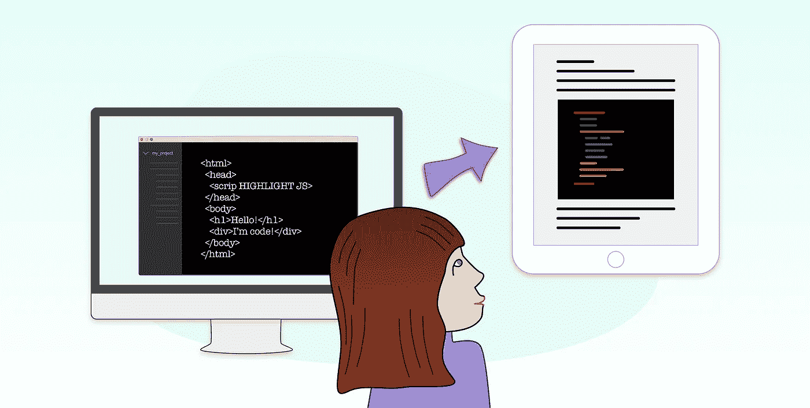

# 如何在 HTML 中将文本显示为代码片段

> 原文：<https://medium.com/geekculture/how-to-display-text-in-your-html-as-code-snippets-f7181e7fa338?source=collection_archive---------4----------------------->

## HighlightJS 库非常好用。



Illustration by [Monica Saiz](http://www.monica-saiz.com/)

我过去常常建立技术博客，在那里我写文章来帮助其他人理解我以前一直在努力解决的任何问题。如果你写技术文章，你很可能需要显示一些代码。

当你在 medium 中编写时，你可以使用他们很酷的编辑器来显示代码，但是当你从头开始编写你的网站时，你可能需要一个解决方案——除非你想把所有这些代码片段包装在 div 中，并在你的 CSS 中自己设计它们...

# 突出显示 JS——一个将文本显示为代码的库

HighlightJS 是一个帮助你在 HTML 中以代码形式显示文本的库。它支持 191 种语言和 97 种风格的疯狂数字。要查看所有可用的样式，您可以查看 highlight.js [样式目录](https://github.com/highlightjs/highlight.js/tree/master/src/styles)。

首先，让我们下载 Highlight JS 包，包括对任意多种语言的支持。这里可以下载[。](https://highlightjs.org/download/)

你可以从一大堆中选择你想要的。

## **看起来怎么样的截图。**

然后将 JS 文件复制到项目中您想要的文件夹中，并将其包含在您的`index.html`文件中(或在您的应用程序中作为索引页的文件):

```
<script src=”/path/to/highlight.pack.js”></script>
```

## 添加到库的链接*高亮显示*。 *js*

```
<script src="/path/to/highlight.min.js"></script>
```

## 添加一个链接到他们的 CSS 样式之一

```
<link rel="stylesheet" href="/path/to/styles/default.css">
```

## 调用 initHighlightingOnLoad

```
<script>hljs.initHighlightingOnLoad();</script>
```

您可以将这三行代码添加到 index.html 的头部，或者作为索引的 HTML 中:

```
<head>
  ...
  <link rel="stylesheet" href="/path/to/styles/default.css">
  <script src="/path/to/highlight.min.js"></script>
  <script>hljs.initHighlightingOnLoad();</script>
  ...
</head>
```

您还需要在 JS 中调用这个函数来初始化高亮 JS。有几种可能的方法可以做到这一点:

# **默认方式**

在 JS 的开头只调用这个函数:

```
<script> hljs.initHighlightingOnLoad(); </script>
```

如果你这样做，HighlightJS 将样式化`<pre><code>`标签中的代码。

它试图自动检测语言，但是如果这不起作用，您总是可以在类属性中指定要设置样式的语言:

```
<pre><code class=”html”>…</code></pre>
```

**自定义方式:**

但是您也可以用一种更加定制的方式来初始化 highlight，以突出显示其他 HTML 标签或类。例如，让我们用`class=’iamcode’`将它应用于所有的 div:

```
$(document).ready(function() {
 $(‘div.iamcode’).each(function(i, block) {
 hljs.highlightBlock(block);
 });
});
```

重要提示:如果你使用一个内联元素作为容器(span，code，img，label ),那么你应该在你的高亮配置中指定它应该使用`<br/>`标签，就像这样:

```
hljs.configure({useBR: true});
```

要完全禁用突出显示，请使用“nohighlight”类:

```
<pre><code class=”nohighlight”>…</code></pre>
```

你可以在他们的官方网站上找到更多关于高亮[配置选项](https://highlightjs.readthedocs.io/en/latest/api.html#configure-options)的信息。

我发现它是一个非常酷的图书馆；希望你也喜欢！

享受，并感谢阅读！

## VueJS 注意事项

在 VueJs 中，它并没有很好地工作，因为在`<template>`标签中的代码被处理和编译的方式与普通的 HTML 代码有些不同。

因此，如果您想将它与 VueJs 一起使用，您有两种选择。

1.  您可以向 Vue 注册插件:

```
Vue.use(hljs.vuePlugin);
```

您将能够在您的模板中使用一个`highlightjs`组件。我从官方文档中找到了这个例子:

```
<div id="app"> <!-- bind to a data property named `code` -->
    <highlightjs autodetect :code="code" /> <!-- or literal code works as well -->
    <highlightjs language='javascript' code="var x = 5;" /> </div>
```

2.否则，有一个像符咒一样工作的插件叫做[**vue-Highlight js**](https://www.npmjs.com/package/vue-highlightjs)**来使用高亮 JS。**

**我希望你觉得这很有用。有关 HighlighJS 及其用法的更多信息，请不要犹豫，直接进入它的官方文档。它充满了有价值的提示和使用指南。**

**感谢阅读。**

## **一些来源**

**[高亮官方文档](https://highlightjs.org)
[高亮配置-选项](https://highlightjs.readthedocs.io/en/latest/api.html#configure-options)
[Github 中的 Vue-highlightjs 插件](https://github.com/metachris/vue-highlightjs)
[Vue-highlightjs NPM 包](https://www.npmjs.com/package/vue-highlightjs)
[Github 中的 Highlight js 项目](https://github.com/highlightjs/highlight.js)**