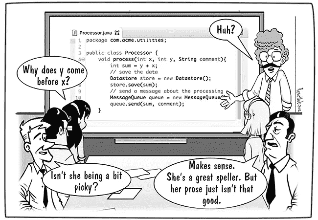

# 如何做好代码评审

> 原文：<https://medium.com/geekculture/how-to-do-a-good-code-review-1598497849e0?source=collection_archive---------0----------------------->

代码评审是提高代码质量、建立最佳实践和传播知识的有力手段。在这篇文章中，我将提供一个如何正确进行代码审查的快速指南。

## 在评审之前，您应该遵循这些提示，它们将引导您进行有效的同行代码评审

1.  **构建和测试:**这确保了稳定性。首先进行自动化检查将减少错误并节省代码。确保代码做了预期的事情。
2.  **一次审查少于 400 行的代码:**如果你试图一次审查太多行代码，你就不太可能发现缺陷。
3.  **慢慢来:**在有限的时间内，以较慢的速度进行合理数量的代码评审，会产生最有效的代码评审。
4.  **一次复习不要超过 60 分钟:**一次复习不要超过 60 分钟。从那以后，表现和对细节的关注就会下降。
5.  给予有帮助的反馈，而不是伤害:在你的反馈中，尽量表现出建设性，而不是批判性。
6.  **使用清单:**很有可能你团队中的每个人都反复犯同样的 10 个错误。特别是遗漏是最难发现的缺陷，因为很难检查不存在的东西。清单是消除经常犯的错误和应对遗漏发现挑战的最有效的方法。代码审查清单还为团队成员提供了对每种类型审查的明确期望，并有助于跟踪报告和过程改进的目的。

## 设计

评论中最重要的内容是 CL 的整体设计。CL 中各种代码的交互有意义吗？这种改变属于你的代码库，还是属于一个库？它与您系统的其余部分集成得好吗？现在是添加此功能的好时机吗？

## 识别主要的难闻气味

> 如果很臭，就换一个。—贝克奶奶，讨论育儿哲学

1.  **名称:**这里我们必须明确的一点是，我们是为人而不是为机器写代码。一旦我们清楚了这一点，我们必须学会使用描述性的名称。命名是编程中两大难题之一。一个好名字可以在将来省去几个小时的困惑不解。
2.  **评论:**唯一完美的评论是你找到方法不写的评论。也有一些例外(例如，正则表达式和复杂算法通常从解释它们在做什么的注释中受益匪浅)，但大多数注释是针对代码本身不可能包含的信息，比如决策背后的推理。
3.  **重复代码**:如果你在不止一个地方看到相同的代码结构，可以肯定的是，如果你找到统一它们的方法，你的程序会更好。
4.  **长函数:**函数越长，越难理解。
5.  **大类:**当一个类试图做太多事情时，它通常会显示太多的字段。

## 试验

> 一套测试是一个强大的 bug 检测器，可以缩短发现 bug 的时间。

在这一部分，您必须确保测试覆盖了添加的特性，并且有一个干净的测试。

什么实际上使干净的测试？所以，老实说，我不是实现测试的专家(我正在路上)，但是使测试干净的事情是可读性在单元测试中比在生产代码中更重要。什么使得测试可读？同样的事情，使所有代码可读；表达的清晰、简单和密集。

## 好东西

如果你在 CL 中看到一些好的东西，告诉开发者，尤其是当他们很好地解决了你的一个评论的时候。代码评审通常只关注错误，但是他们应该鼓励和欣赏好的实践，就指导而言，有时候告诉开发人员他们做对了什么比告诉他们做错了什么更有价值。

## 摘要

*   遵循如何做好代码审查的提示。
*   代码设计得很好。
*   任何代码都有味道(注释清晰有用，命名好等等。).
*   代码并没有比它需要的更复杂。
*   测试是精心设计的。

感谢您的阅读，请留下您对代码审查的看法。别忘了，如果你喜欢这个帖子，你可以留下超过 50 个掌声。

👋让我们成为朋友吧！在 [**Twitter**](https://twitter.com/kemilbeltre) 上关注我，在 [**LinkedIn**](https://www.linkedin.com/in/kemilbeltre) 上联系我。别忘了在这里跟着我上 [**中**](https://kemilbeltre.medium.com/) 也一样。