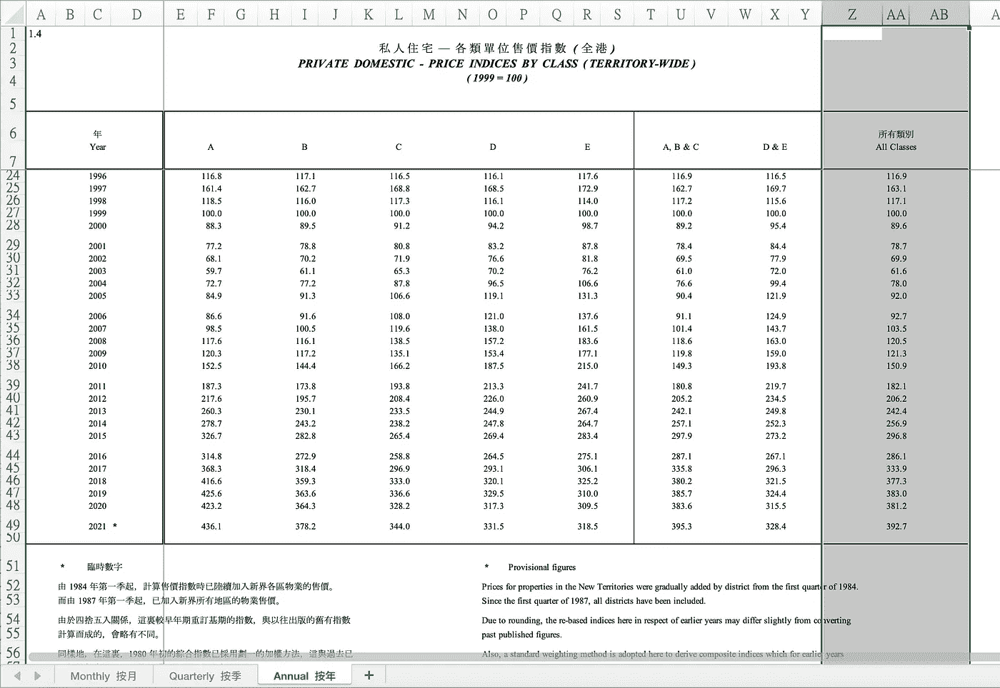
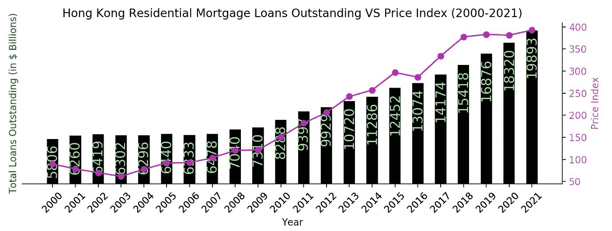

# 如何做实用的数据科学研究？

> 原文：<https://medium.com/geekculture/how-to-do-data-visualisation-for-your-data-science-research-a2d8b32bafdc?source=collection_archive---------17----------------------->

## Python 中的实用数据科学

## 将数据表示的原则和研究的基本制图技术放在一起


image from seaborn.pydata.org

在之前的帖子中，我讨论了一些 github 教程。在这篇文章中，我将谈论一些数据科学的话题:如何在 python 中为你的数据集进行数据可视化。那么，我们开始吧。

在传统的数据科学研究中，它有 3 个步骤:1 .定义数据集和数据源，2。定义你想探索的研究问题；3。进行编码并产生结果，可选地以数据表示来证明您的结果。

1.  *数据集*:陈述你的数据集所涉及的地区和领域类别:

例如，在我的例子中，我将研究香港的数据。这里的领域类别是房地产，我可以从许多数据集中选择。在本例中，数据集设置为(1)未偿还抵押贷款和(2)房地产价格指数。

2.*研究问题*:针对你所确定的领域类别和区域，撰写一份陈述。

研究问题被定义为:*在过去的二十年中，未偿还的住房抵押贷款和房地产价格指数是如何变化的？*

为了更加客观，我们应该提供公共可访问数据集的源链接。这些链接可以是指向 CSV 或 Excel 文件等文件的链接，也可以是指向可能包含表格形式数据的网站的链接，如维基百科页面。以下是链接:

链接 1 ( *私人住宅——按类别分类的价格指数*):[https://www.rvd.gov.hk/doc/en/statistics/his_data_4.xls](https://www.rvd.gov.hk/doc/en/statistics/his_data_4.xls)

链接二(*住宅按揭调查结果*):[https://www . hkma . gov . hk/media/eng/doc/market-data-and-statistics/monthly-statistical-bulletin/t 0307 . xlsx](https://www.hkma.gov.hk/media/eng/doc/market-data-and-statistics/monthly-statistical-bulletin/T0307.xlsx)

3.*编码*:从这里开始，一切都准备好了，除了让你的手弄脏一些编码。我们将主要使用 python 和一些库，如 pandas、matplotlib 和 numpy。编码过程包括三个部分:准备、数据处理和数据表示计划。

**(i)** *准备*:看一下数据集，了解一下:a .数据看起来像什么，b .是否有丢失的数据或异常值 c .是否需要清理数据。



Use Python pandas library to read excel data

**(二)** *数据处理*:首先将数据读入 python 中的 Pandas Dataframe 这样的变量中，

我们以 Link 1 数据为例。例如，我们可以过滤掉页眉和页脚以及不相关的列和行，并使用 pandas 的一些内置支持在数据帧中只存储相关的数据

```
df1sh1 = pd.read_excel(r’./T0307.xlsx’, “T3.7”, usecols=[0,1,3], skiprows=[0,1,2,3,4,5,6,7,8,9,10,11,12,13,14,17,30,43,56,69], skipfooter=10)
df1sh2 = pd.read_excel(r’./T0307.xlsx’, “T3.7 (old)” , usecols=[0,1,3], skiprows=62, skipfooter=4) 
```

重命名数据框架中的列:

```
df1sh1.rename(columns={‘Unnamed: 0’:’Year’,’Unnamed: 1':’Month’,’(百萬港元)’:’Amount’}, inplace=True) 
```

连接两个数据框架(源自 2 个源 excel 工作表等。)

```
df1 = pd.concat([df1sh2, df1sh1])
```

其次，进行转换、分组等。
对时间序列数据进行分组(如从月到年):

```
df1 = df1.groupby(‘Year’).agg({‘Amount’:sum}).reset_index()
```

改变公制单位(例如从百万到十亿)

```
df1[‘Amount’] = df1[‘Amount’]/1000 #in billions
```

然后，我们应该对来自 Link 2 的另一个数据集应用相同的数据处理，我把它留给您作为练习。

**(iii)** *想到如何表示数据*。作为一名数据科学家，我们应该努力展示相互关系，并从数据集中找出任何见解。谈到真实表示数据的原则，我推荐 Alberto Cairo 的作品。注意[图形谎言，误导性视觉效果](https://faculty.ucmerced.edu/jvevea/classes/Spark/readings/Cairo2015_Chapter_GraphicsLiesMisleadingVisuals.pdf)。


Use of Visualisation Wheel tool to plan you visuals

Python 中绘图的基本工具是 Matplolib，而[参考网站](https://matplotlib.org/stable/api/index)在查找所需资源方面非常出色。`matplotlib`架构主要有三层。从上到下分别是**脚本层** ( `matplotlib.pyplot`模块)、**美工层** ( `matplotlib.artist`模块)、和**后端层** ( `matplotlib.backend_bases`模块)。我们将主要使用顶层脚本层进行基本绘图:

绘制条形图，并在轴上设置一些刻度和标签:

```
bars = plt.bar(year, outstandings, align=’center’, linewidth=0, width = 0.5, color=’black’)plt.xticks(year)
plt.xlabel(‘Year’)
plt.ylabel(‘Total Loans Outstanding (in $ Billions)’, color = ‘green’)
```

我们有时会在中间的艺术家层上编码来做一些定制，比如:将标签旋转 45 度:

```
ax1.set_xticklabels(ax1.get_xticks(), rotation = 45)
```

并将一些轴设置为不可见:

```
ax1.spines[‘top’].set_visible(False)
ax1.spines[‘left’].set_visible(False)
```

最后，我们可以对提出的研究问题进行自己的工作:



总之，这篇文章讨论了为数据科学研究创建数据表示一般方法。我希望你能学到一些东西，感谢你支持我的文章。如果我以后有时间，我会发表更多关于其他数据科学主题的文章，如其他基本图表，如热图、箱线图或机器学习主题等。