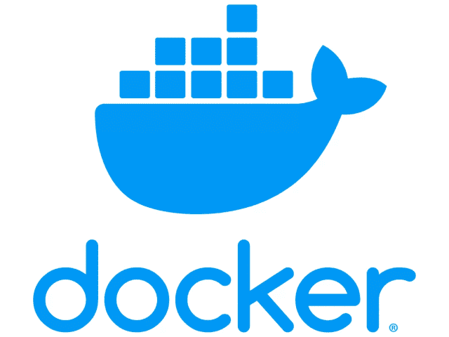

# 如何对接 fastapi 应用程序

> 原文：<https://medium.com/geekculture/how-to-dockerise-your-fastapi-application-43fb4a106ae?source=collection_archive---------3----------------------->

## 记录您的 fastapi 应用程序


# 简介:

这篇文章的目的是记录一个极简的应用程序。让我们以一个简单的 fastapi 程序为例，对它进行 dockerise。

# 一个简单的 Fastapi 应用程序:

下面的代码是一个简单的 fastapi 应用程序，只有一个端点`/hello`。假设模块名为`my_fastapi.py`。

# 运行 fastapi 应用程序:

# 输出:

现在，我们的 fastapi 应用程序正在运行，并给出了预期的输出，让我们来对接它。

# 码头工人——什么？



从文件上看，

> *容器是一个标准的软件单元，它将代码及其所有依赖项打包，以便应用程序能够快速可靠地从一个计算环境运行到另一个计算环境。Docker 容器映像是一个轻量级的、独立的、可执行的软件包，包括运行应用程序所需的一切*
> 
> [*https://www.docker.com/resources/what-container/*](https://www.docker.com/resources/what-container/)

从技术上讲，docker 容器是应用程序之上的一个抽象层。在我们的例子中是 fastapi 应用程序。那么，要在不同的环境下运行 fastapi 应用程序而不出错，我们需要做些什么呢？让我们把它们列出来。

1.  首先，我们需要`python`。
2.  `fastapi`和 uvicorn 库应该安装。

这就是我们所需要的。假设您希望您的 fastapi 应用程序被发布并运行在您的对等机器上的其他地方，我们所需要的就是一个安装了`fastapi`的`python`环境。这正是 Docker 解决的问题。

您不必向您的同行提供您的依赖库或 README 文档来开始使用 fastapi 应用程序。他/她只需要一个 docker 环境来运行你的应用程序，并访问你的应用程序所在的存储库。我们将使用`dockerhub`来托管 fastapi 应用程序。然而，大多数组织也使用`JFrog artifactory`来托管他们的内部 docker 映像。

# Dockerhub:

> *Docker Hub 是由 Docker 提供的托管存储库服务，用于与您的团队查找和共享容器映像*

# Requirements.txt:

一个`requirements.txt`文件列出了运行项目所需的所有依赖库。我们的小工作室只需要`fastapi`模块。

```
fastapi==0.85.0
```

让我们编写 Docker 文件。

# Docker 文件:

1.  从 dockerhub 导入 python。
2.  创建一个工作目录 fastapiapp。
3.  将`requirements.txt`文件复制到 app 目录下。
4.  安装 requirements.txt 文件中的所有依赖项。
5.  将整个项目复制到 fastapiapp 目录中。
6.  我们公开端口 8000，因为应用程序将在端口 8000 上运行。
7.  定义`FASTAPI_APP`环境变量。否则解释器可能会抱怨找不到变量
8.  最后，输入运行命令`uvicorn fastapiapp.docker_fastapi:app --reload --host 0.0.0.0`。这是为了确保服务器接受来自所有主机的请求。请注意，我们在这里包含了源目录 fastapiapp。不包括这个可能会导致`Error loading ASGI app.Could not import module`错误。

# 构建 docker 图像:

既然我们已经准备好了`Dockerfile`，我们将构建 docker 映像。请确保您的`docker desktop`正在运行。否则你可能会得到这个错误。

```
Cannot connect to the Docker daemon at unix:///var/run/docker.sock. Is the docker daemon running?(docker-env) dinesh@dinesh % docker build -t myfastapiapp .
```

请注意命令末尾的句点。

```
[+] Building 7.5s (9/9) FINISHED                                                                                                                                                                                        
 => [internal] load build definition from Dockerfile                                                                                                                                                               0.0s
 => => transferring dockerfile: 201B                                                                                                                                                                               0.0s
 => [internal] load .dockerignore                                                                                                                                                                                  0.0s
 => => transferring context: 2B                                                                                                                                                                                    0.0s
 => [internal] load metadata for docker.io/library/python:3.9-bullseye                                                                                                                                             2.1s
 => [internal] load build context                                                                                                                                                                                  0.0s
 => => transferring context: 3.35kB                                                                                                                                                                                0.0s
 => [1/4] FROM docker.io/library/python:3.9-bullseye@sha256:dd19baa7cbbf06a32808bb4d6dd63595010dc7da422ac332b789ee6ff08cc7c9                                                                                       0.0s
 => CACHED [2/4] WORKDIR /fastapiapp                                                                                                                                                                               0.0s
 => [3/4] COPY ./ ./fastapiapp                                                                                                                                                                                     0.0s
 => [4/4] RUN pip install -r fastapiapp/requirements.txt                                                                                                                                                           5.0s
 => exporting to image                                                                                                                                                                                             0.3s
 => => exporting layers                                                                                                                                                                                            0.3s
 => => writing image sha256:3f67d3fc43a32cecce470cd2878786c37018ff7fa07ed2e3a64a9f7e183f564d
```

一旦成功构建了映像，这些映像应该作为 docker 映像的一部分列出。

```
(docker-env) dinesh@dinesh % docker images REPOSITORY     TAG       IMAGE ID          CREATED          SIZE
myfastapiapp   latest    6b1ab29f10db   10 minutes ago   133MB
```

# 运行 Docker 映像:

现在，访问端点应该给出与直接运行 fastapi 应用程序相同的结果。

# 将 Docker 映像推送到 Docker hub:

Docker 图像通过`[docker push](https://docs.docker.com/engine/reference/commandline/push/)`命令被推送到 Docker Hub。单个 Docker Hub 存储库可以保存许多 Docker 图像(存储为**标签**)。要将图像推送到 Docker Hub，您的帐户中应该有一个存储库。假设我的存储库名称是`myfastapi`，docker push 命令看起来像这样，

```
docker push <username>/<reponame>:tagname

docker push dinesh/myfastapiapp:mytag
```

# 总结:

如果你读到这一行，感谢你的耐心和时间。请继续访问这个空间，了解更多的技术内容。😊

*原载于 2022 年 10 月 15 日 https://dock2learn.com*[](https://dock2learn.com/tech/how-to-dockerise-your-fastapi-application/)**。**