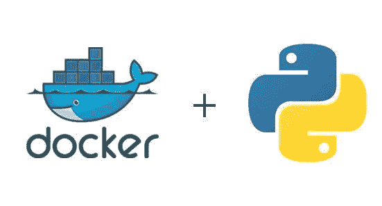

# 如何对 Python Flask 应用程序进行 Dockerize

> 原文：<https://medium.com/geekculture/how-to-dockerize-a-python-flask-app-cf98df24775d?source=collection_archive---------3----------------------->

## 创建 docker 映像并使用容器运行 Python Flask

Docker + Python + Flask app

在这篇简短的文章中，我将带你完成一个 Python Flask 应用程序的 Dockerizing 过程。一旦你将你的 Flask 应用程序容器化，你就可以很容易地[将它部署到云端](/geekculture/deploying-python-flask-app-as-a-docker-image-to-google-cloud-dd0bdfef3735)。

例如，我们将定义一个带有 hello world API 端点的简单 Flask 应用程序，并学习如何创建一个…