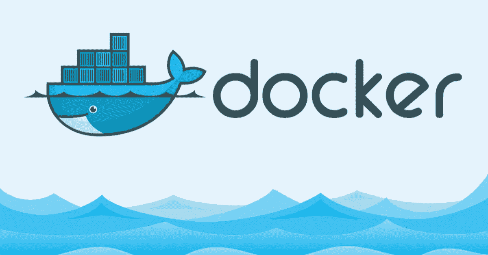

# 如何对 React 应用程序进行分类

> 原文：<https://medium.com/geekculture/how-to-dockerize-a-react-app-c8092a31483d?source=collection_archive---------8----------------------->

在这篇简短的文章中，我将带你了解一个 React 应用程序的归档过程。在某些情况下，您可能希望将 React 应用程序容器化。它可以用于基于云的部署，也可以仅用于本地开发。

例如，我们将创建一个新的 React 应用程序，然后向其中添加 docker 脚本。最后，我们将运行 docker 容器来验证一切正常。